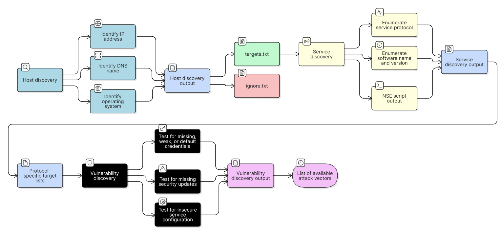
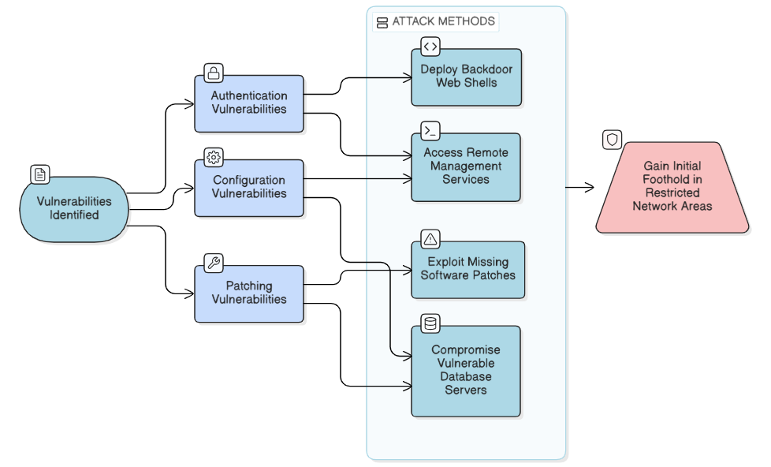
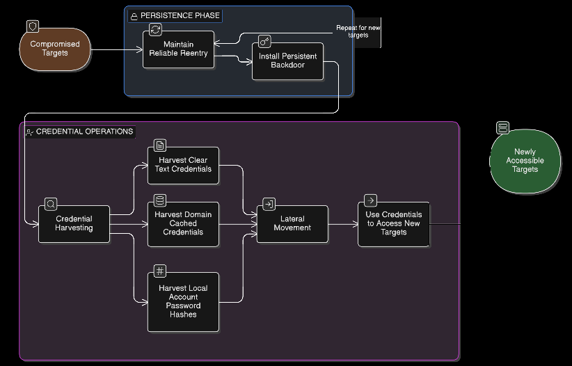

# Chapter 1 — Network Penetration Testing
### Companion Lab Report: *The Art of Network Penetration Testing* (Royce Davis, Manning Publications, 2020)

| | |
|---|---|
| **Author** | Iliya Dehghani |
| **Source Lab** | Lab 1 |
| **Lab Environment** | Capsulecorp (VMware Workstation 17 Pro) |
| **Report Type** | Chapter walkthrough / technical lab report |

---

## 1. Objective

This report covers Chapter 1 of *The Art of Network Penetration Testing*, which introduces the concept of an Internal Network Penetration Test (INPT) and defines the four-phase methodology used throughout the rest of the book. The goal of this section of the lab was to build a working understanding of:

- Why corporate data breaches occur and why INPTs are used to proactively find the same weaknesses attackers exploit.
- The four phases of an INPT: information gathering, focused penetration, post-exploitation and privilege escalation, and documentation.
- How each phase feeds into the next, forming a repeatable methodology rather than an ad hoc series of attacks.

## 2. Tools Referenced

No offensive tooling is exercised in Chapter 1 — it is conceptual. The following tools are introduced here and used hands-on starting in Chapter 2:

- VMware Workstation 17 Pro (lab virtualization platform)
- Nmap
- ICMP-based host discovery utilities (`ping`, `bash`)

## 3. Background

Corporate data breaches occur when unauthorized individuals gain access to sensitive company information, typically due to vulnerabilities in network security — unpatched software, default credentials, or weak configuration. An **Internal Network Penetration Test (INPT)** simulates a real attack carried out by a malicious or compromised insider who already has access to a company's internal network. The purpose is to identify these gaps before a genuine threat actor can exploit them.

An INPT is broken into four sequential phases, adapted from Davis [1]:

- **Phase 1: Information gathering**
  - Discover network hosts
  - Enumerate listening services
  - Discover vulnerable attack surfaces
- **Phase 2: Focused penetration** — compromise vulnerable level-1 hosts
  - Exploit missing software patches
  - Deploy custom executable payloads
  - Access remote management interfaces (RMI)
- **Phase 3: Post-exploitation and privilege escalation**
  - Establish reliable re-entry
  - Harvest credentials
  - Move laterally to level-2 hosts, identify privileged accounts, and elevate to domain administrator
- **Phase 4: Documentation**
  - Gather evidence and screenshots
  - Create a linear attack narrative
  - Produce the final deliverable

## 4. Phase Breakdown

### 4.1 Phase 1: Information Gathering

Also referred to as discovery or reconnaissance, this phase examines the network infrastructure from the inside. Per Davis [1], it begins with host discovery, where results are split into two files: `target.txt` for in-scope ranges and `ignore.txt` for out-of-scope assets. In-scope hosts are then probed for active services to build a refined target list, which defines the specific systems to be tested for weaknesses and helps identify available attack vectors.

*Figure 1.1 — The information-gathering phase (reproduced from [1]).*

### 4.2 Phase 2: Focused Penetration

The focused penetration phase is where known weaknesses are exploited to gain an initial foothold. Attackers exploit missing patches, misuse remote services, compromise databases, and deploy web shells to achieve remote code execution (RCE) and establish a presence on the network.

*Figure 1.2 — The focused penetration phase (reproduced from [1]).*

### 4.3 Phase 3: Post-Exploitation and Privilege Escalation

This phase is about extending access after the initial compromise. Once level-1 hosts have been breached, the attacker attempts to persist, escalate privileges, and harvest credentials. These steps enable pivoting to level-2 hosts that were not directly reachable during focused penetration. By capturing clear-text and hashed credentials, escalating non-administrator accounts to administrative or domain-level privileges, and leveraging newly discovered access paths, control of the environment is progressively expanded.

*Figure 1.3 — The privilege escalation phase (reproduced from [1]).*

### 4.4 Phase 4: Documentation

The documentation phase collects evidence, tells the story of the attack in a way non-technical stakeholders can follow, and delivers actionable recommendations. Per Davis [1], this consists of three parts:

**A. Gather evidence / screenshots**
- Proof of every system compromised
- More screenshots are generally better than fewer

**B. Create a linear attack narrative**
- A step-by-step explanation of how the network was penetrated
- Written so non-technical readers can follow along

**C. Create the final deliverable**
- Detailed, actionable recommendations for remediation
- This is ultimately the work product the client is paying for

## 5. Conclusion

Chapter 1 establishes the conceptual skeleton for the rest of the engagement: a four-phase methodology that moves from reconnaissance, to exploitation, to privilege escalation, and finally to a documented deliverable. Understanding this framework up front is what allows the more technical, hands-on chapters that follow (starting with Chapter 2's host discovery techniques) to be organized around a consistent, repeatable process rather than a disconnected list of tools and commands.

## 6. References

[1] R. Davis, *The Art of Network Penetration Testing*, Manning Publications, 2020.
