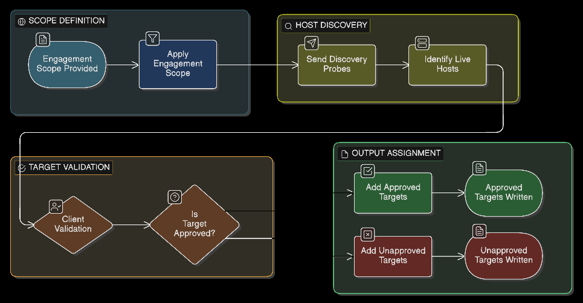
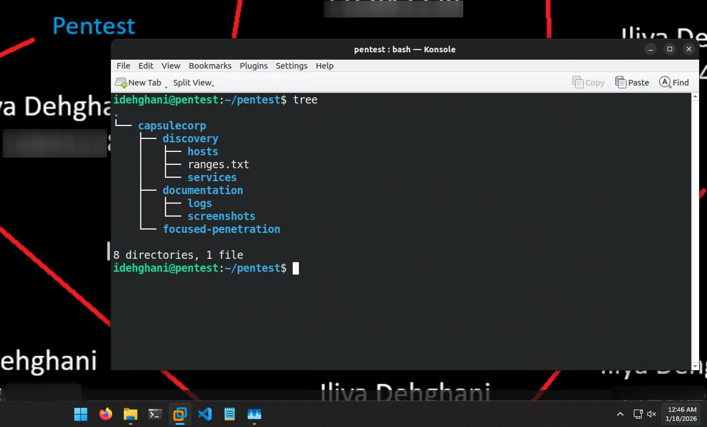
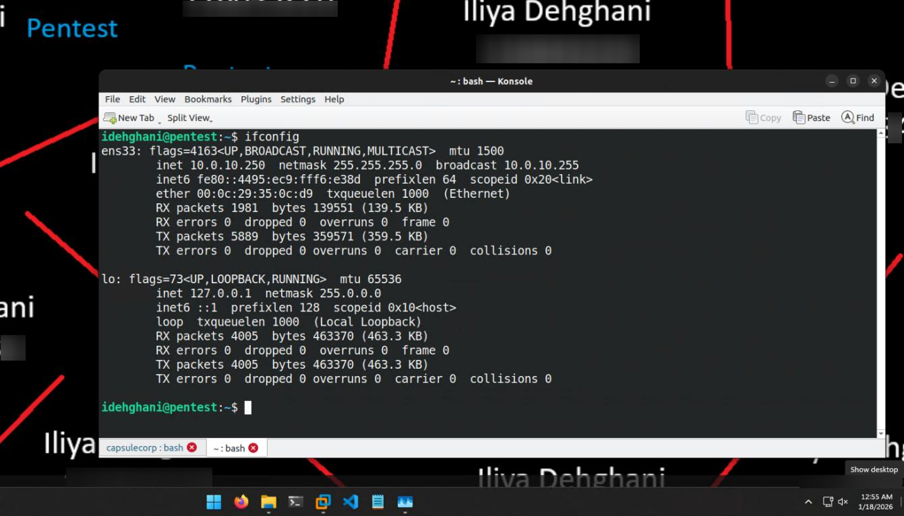
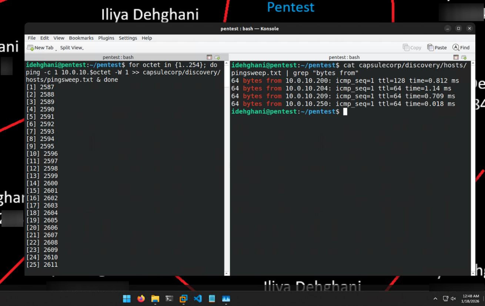
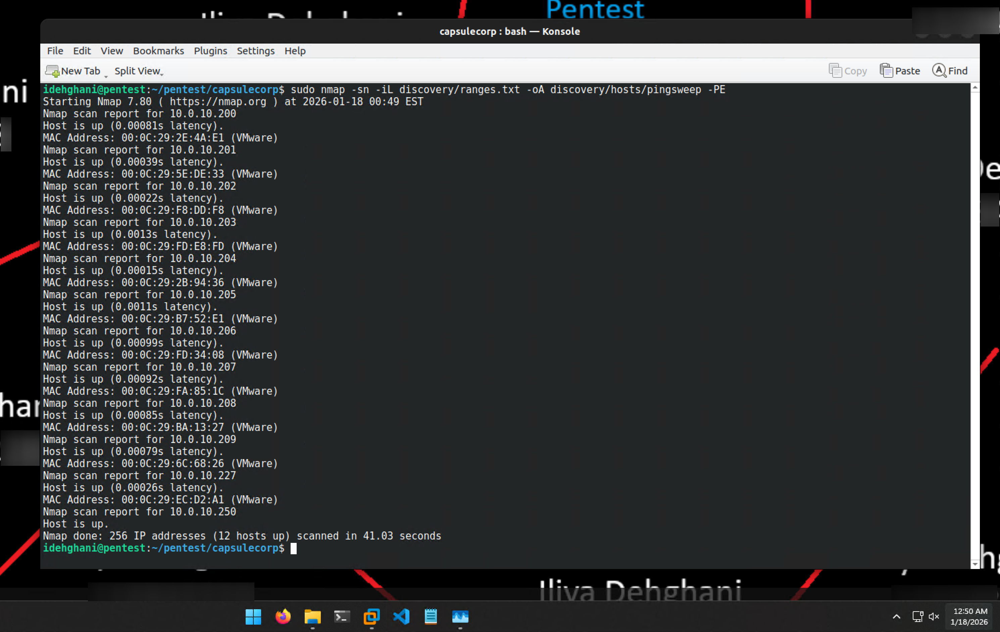
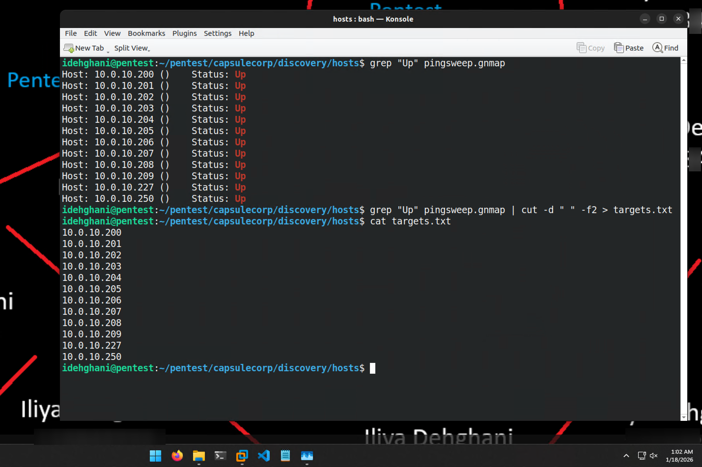
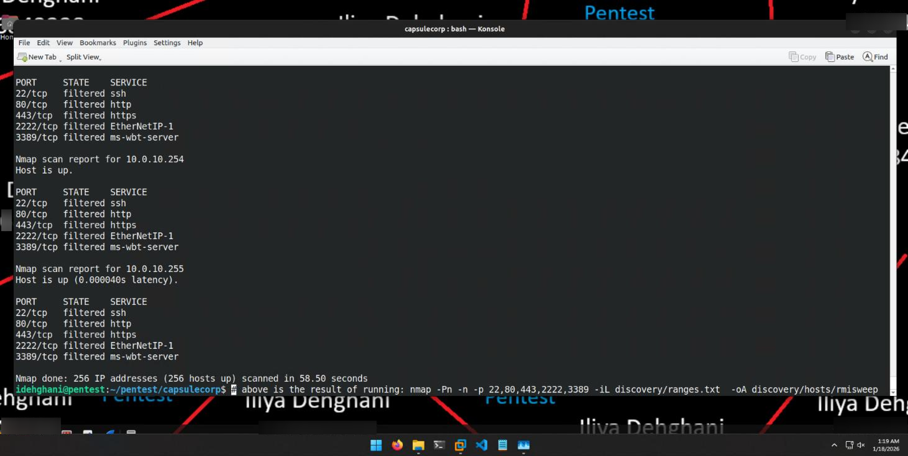
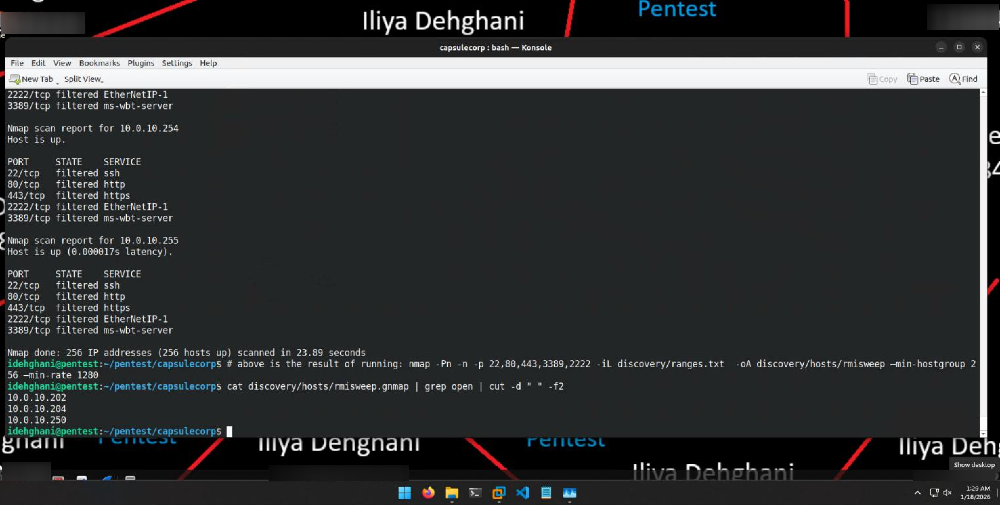
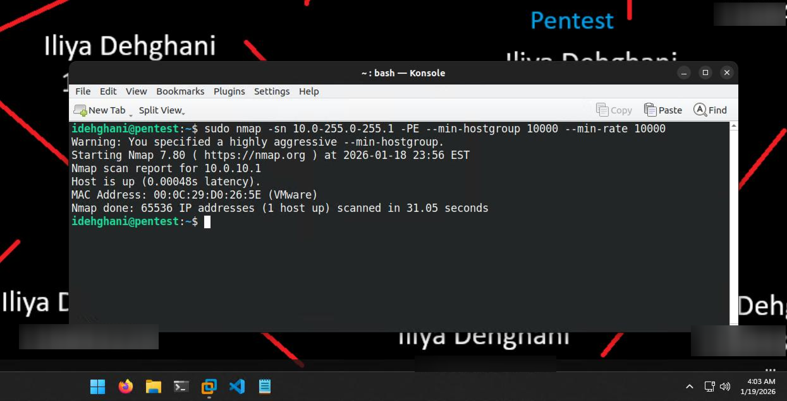

# Chapter 2 — Discovering Network Hosts
### Companion Lab Report: *The Art of Network Penetration Testing* (Royce Davis, Manning Publications, 2020)

| | |
|---|---|
| **Author** | Iliya Dehghani |
| **Source Lab** | Lab 1 |
| **Lab Environment** | Capsulecorp (VMware Workstation 17 Pro) |
| **Report Type** | Chapter walkthrough / technical lab report |

---

## 1. Objective

Chapter 2 covers Phase 1 (information gathering) hands-on, focusing specifically on **host discovery** — identifying which systems in an in-scope IP range are actually alive before any service enumeration or exploitation is attempted. This report documents the practical application of ICMP sweeps, Nmap host discovery, and remote management interface (RMI) scanning against the Capsulecorp lab environment.

## 2. Tools Used

| Tool | Purpose |
|---|---|
| `ifconfig` / `ipconfig` | Identify the pentest machine's own IP address and subnet mask |
| `bash` (loop + `ping`) | Manual ICMP pingsweep of a subnet |
| Nmap | ICMP-based host discovery, RMI port scanning, performance-tuned discovery |
| `grep` / `cut` | Parsing and filtering scan output (Gnmap format) |

## 3. Scope and Lab Environment

The information-gathering phase consists of host discovery, service discovery, and vulnerability discovery. During this initial stage, the primary objective is to identify as many live hosts as possible within the defined in-scope IP address range.

*Figure 2.1 — The information-gathering phase workflow (reproduced from [1]).*

For this lab, the Capsulecorp environment was deployed as a virtualized infrastructure in VMware Workstation 17 Pro. The following hosts were active on the network at the time of testing:

| Hostname | IP Address | Operating System |
|---|---|---|
| Router | 10.0.10.1 | Ubuntu 22.04 LTS |
| Goku | 10.0.10.200 | Windows Server 2019 Standard Evaluation |
| Gohan | 10.0.10.201 | Windows Server 2016 Standard Evaluation |
| Vegeta | 10.0.10.202 | Windows Server 2012 R2 Datacenter Evaluation |
| Trunks | 10.0.10.203 | Windows Server 2012 R2 Datacenter Evaluation |
| Piccolo | 10.0.10.204 | Ubuntu 18.04.2 LTS |
| Krillin | 10.0.10.205 | Windows 10 Professional |
| Yamcha | 10.0.10.206 | Windows 10 Professional |
| Raditz | 10.0.10.207 | Windows Server 2016 Datacenter Evaluation |
| Tien | 10.0.10.208 | Windows 7 Professional |
| Nail | 10.0.10.209 | Ubuntu 18.04.2 LTS |
| Nappa | 10.0.10.227 | Windows Server 2008 Enterprise |
| Pentest | 10.0.10.250 | Ubuntu 22.04 LTS |

*Table 2.1 — Capsulecorp host inventory.*

A working directory structure was created for the engagement, and the in-scope range `10.0.10.0/24` was recorded in `ranges.txt` to keep the engagement scope explicit and auditable throughout testing.

*Figure 2.2 — `tree` output showing the engagement's working directory structure (discovery, documentation, and focused-penetration folders).*

## 4. Methodology and Walkthrough

### 4.1 Confirming the Pentest Host's Own Network Position

Before scanning, the pentest machine's own IP address and subnet mask were confirmed to validate connectivity to the target range.

*Figure 2.3 — `ipconfig`/`ifconfig` output confirming the pentest machine's network position.*

### 4.2 ICMP Pingsweep with Bash

A simple `bash` loop was used to pingsweep the entire `10.0.10.0/24` subnet, sending a single ICMP echo request (`-c1`) to each host with a 1-second timeout (`-W 1`) and appending results to `pingsweep.txt`.

*Figure 2.4 — Bash pingsweep of the Capsulecorp subnet.*

Filtering the output with `grep "bytes from"` showed that only **Goku** and the two Ubuntu hosts (**Piccolo** and **Nail**) replied. Although the remaining hosts were online, the default firewall ruleset on the Capsulecorp network drops ICMP echo requests, causing pings to those hosts to fail silently. This is an important finding in itself: **ping is unreliable as a sole host-discovery method** whenever ICMP is filtered, and it does not scale well across large or non-contiguous IP ranges.

### 4.3 Host Discovery with Nmap

To overcome the limitations of a raw ping sweep, Nmap's dedicated host-discovery mode (`-sn`, no port scan) was used with `-PE` to force ICMP echo probes specifically, writing output in all three formats simultaneously (`-oA`) for later analysis.

*Figure 2.5 — Nmap ICMP-based host discovery against the Capsulecorp subnet.*

Unlike the manual pingsweep, Nmap reported **all** Capsulecorp hosts as up, demonstrating that Nmap's discovery engine is more resilient to the same firewall conditions that defeated the raw `ping` sweep.

#### 4.3.1 Parsing Nmap Output

Nmap's `-oA` switch produces output in three formats: normal, Grepable (Gnmap), and XML. Of the three, Gnmap is the most convenient for command-line analysis, since each field can be selectively filtered with `grep`/`cut`.

*Figure 2.6 — Extracting a clean `targets.txt` list of live hosts from Gnmap output.*

A `targets.txt` file was generated by filtering lines containing `"Up"` with `grep` and trimming the output with `cut`, producing a clean list of confirmed live hosts to carry forward into service discovery.

### 4.4 Remote Management Interface (RMI) Scanning

RMI ports are significant during host discovery because most production systems must remain accessible for maintenance and support — services like SSH, RDP, and web-based management consoles frequently stay open even when ICMP traffic is restricted. The ports with the highest likelihood of exposing administrative or service interfaces are:

- SSH: 22
- Alternate SSH: 2222
- Web admin panels / internal apps: 80
- Secure web consoles / APIs: 443
- RDP (Windows admin access): 3389

*Figure 2.7 — Targeted Nmap scan of common RMI ports across the Capsulecorp range.*

This scan assumed all hosts were up (skipping the ping phase) and checked each host for the five ports above — 1,280 total TCP probes. Because Nmap by default splits a `/24` into four blocks of 64 hosts, the scan took 58 seconds to complete.

### 4.5 Optimizing Nmap Scan Performance

To reduce scan time on larger ranges, `--min-hostgroup` and `--min-rate` were used to instruct Nmap to scan more hosts in parallel and send packets at a higher rate.

*Figure 2.8 — Performance-tuned RMI scan using `--min-hostgroup 256` and `--min-rate 1280`.*

`--min-hostgroup 256` instructs Nmap to scan up to 256 hosts simultaneously, and `--min-rate 1280` forces a minimum send rate of 1,280 packets per second. This reduced the scan time from 58 seconds to 23 seconds — a clear illustration of why scan-tuning matters once an engagement scope grows beyond a single `/24`.

### 4.6 Additional Host-Discovery Techniques

For large, sparsely populated address spaces (e.g., an entire `/8`), pinging only the `.1` address of every candidate `/24` subnet is an efficient way to identify which subnets are actually in use, since `.1` is conventionally assigned to a router or gateway.

*Figure 2.9 — Using a targeted `.1` sweep to identify active subnets within a larger address space.*

This technique lets a tester focus subsequent scans only on subnets known to be in use, avoiding wasted time scanning millions of unused addresses.

## 5. Findings / Observations

| Observation | Detail |
|---|---|
| ICMP is filtered by default | The Capsulecorp firewall ruleset drops ICMP echo requests, causing a raw `ping` sweep to under-report live hosts (only 3 of 13 hosts responded). |
| Nmap discovery is more reliable | Nmap's `-sn -PE` discovery mode correctly identified all hosts as up despite the same ICMP filtering. |
| RMI ports remain valuable even without ICMP | SSH, HTTP/HTTPS, and RDP ports were reachable and scannable independent of ICMP filtering, providing an alternate discovery path. |
| Scan tuning materially affects engagement time | `--min-hostgroup` and `--min-rate` cut scan time by ~60% on a single `/24`; this becomes essential at enterprise scale. |

## 6. Conclusion

This chapter demonstrated that no single host-discovery method is sufficient in isolation — ICMP sweeps, Nmap discovery scans, and RMI-based scanning each surfaced different results based on how the network's firewall controls handled different types of probes. Optimizing Nmap's performance parameters proved essential to keeping scans efficient as the address space grows. These results reinforce that accurate, methodical reconnaissance is the foundation the rest of the penetration test methodology depends on — the target list produced here (`targets.txt`) becomes the direct input to the service-discovery work covered in Chapter 3.

## 7. References

[1] R. Davis, *The Art of Network Penetration Testing*, Manning Publications, 2020.
