# Chapter 3 — Discovering Network Services
### Companion Lab Report: *The Art of Network Penetration Testing* (Royce Davis, Manning Publications, 2020)

| | |
|---|---|
| **Author** | Iliya Dehghani |
| **Source Lab** | Lab 2 |
| **Lab Environment** | Capsulecorp (VMware Workstation 17 Pro) |
| **Report Type** | Chapter walkthrough / technical lab report |

---

## 1. Objective

Chapter 3 narrows the focus from generic host discovery to **service discovery** — identifying which network services are listening on each live host, and what protocol, software, and version each one is running. This report documents a systematic three-step process: enumerating services and software versions, organizing findings into protocol-specific target lists, and preparing that data for the vulnerability-discovery work in Chapter 4.

## 2. Tools Used

| Tool | Purpose |
|---|---|
| `curl` | Manually request and inspect HTTP service banners |
| Nmap | Port scanning, service/version detection (`-sV`), aggressive scanning (`-A`), NSE scripting |
| `grep` / `cut` | Filtering Gnmap output and isolating executed NSE scripts |
| `parsenmap.rb` ([R3dy/parsenmap](https://github.com/R3dy/parsenmap)) | Parsing Nmap XML output into a condensed, spreadsheet-friendly format |
| LibreOffice Calc | Analyzing parsed scan data in tabular form |

## 3. Methodology and Walkthrough

### 3.1 Network Services from an Attacker's Perspective

As information gathering moves from host discovery to service discovery, the focus narrows considerably. This stage is about identifying which network services are running on a target machine — finding out which "doors and windows" are actually open. From an offensive standpoint, every live service is a potential entry point: if a service exists, it can potentially be leveraged in some way. The goal is to build a complete schematic of the target environment [1].

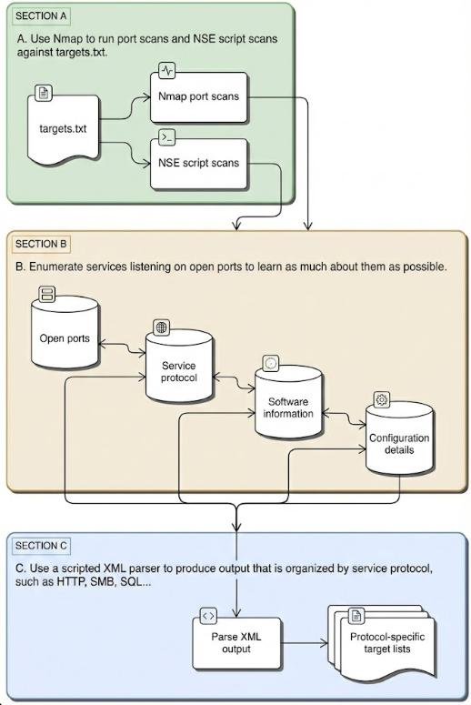
*Figure 3.1 — Service discovery workflow, reproduced from [1].*

This sub-phase consumes `targets.txt`, the output of host discovery (Chapter 2), as its primary input, and produces protocol-specific target lists that become the input for vulnerability discovery (Chapter 4).

#### 3.1.1 Understanding Network Service Communication

Network communication fundamentally operates on a request-response model — entering a URL in a browser triggers an HTTP GET request built to protocol specification, and the server responds with the requested data.

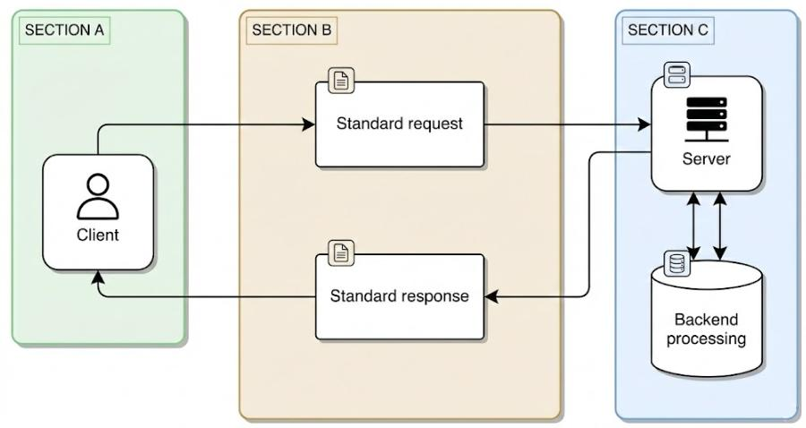
*Figure 3.2 — A client querying a server under normal conditions, reproduced from [1].*

Many network-based attacks work by delivering a carefully crafted or malicious service request that exploits a specific weakness in a service. A successful compromise typically results in the service handing the attacker a reverse command shell.

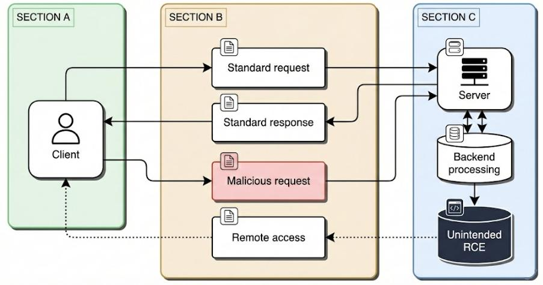
*Figure 3.3 — A malicious request subverting normal processing to achieve remote code execution, reproduced from [1].*

#### 3.1.2 Identifying Listening Network Services

Real-world engagements rarely come with a complete network diagram, which means active services must be identified systematically through port scanning. This involves probing each known IP address across the full range of 65,535 possible ports. Most probes return no response (closed/filtered), but any response generally indicates an active, listening service — administrators are free to bind services to any port in the range, so scans cannot assume standard port usage.

#### 3.1.3 Network Service Banners

Finding an open port is only the first step; a tester needs richer detail to understand the attack surface. Service banners typically reveal the protocol (FTP, HTTP, RDP, etc.), the software name, and its version — information that is essential for cross-referencing against public exploit repositories like Exploit-DB.

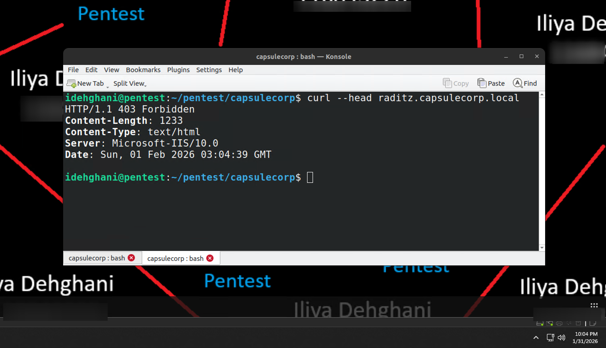
*Figure 3.4 — `curl --head` executed against raditz.capsulecorp.local to interrogate the HTTP banner.*

The banner confirmed:

- **Protocol:** HTTP
- **Software & version:** Microsoft IIS 10.0, narrowing the target OS to Windows Server 2016 or later
- **Hardening observation:** unlike the reference material's example, this IIS installation suppressed the `X-Powered-By` header, suggesting a hardened baseline aimed at minimizing information disclosure

### 3.2 Port Scanning with Nmap

Unlike host discovery, which relies primarily on ICMP, port scanning attempts TCP connections across the full 65,535-port range. At this stage Nmap does not need to interpret specific protocols — any response means a port is open, and no response means it's closed or unoccupied.

#### 3.2.1 Commonly Used Ports

In large environments, scanning every port on every host is slow. To balance completeness with efficiency, a "quick sweep" targeting a custom list of 13 commonly attacked ports was run first, allowing early leads to be pursued while a comprehensive scan runs in the background:

```
nmap -Pn -n -p 22,25,53,80,443,445,1433,3306,3389,5800,5900,8080,8443 -iL \
  hosts/targets.txt -oA services/quick-sweep
```

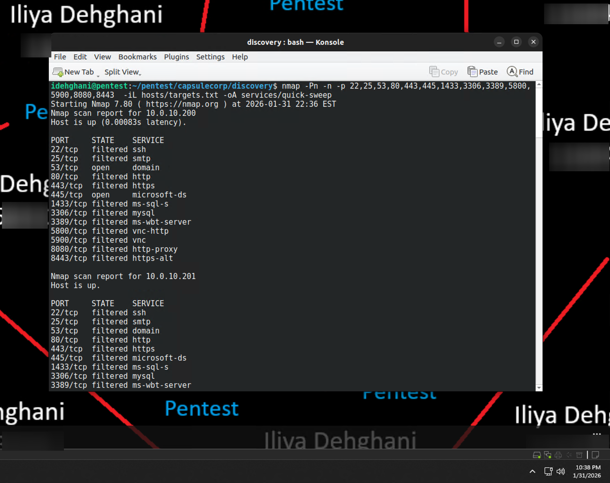
*Figure 3.5 — Quick-sweep scan of commonly targeted ports across Capsulecorp.*

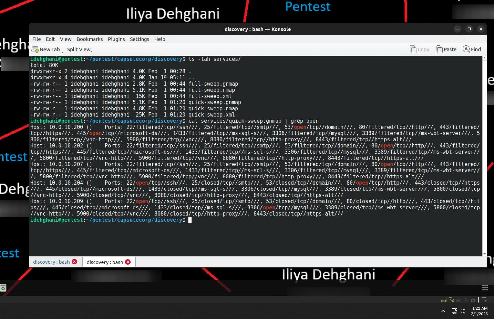
*Figure 3.6 — Filtering the Grepable (`.gnmap`) output to isolate open ports.*

The quick sweep produced an early snapshot of the attack surface:

- **10.0.10.200:** 53/tcp (DNS), 445/tcp (Microsoft-DS/SMB)
- **10.0.10.202:** 80/tcp (HTTP)
- **10.0.10.207:** 80/tcp (HTTP)
- **10.0.10.204:** 22/tcp (SSH), 80/tcp (HTTP)
- **10.0.10.209:** 22/tcp (SSH), 3306/tcp (MySQL)

| Port | Service |
|---|---|
| 22 | SSH |
| 25 | SMTP |
| 53 | DNS |
| 80 | HTTP |
| 443 | HTTPS |
| 445 | Microsoft CIFS/SMB |
| 1433 | Microsoft SQL Server |
| 3306 | MySQL |
| 3389 | Microsoft RDP |
| 5800 | Java VNC server |
| 5900 | VNC server |
| 8080 | Misc. web server |
| 8443 | Misc. web server |

*Table 3.1 — Commonly used network ports, sourced from [1].*

#### 3.2.2 Scanning All 65,536 TCP Ports

After identifying high-value targets via the quick sweep, a comprehensive full-range scan was run with service fingerprinting and aggressive enumeration:

```
nmap -Pn -n -iL hosts/targets.txt -p 0-65535 -sV -A -oA services/full-sweep \
  --min-rate 50000 --min-hostgroup 22
```

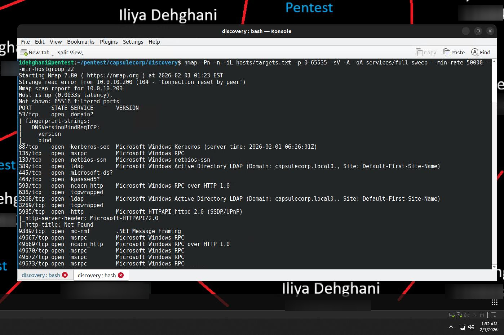
*Figure 3.7 — Full 65,535-port scan with `-sV -A` enabled.*

Two flags were central to this scan:

- **`-sV` (service/version detection):** identifies specific service versions — e.g., reporting "Microsoft IIS httpd 8.5" instead of simply "open" on port 80.
- **`-A` (aggressive scan):** enables OS detection, version detection, and the Nmap Scripting Engine (NSE), which automatically runs relevant scripts against detected services.

For large environments (hundreds/thousands of hosts), running full aggressive scans against every port on every host is inefficient. A staged approach is more practical: run a lightweight `-sT` connect scan across all ports first, then re-run the aggressive scan (`-sV -A`) scoped only to the ports found open.

#### 3.2.3 Sorting Through NSE Script Output

The `-A` flag automatically triggers relevant NSE scripts based on detected services — e.g., `ssh-hostkey` against an SSH service on port 22, useful for authenticating host identity.

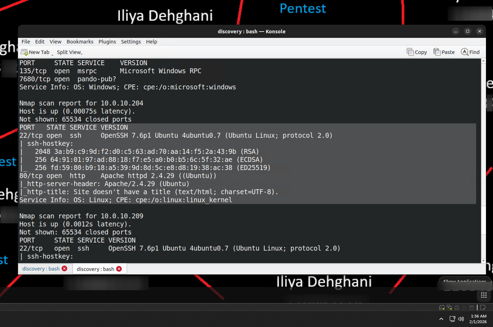
*Figure 3.8 — SSH host key fingerprint captured via the `ssh-hostkey` NSE script.*

Because NSE script output formatting is inconsistent (community-contributed scripts), manual parsing with `cat`/`grep` becomes unwieldy at scale. A focused pipeline isolates executed script names quickly:

```
cat services/full-sweep.nmap | grep '|_' | cut -d '_' -f2 | cut -d ' ' -f1 | sort -u | grep ':'
```

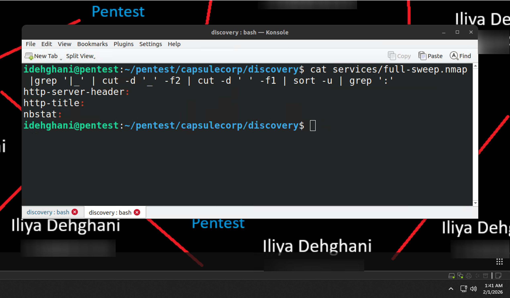
*Figure 3.9 — Isolating the set of NSE scripts that fired during the scan (`http-server-header`, `nbstat`, `http-title`, etc.).*

`http-title` in particular is valuable — it retrieves web server banners for a fast read on the web attack surface.

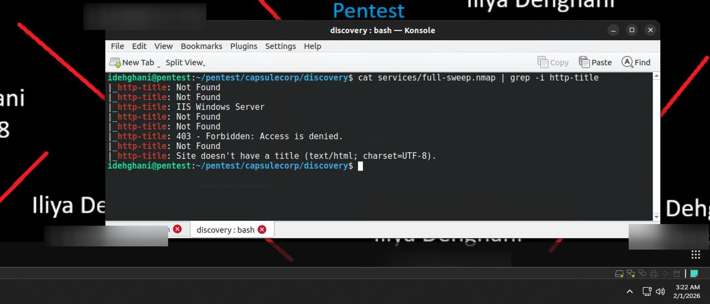
*Figure 3.10 — `http-title` output providing a rapid overview of web infrastructure.*

Manual CLI sorting becomes impractical as network size grows, which is why Nmap's XML output — a structured, hierarchical format — becomes the preferred data source at scale. XML organizes results into host nodes, child nodes (IP addresses, ports, service versions), and script nodes (nested NSE results).

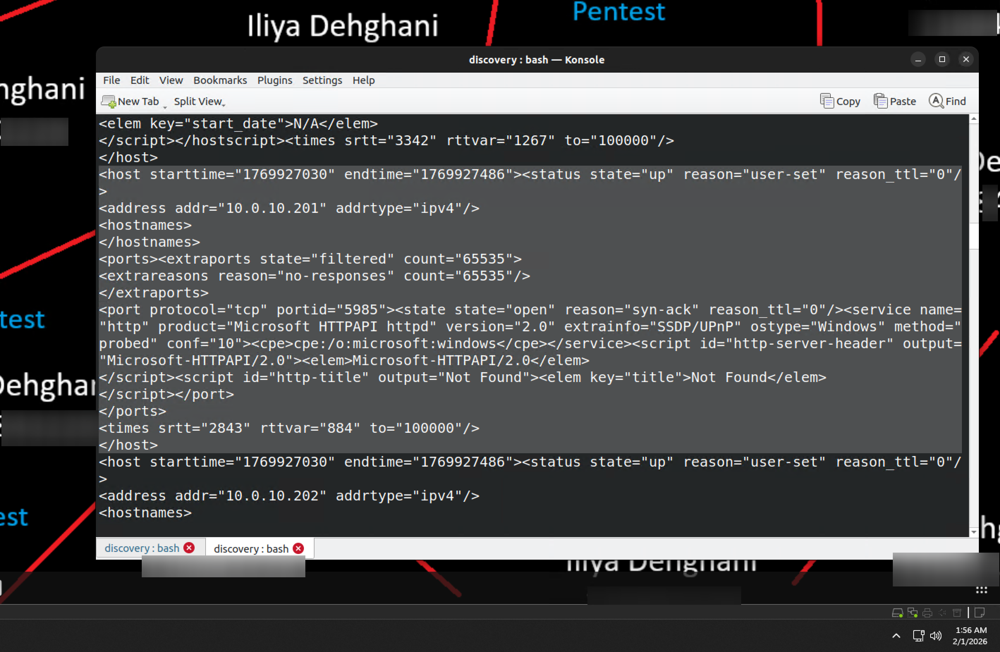
*Figure 3.11 — XML representation of host 10.0.10.201, showing an open port 5985 running Microsoft HTTPAPI httpd 2.0 along with nested NSE results.*

### 3.3 Parsing XML Output with Ruby

Raw XML, while structured, is too verbose for rapid analysis mid-engagement. The `parsenmap.rb` script ([R3dy/parsenmap](https://github.com/R3dy/parsenmap)) condenses Nmap XML into single-line summaries containing IP addresses, open ports, and service versions — critical for handling the volume of data produced when scanning large enterprise environments.

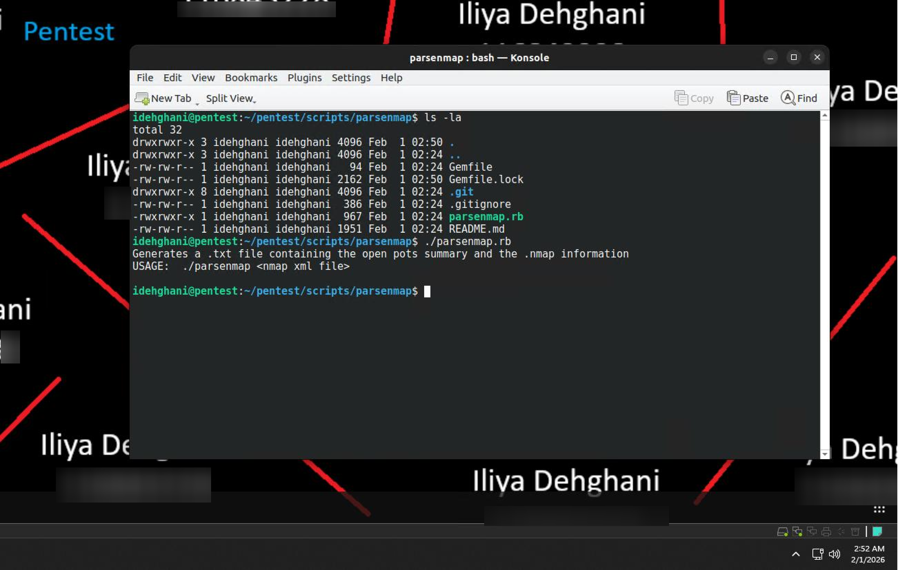
*Figure 3.12 — Downloading and executing `parsenmap.rb` against `full-sweep.xml`.*

A dedicated `~/bin` directory was created and added to `$PATH` to make the script globally accessible, following a professional workflow of maintaining a centralized, reusable tool repository:

1. Created `~/bin` via `mkdir ~/bin`
2. Appended a conditional `$PATH` block to `~/.bash_profile`
3. Symlinked `parsenmap.rb` into `~/bin` for global invocation

Running `parsenmap services/full-sweep.xml` converted the full 65k-port scan into a condensed, readable overview.

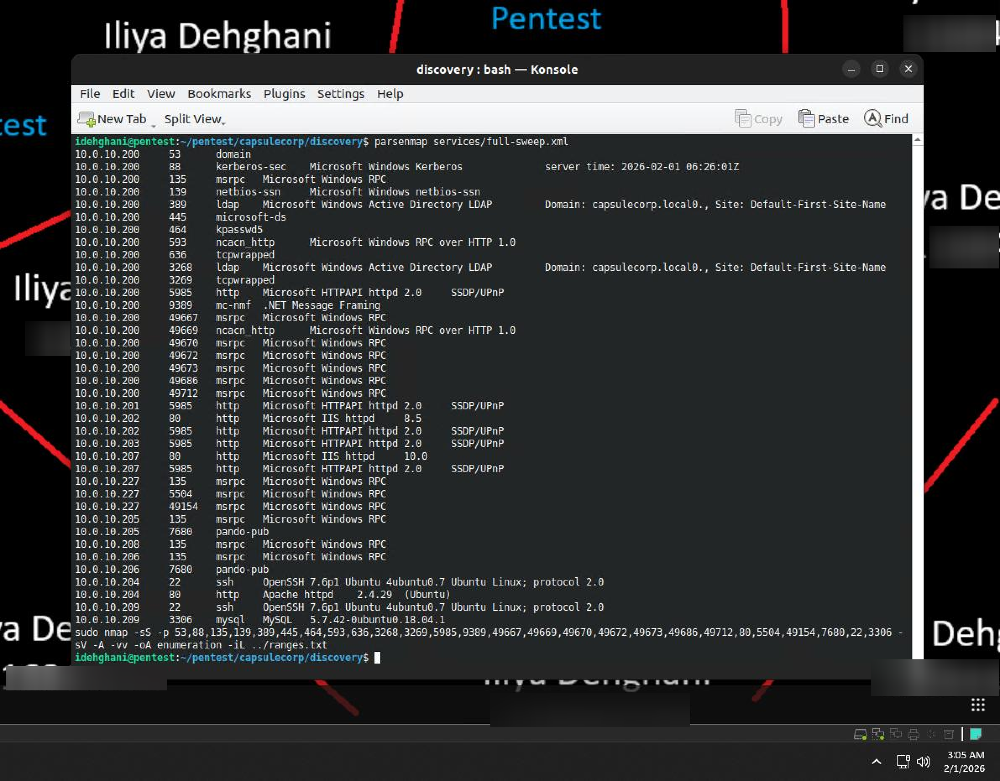
*Figure 3.13 — Condensed service inventory produced by `parsenmap.rb`.*

This inventory lets a tester quickly spot version inconsistencies and high-value targets without manually sifting through thousands of lines of raw XML.

#### 3.3.1 Creating Protocol-Specific Target Lists

To make the collected data actionable, results were partitioned into smaller, protocol-specific files. `parsenmap.rb` outputs tab-delimited data compatible with spreadsheet tools such as LibreOffice Calc:

```
parsenmap services/full-sweep.xml > services/all-ports.csv
```

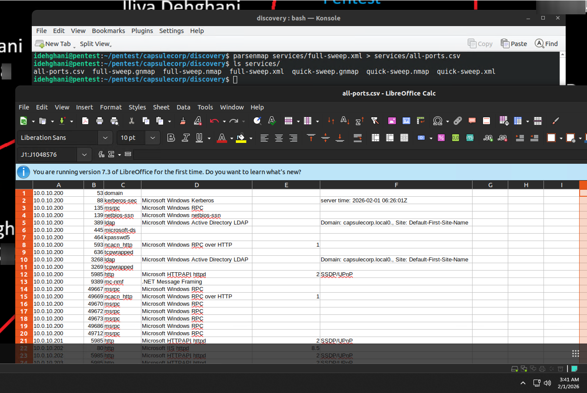
*Figure 3.14 — `all-ports.csv` opened in LibreOffice Calc for sorting and categorization.*

**Exercise 3.1 — Creating protocol-specific target lists.** The consolidated `all-ports.csv` file was used to identify prominent services (HTTP, MySQL, Microsoft-DS, etc.) and build a series of protocol-specific target lists under `discovery/hosts/`, which form the operational basis for Chapter 4's vulnerability discovery work:

| Filename | Protocol | Ports |
|---|---|---|
| `discovery/hosts/dns.txt` | DNS | 53 |
| `discovery/hosts/kerberos.txt` | Kerberos / kpasswd | 88, 464 |
| `discovery/hosts/ldap.txt` | LDAP / LDAPS | 389, 636 |
| `discovery/hosts/ad_gc.txt` | LDAP (Global Catalog) | 3268, 3269 |
| `discovery/hosts/windows.txt` | Microsoft-DS / NetBIOS-SSN | 139, 445 |
| `discovery/hosts/msrpc.txt` | MSRPC / ncacn_http | 135, 593, 49154, 49667, 49669, 49670, 49672, 49673, 49686, 49712, 5504 |
| `discovery/hosts/web.txt` | HTTP | 80, 5985 |
| `discovery/hosts/winrm.txt` | HTTP (WSMan) | 5985 |
| `discovery/hosts/ssh.txt` | SSH | 22 |
| `discovery/hosts/misc_windows.txt` | pando-pub | 7680 |

*Table 3.2 — Protocol-specific target lists.*

## 4. Findings / Observations

| Observation | Detail |
|---|---|
| Wide service diversity across the environment | DNS, SMB, HTTP, SSH, and MySQL services were all identified across the twelve in-scope hosts. |
| A hardened IIS host was identified | 10.0.10.207 suppressed the `X-Powered-By` header, unlike the reference lab environment, indicating a partially hardened configuration. |
| Manual output parsing does not scale | NSE and Gnmap output required progressively more automation (grep pipelines → `parsenmap.rb` → CSV) as scan volume increased. |
| Protocol-specific target lists are a force multiplier | Splitting `all-ports.csv` into per-protocol lists directly streamlined the vulnerability-discovery work in Chapter 4. |

## 5. Conclusion

Chapter 3 converted a flat list of live hosts into a structured, protocol-organized map of the Capsulecorp attack surface. The progression from a simple `curl` banner grab, to a targeted 13-port sweep, to a full 65,535-port aggressive scan, to XML parsing with `parsenmap.rb`, illustrates how service discovery must scale its tooling as data volume grows. The protocol-specific target lists produced here are the direct input to the vulnerability-discovery work covered in Chapter 4.

## 6. References

[1] R. Davis, *The Art of Network Penetration Testing*, Manning Publications, 2020.
