# Chapter 4 — Discovering Network Vulnerabilities
### Companion Lab Report: *The Art of Network Penetration Testing* (Royce Davis, Manning Publications, 2020)

| | |
|---|---|
| **Author** | Iliya Dehghani |
| **Source Lab** | Lab 2 |
| **Lab Environment** | Capsulecorp (VMware Workstation 17 Pro) |
| **Report Type** | Chapter walkthrough / technical lab report |

---

## 1. Objective

Chapter 4 shifts from mapping the network's services (Chapter 3) to assessing whether any of those services are actually exploitable. The chapter's goal is to adopt the perspective of an adversary and interrogate every identified entry point for three categories of weakness: **credential integrity**, **patch management**, and **access control / configuration**.

## 2. Tools Used

| Tool | Purpose |
|---|---|
| NetExec (`nxc`) | SMB/Windows version and configuration auditing, credential spraying |
| Metasploit Framework | MS17-010 scanning, MSSQL/MySQL/VNC credential brute-forcing |
| Medusa | MySQL and Jenkins credential brute-forcing |
| Exploit-DB | Cross-referencing software versions against known public exploits |
| EyeWitness (in place of the book's Webshot) | Automated screenshotting/triage of web-based attack surface |

## 3. Methodology and Walkthrough

### 3.1 Understanding Vulnerability Discovery

Vulnerability discovery follows directly from service discovery, using the protocol-specific target lists produced in Chapter 3 as its primary input. Target lists were built for Windows, HTTP, SSH, and DNS services in this engagement.

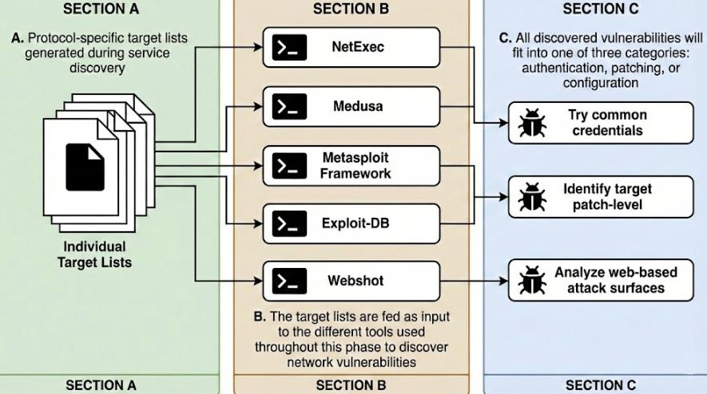
*Figure 4.1 — Vulnerability-discovery workflow, reproduced from [1].*

The process focuses on three objectives:

- **Credential auditing** — attempting authentication with common or default credentials
- **Patch-level identification** — comparing running software versions against known security updates
- **Web surface analysis** — evaluating web-based services for insecure configuration or application-level flaws

Tooling used to execute these objectives included NetExec, Metasploit, and Medusa for credential testing; Exploit-DB for cross-referencing software versions; and EyeWitness for documenting the web attack surface.

#### 3.1.1 Following the Path of Least Resistance

Effective testing prioritizes "low-hanging fruit" (LHF) — vulnerabilities that are easy to identify and exploit with minimal effort — to gain a foothold quickly and with a minimal footprint. MS17-010 (EternalBlue), a critical flaw in the Windows SMB protocol, is a textbook example of an LHF vulnerability and a primary focus of this chapter.

### 3.2 Discovering Patching Vulnerabilities

Identifying patch-related vulnerabilities means comparing the software version running on a target against the vendor's latest stable release. A mismatch generally indicates missing security patches.

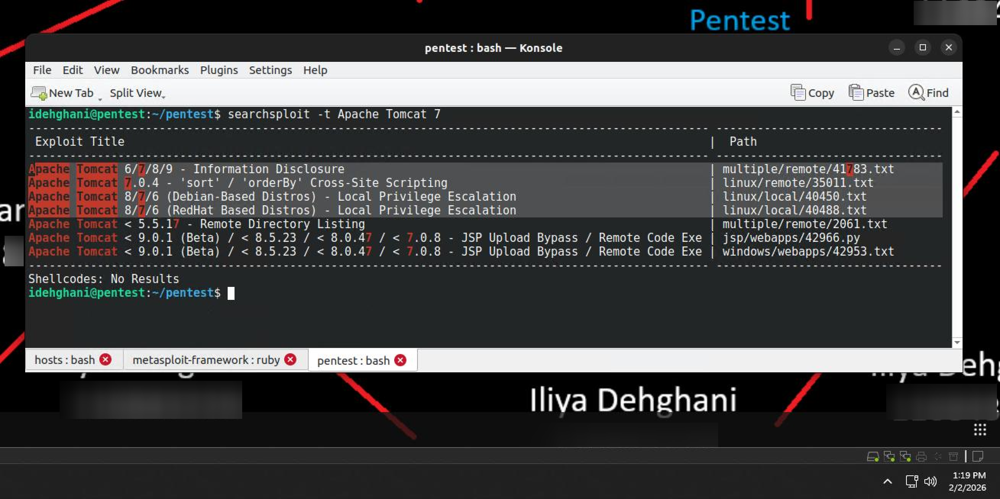
*Figure 4.2 — Cross-referencing Apache Tomcat 7 against Exploit-DB for known RCE vulnerabilities.*

For Windows-centric assessment, NetExec (NXC) was used against the `windows.txt` host list to enumerate SMB versions and configuration:

```
nxc smb discovery/hosts/windows.txt
```

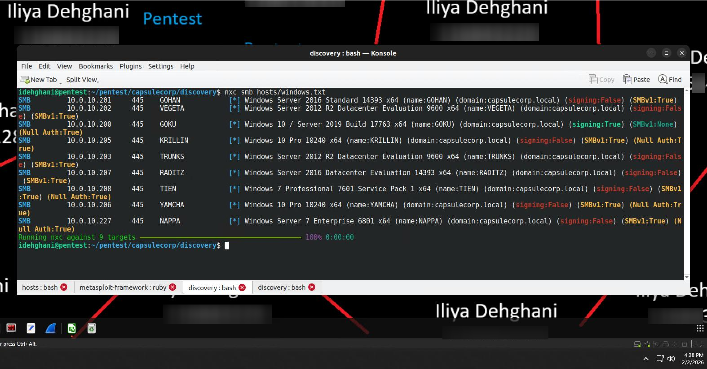
*Figure 4.3 — SMB security posture across the Capsulecorp Windows fleet.*

This scan revealed several critical weaknesses:

- **10.0.10.201 (GOHAN)** — Windows Server 2016; SMBv1 enabled; SMB signing disabled (relay risk)
- **10.0.10.202 (VEGETA)** — Windows Server 2012 R2; SMBv1 enabled; evaluation edition OS
- **10.0.10.200 (GOKU)** — Windows Server 2019; SMB signing enabled; null authentication allowed
- **10.0.10.205 (KRILLIN)** — Windows 10 Pro (Build 10240); outdated OS; SMBv1 enabled; null authentication allowed
- **10.0.10.208 (TIEN)** — Windows 7 SP1; end-of-life OS; SMBv1 enabled
- **10.0.10.227 (NAPPA)** — Windows Server 2008 Enterprise; highly insecure legacy configuration; SMBv1 enabled

The prevalence of SMBv1 and disabled SMB signing across these hosts represents a significant vulnerability to relay attacks and legacy protocol exploitation, compounded by the presence of end-of-life systems like Tien (Windows 7) and outdated builds like Krillin.

#### 3.2.1 Scanning for MS17-010 (EternalBlue)

Metasploit's dedicated scanner module was used to non-intrusively check for MS17-010 by querying the SMB service on each target:

```
use auxiliary/scanner/smb/smb_ms17_010
```

with `RHOSTS` pointed at `windows.txt`.

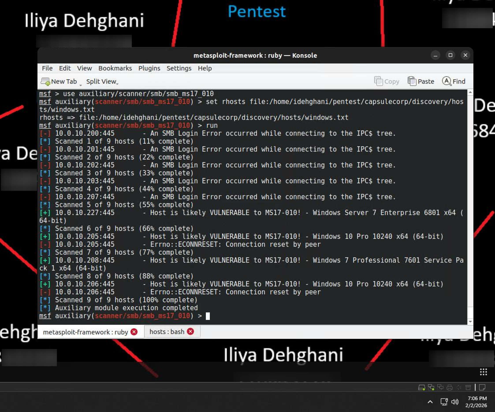
*Figure 4.4 — MS17-010 vulnerability scan results across the Windows fleet.*

Four high-risk systems were identified:

- **10.0.10.227 (NAPPA)** — Windows Server 2008 Enterprise; confirmed vulnerable
- **10.0.10.208 (TIEN)** — Windows 7 Professional SP1; confirmed vulnerable
- **10.0.10.205 (KRILLIN)** and **10.0.10.206 (YAMCHA)** — both Windows 10 Pro (Build 10240); potentially vulnerable, both displaying a "connection reset" typical of specific SMB probing behavior

**Exercise 4.1 — Identifying missing patches.** Beyond SMB, a broader patch-level analysis was conducted for other identified services by cross-referencing software versions against public CVE databases:

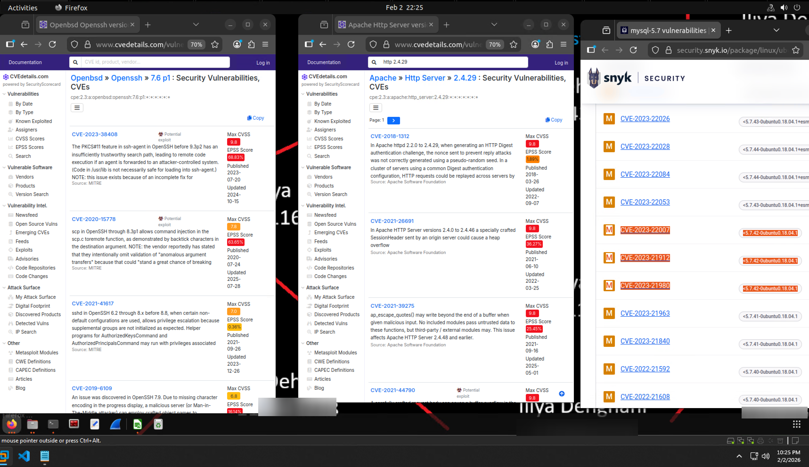
*Figure 4.5 — Version-to-CVE cross-reference summary.*

- **OpenSSH 7.6p1** — evaluated for known authentication bypass / information disclosure flaws [2]
- **Apache HTTP 2.4.29** — interrogated for remote code execution and denial-of-service vulnerabilities [3]
- **MySQL 5.7.42** — analyzed for privilege escalation and data exfiltration vectors [4]

### 3.3 Discovering Authentication Vulnerabilities

An authentication vulnerability is any default, blank, or easily guessable password that can be leveraged for unauthorized access. Brute-force password guessing is the most direct way to detect these weaknesses and is a standard component of every INPT.

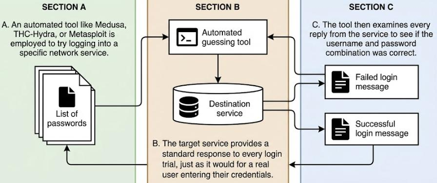
*Figure 4.6 — Conceptual illustration of brute-force credential guessing, reproduced from [1].*

#### 3.3.1 Creating a Client-Specific Password List

Rather than relying on a generic public wordlist, a client-specific list was built targeting default accounts and common complexity-satisfying variants, based on the observation that most users treat password requirements as an obstacle to minimally satisfy:

- **Default accounts:** admin, root, guest, sa
- **Common phrases:** changeme, password
- **Complexity variants:** password1, password!, password1!, P@ssw0rd

**Exercise 4.2 — Creating a Client-Specific Password List.**

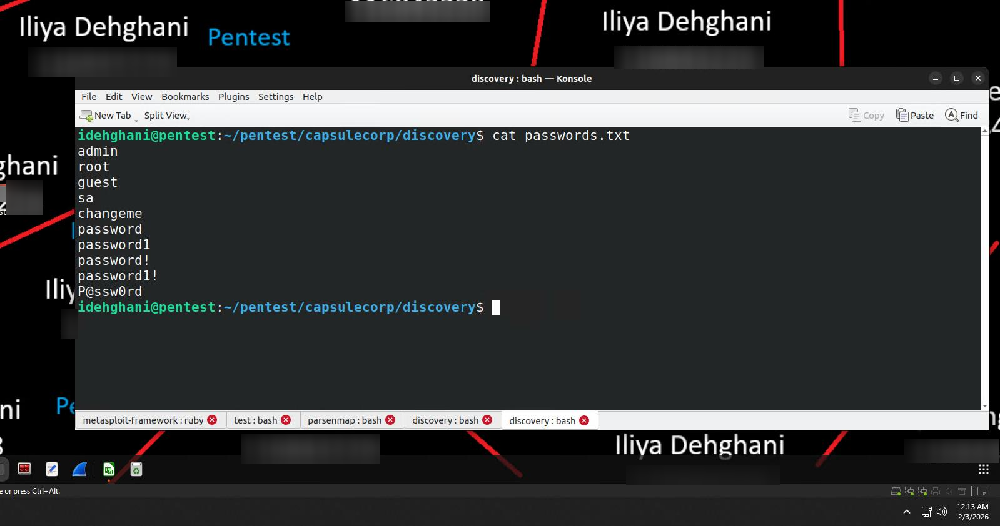
*Figure 4.7 — Custom `passwords.txt` compiled for the Capsulecorp engagement.*

#### 3.3.2 Brute-Forcing Local Windows Account Passwords

Windows environments are prioritized because Active Directory centralizes authentication — compromising one domain-joined system can facilitate escalation to Domain Administrator. Rather than brute-forcing Active Directory accounts directly (risking lockout policies), the local administrator account (UID 500), which is typically excluded from lockout policy, was targeted instead:

```
nxc smb discovery/hosts/windows.txt -u Administrator -p passwords.txt --local-auth | grep "Pwn3d"
```

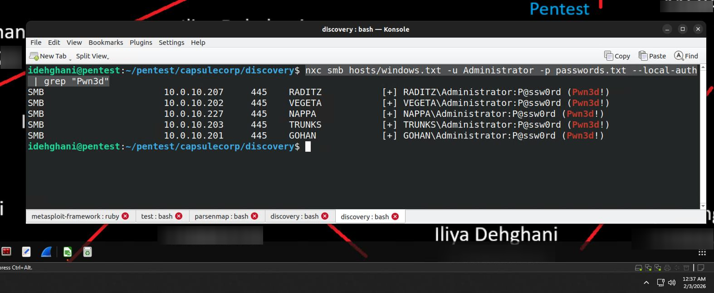
*Figure 4.8 — Successful local administrator authentications flagged with "Pwn3d!".*

The password `P@ssw0rd` successfully authenticated as local administrator on:

- Gohan
- Vegeta
- Trunks
- Raditz
- Nappa

#### 3.3.3 Brute-Forcing MSSQL and MySQL Database Passwords

Database servers were targeted next using Metasploit's specialized auxiliary modules. Against MSSQL, the default `sa` account was tested on Gohan via `auxiliary/scanner/mssql/mssql_login`:

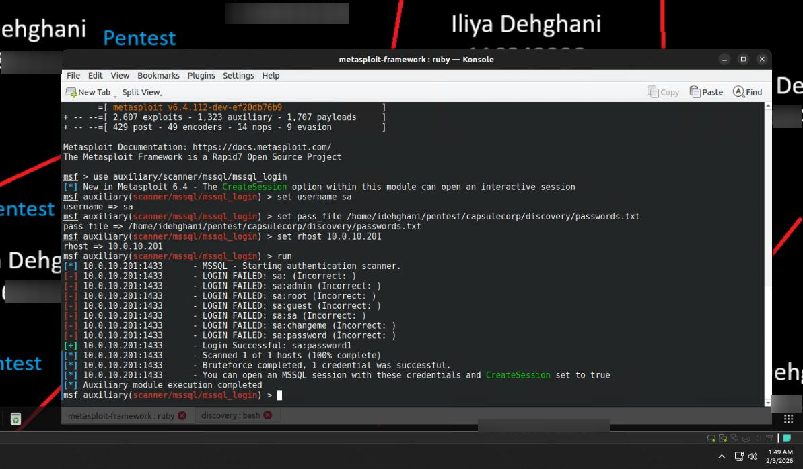
*Figure 4.9 — Valid credential pair `sa:password1` identified on Gohan.*

Against MySQL on the host Nail, the default `root` account was tested with `auxiliary/scanner/mysql/mysql_login`:

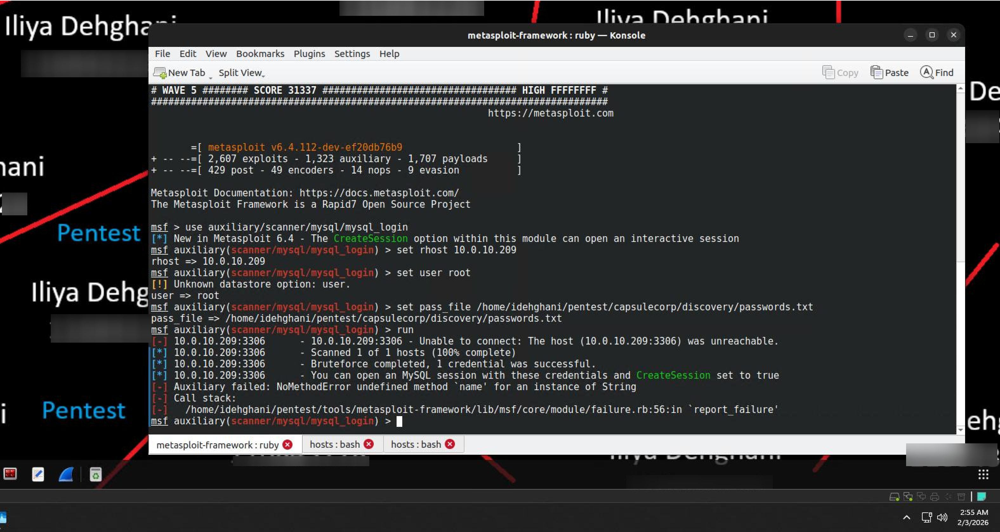
*Figure 4.10 — MySQL credential audit against Nail.*

Medusa was additionally used to validate whether the MySQL service was reachable remotely or restricted to loopback-only access:

```
medusa -M mysql -H discovery/hosts/mysql.txt -u root -P passwords.txt
```

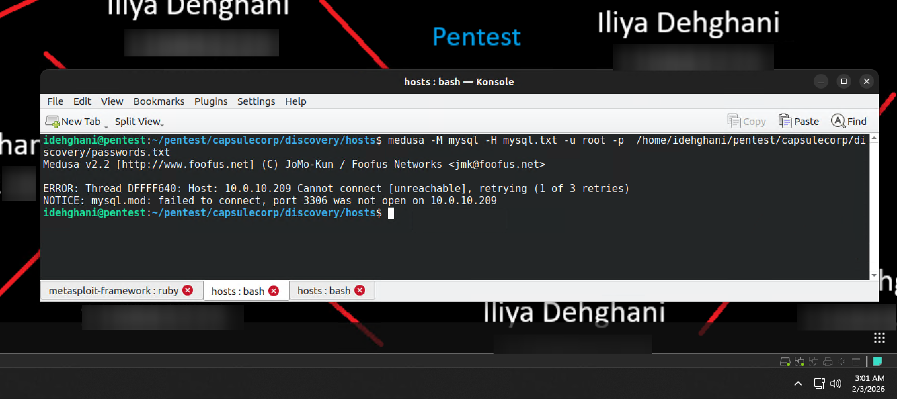
*Figure 4.11 — Medusa was unable to establish a remote connection, confirming the MySQL service was bound to `127.0.0.1` only.*

#### 3.3.4 Brute-Forcing VNC Passwords

VNC remains common in corporate environments despite lacking built-in encryption and centralized authentication integration, and frequently lacks account lockout — making it an ideal brute-force target. The `vnc_login` auxiliary module was used against Krillin:

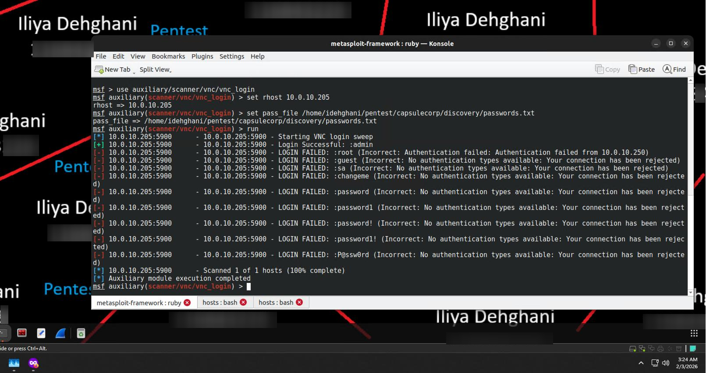
*Figure 4.12 — Weak VNC administrative password `admin` identified on Krillin.*

This compromise permits direct, unencrypted remote desktop access to the host.

**Exercise 4.3 — Discovering weak passwords.** Additional services assessed:

- **Trunks (Apache Tomcat via XAMPP):** exploited via `auxiliary/scanner/http/tomcat_mgr_login`, recovering credentials `admin:admin`
- **Vegeta (Jenkins automation server):** brute-forced with Medusa, recovering credentials `admin:admin`

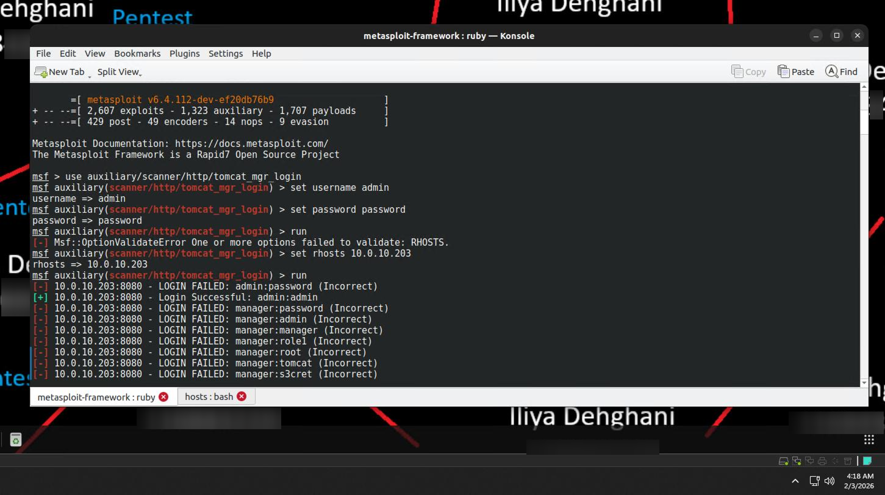
*Figure 4.13 — Tomcat Manager compromised with default credentials `admin:admin`.*

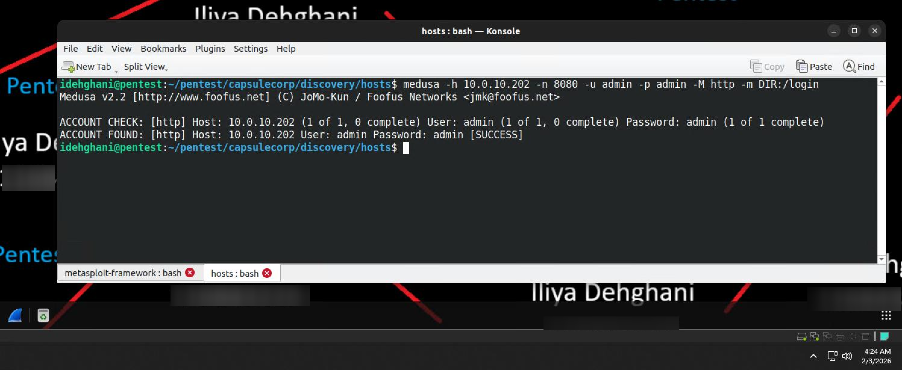
*Figure 4.14 — Jenkins administrative credentials recovered via brute force.*

### 3.4 Discovering Configuration Vulnerabilities

Web servers are a reliably efficient gateway to code execution during an INPT. Large environments often run hundreds of HTTP services, many deployed by administrators unaware of auxiliary web interfaces running on non-standard ports — interfaces that frequently retain unmodified default credentials.

#### 3.4.1 Setting Up Automated Web Triage

The book's reference tool, Webshot, could not be used due to dependency/versioning issues, so **EyeWitness** was substituted to fulfill the same role: automated screenshotting and categorization of the web attack surface.

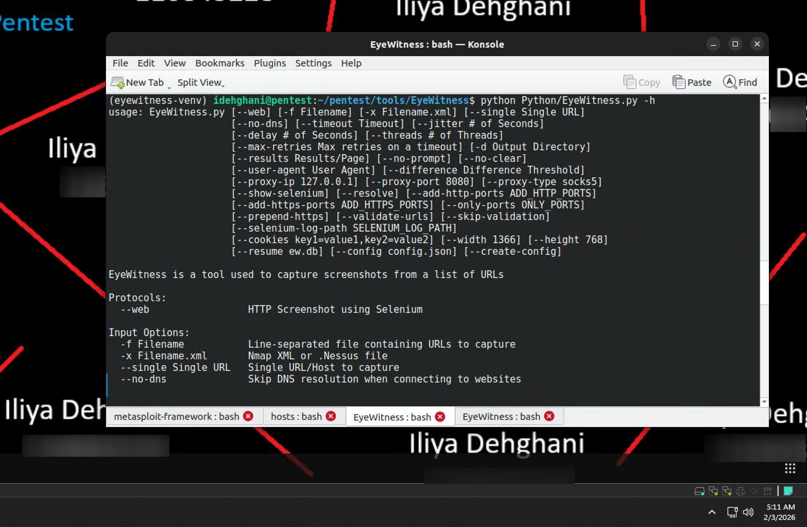
*Figure 4.15 — EyeWitness help menu.*

#### 3.4.2 Analyzing Output from the Web Triage Tool

EyeWitness output lets a tester quickly navigate a large set of web servers via a gallery of thumbnails, immediately surfacing systems with likely attack vectors such as default management consoles or unhardened login portals.

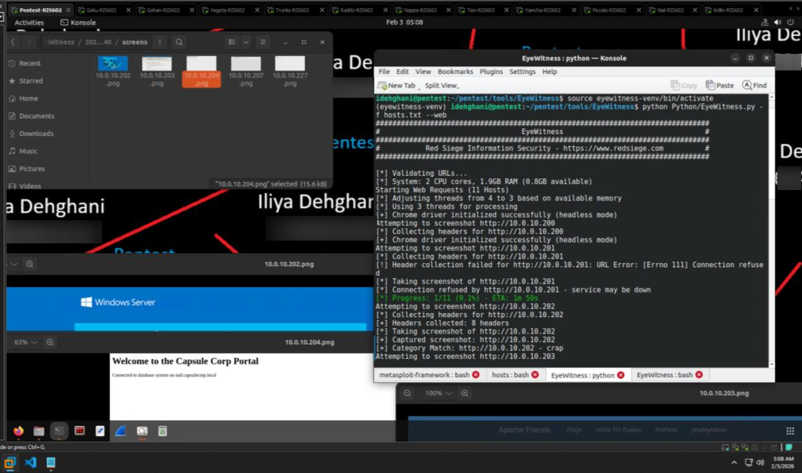
*Figure 4.16 — EyeWitness thumbnail gallery of Capsulecorp web services.*

#### 3.4.3 Manual Credential Validation

Following automated triage, manual login attempts confirmed whether default or easily guessable credentials identified in earlier sub-phases granted genuine administrative access to the web management interfaces.

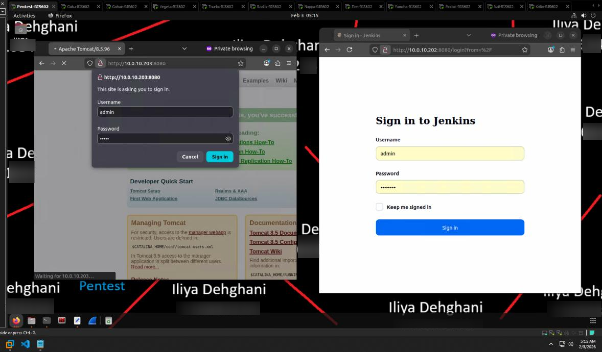
*Figure 4.17 — Manual confirmation of administrative access using previously recovered credentials.*

## 4. Findings / Observations

| # | Finding | Severity | Affected Hosts |
|---|---|---|---|
| 1 | SMBv1 enabled with signing disabled on multiple hosts | High | Gohan, Vegeta, Krillin, Tien, Nappa |
| 2 | MS17-010 (EternalBlue) confirmed or likely present | Critical | Nappa, Tien, Krillin, Yamcha |
| 3 | Local administrator credential reuse (`P@ssw0rd`) | High | Gohan, Vegeta, Trunks, Raditz, Nappa |
| 4 | Default MSSQL `sa` credentials (`sa:password1`) | High | Gohan |
| 5 | Weak VNC credentials (`admin`) | High | Krillin |
| 6 | Default Apache Tomcat Manager credentials (`admin:admin`) | High | Trunks |
| 7 | Default Jenkins credentials (`admin:admin`) | High | Vegeta |
| 8 | End-of-life / unsupported operating systems in production | Medium | Tien (Windows 7), Nappa (Windows Server 2008) |

## 5. Conclusion

Chapter 4 converted the network map built in Chapter 3 into a concrete list of exploitable weaknesses, exposing a highly susceptible internal environment. The systematic compromise of multiple local administrator accounts, a database server, a VNC service, and two web management consoles — almost entirely through default or weak credentials — demonstrates that current security controls are insufficient against basic, automated credential attacks. These findings form the prioritized target list carried forward into the focused-penetration work covered in Chapter 5.

## 6. References

[1] R. Davis, *The Art of Network Penetration Testing*, Manning Publications, 2020.

[2] CVEdetails.com, "OpenSSH 7.6p1 Security Vulnerabilities." [Online]. Available: https://www.cvedetails.com/vulnerability-list/vendor_id-97/product_id-585/version_id-1295239/Openbsd-Openssh-7.6.html

[3] CVEdetails.com, "HTTP Server 2.4.29 Security Vulnerabilities." [Online]. Available: https://www.cvedetails.com/vulnerability-list/vendor_id-45/product_id-66/version_id-576122/Apache-Http-Server-2.4.29.html

[4] Snyk Ltd., "mysql-5.7 vulnerabilities." [Online]. Available: https://security.snyk.io/package/linux/ubuntu%3A18.04/mysql-5.7
