# Chapter 5 — Attacking Vulnerable Web Services
### Companion Lab Report: *The Art of Network Penetration Testing* (Royce Davis, Manning Publications, 2020)

| | |
|---|---|
| **Author** | Iliya Dehghani |
| **Source Lab** | Lab 3 |
| **Lab Environment** | Capsulecorp (VMware Workstation 17 Pro) |
| **Report Type** | Chapter walkthrough / technical lab report |

---

## 1. Objective

Chapter 5 marks the transition from Phase 1 (information gathering) into **Phase 2: Focused Penetration** — actively exploiting the vulnerabilities identified in Chapters 3–4 to gain an initial foothold on the target network. This report documents the exploitation of an Apache Tomcat server via a malicious WAR file, privilege/shell upgrades using the Sticky Keys backdoor, and remote code execution on a Jenkins server via its Groovy script console.

## 2. Tools Used

| Tool | Purpose |
|---|---|
| Apache Tomcat Web Application Manager | Deploying a custom WAR-packaged web shell |
| Custom JSP web shell (`index.jsp`) | Non-interactive OS command execution via a GET parameter |
| `cacls.exe` / `takeown.exe` / `icacls.exe` | Modifying Windows file ACLs to enable the Sticky Keys backdoor |
| `rdesktop` | RDP access to trigger the Sticky Keys backdoor |
| Jenkins Groovy Script Console | Remote code execution via the built-in scripting engine |

## 3. Methodology and Walkthrough

### 3.1 Understanding Phase 2: Focused Penetration

Phase 2 shifts the objective from reconnaissance to active exploitation of the vulnerabilities confirmed during information gathering. The goal at this stage is to secure an initial position within the target infrastructure and gain access to restricted network segments.

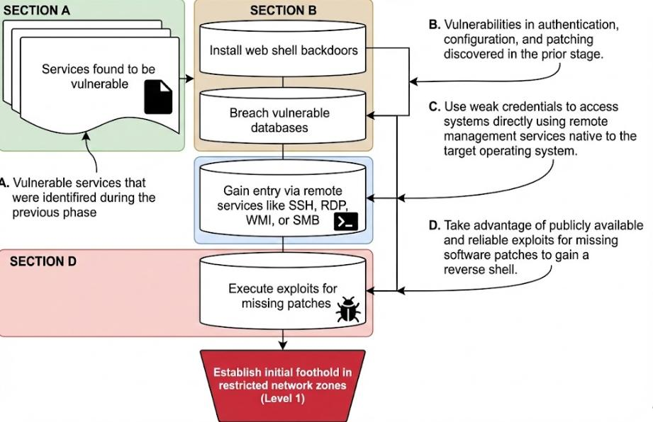
*Figure 5.1 — Focused-penetration workflow, reproduced from [1].*

The objective is complete network control, simulating an attacker's search for unrestricted access by methodically infiltrating systems to uncover credentials or active domain administrator sessions. A disciplined exploitation sequence is followed: prioritize online services, advance to remote management interfaces, and finish with exploitation of unpatched vulnerabilities.

#### 3.1.1 Deploying Backdoor Web Shells

Many enterprise platforms expose administrative management interfaces that, when accessible, allow direct deployment of a custom web shell or use of a built-in script console for OS command execution. Per Davis [1], common platforms with this attack vector include:

- JBoss (JMX Console and Application Server)
- Oracle GlassFish
- phpMyAdmin
- Hadoop HDFS Web UI
- Dell iDRAC

#### 3.1.2 Accessing Remote Management Services

Default, blank, or weak credentials discovered during information gathering are often the fastest route to a breach, enabling rapid authentication to administrator-facing Remote Management Interfaces (RMIs). Commonly exploited interfaces include RDP, SSH, WMI, SMB/CIFS, and IPMI.

#### 3.1.3 Exploiting Missing Software Patches

Software exploitation relies on known vulnerabilities within an application or OS. MS17-010 (EternalBlue) is cited as an exemplary case — a highly precise and reliable exploit against susceptible targets, covered hands-on in Chapter 7.

### 3.2 Gaining an Initial Foothold

When valid credentials aren't available, exploiting a system weakness is often necessary to gain initial access — a calculated risk, since manual changes or new access points may be detectable by administrators. The objective is to use these initial exploits to establish a foothold that can later be used to obtain legitimate credentials, reversing any intrusive changes once elevated access is achieved to preserve stealth.

### 3.3 Compromising a Vulnerable Tomcat Server

An Apache Tomcat server functions like an elevator system controlling access to multiple web applications, each potentially requiring different credentials. The vulnerability here is a management interface secured only by default credentials, granting administrative access comparable to a master key. This allows deployment of a custom JSP web shell packaged inside a Web Application Archive (WAR) file, giving direct access to the underlying host OS without needing application-specific credentials.

#### 3.3.1 Creating a Malicious WAR File

A WAR file is a single compressed archive containing a complete JSP application structure. The web shell used here accepts a GET parameter, `cmd`, whose value is passed to `Runtime.getRuntime().exec()` at the OS level, with the result rendered back to the browser — a simple but effective non-interactive shell.

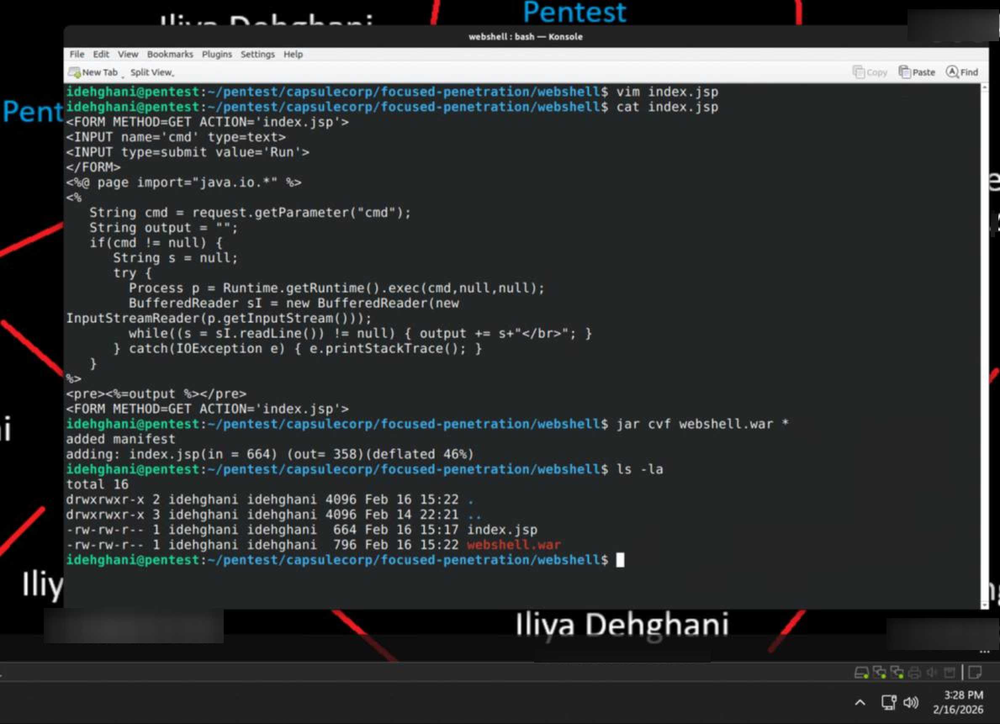
*Figure 5.2 — `index.jsp` web shell source, packaged into `webshell.war`.*

#### 3.3.2 Deploying the WAR File

The Tomcat server was accessed on port 8080, the Manager App was selected, and login was performed using default credentials `admin:admin`.

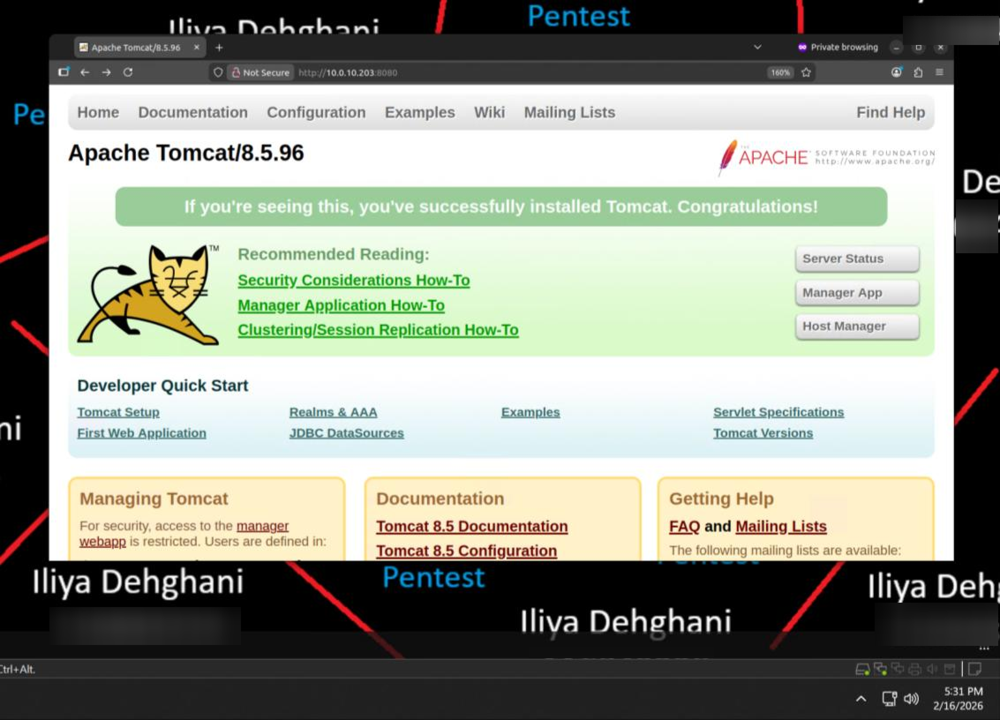
*Figure 5.3 — Trunks VM Tomcat server on port 8080.*

The Manager interface's "WAR File to Deploy" section was used to browse to and deploy `webshell.war`. This constitutes an installed backdoor that must be documented and removed during post-engagement cleanup.

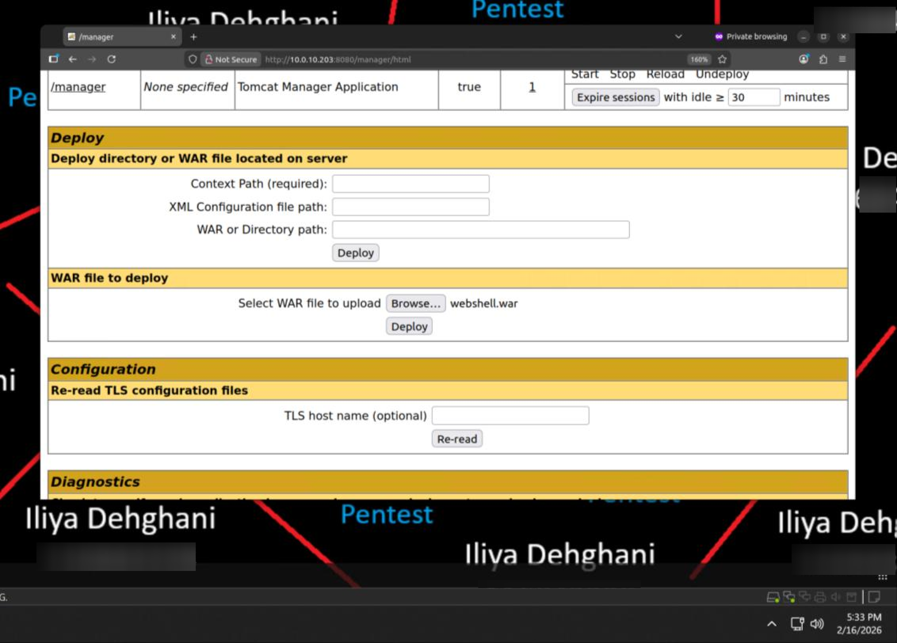
*Figure 5.4 — Deploying `webshell.war` via the Tomcat Manager interface.*

#### 3.3.3 Accessing the Web Shell from a Browser

Once deployed, the application appeared in the management table and was accessible via direct link.

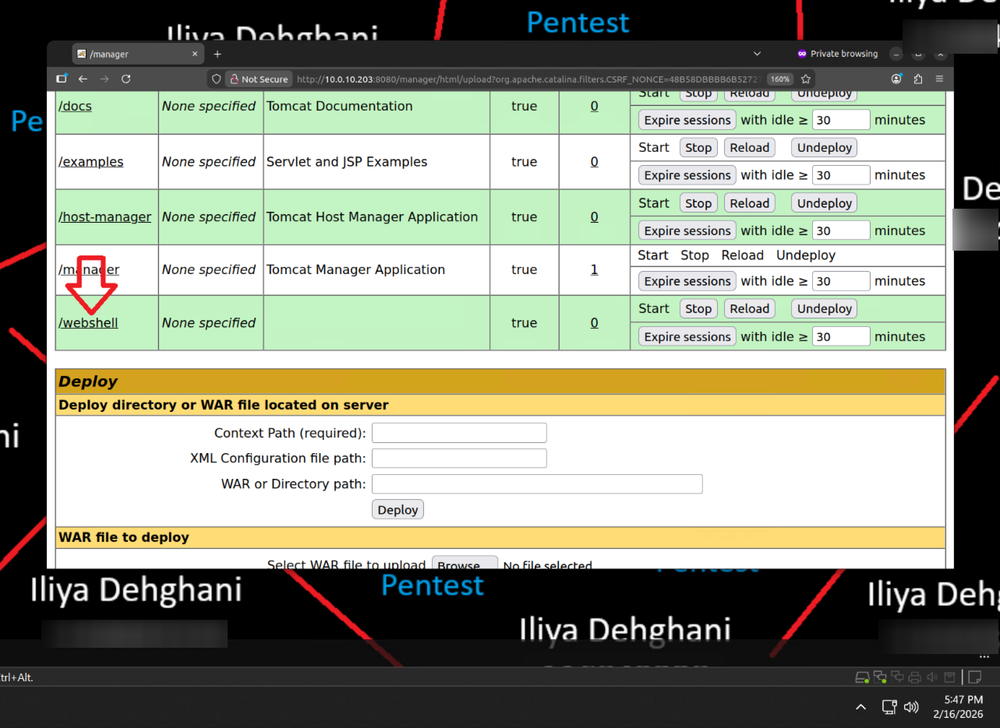
*Figure 5.5 — Deployed web shell listed in the Tomcat application table.*

`ipconfig /all` was run through the shell for demonstration, confirming Active Directory domain details in addition to the host's IP configuration.

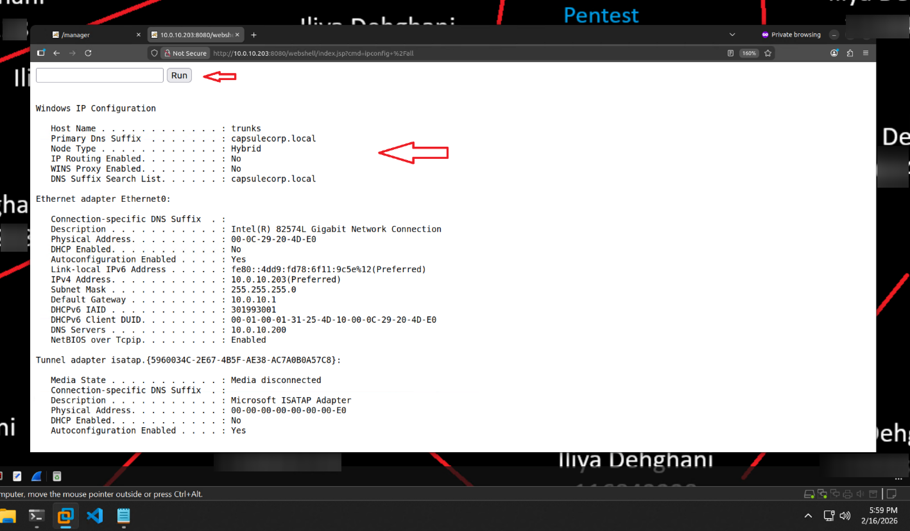
*Figure 5.6 — `ipconfig /all` executed through the JSP web shell.*

**Exercise 5.1 — Deploying a malicious WAR file.** Completed as part of the preceding walkthrough: the shell was uploaded to the Tomcat server and OS-level command execution was confirmed.

### 3.4 Interactive vs. Non-Interactive Shells

The access gained on the Tomcat server is a **non-interactive shell** — unlike an interactive shell, it cannot process multi-stage commands requiring user input (e.g., confirmation prompts). Commands must therefore be structured for unattended execution (e.g., using `-y` flags in package managers). Common commands compatible with non-interactive shells:

| Purpose | Windows | Linux/UNIX/Mac |
|---|---|---|
| IP address information | `ipconfig /all` | `ifconfig` |
| List running processes | `tasklist /v` | `ps aux` |
| Environment variables | `set` | `export` |
| List current directory | `dir /ah` | `ls -lah` |
| Display file contents | `type [FILE]` | `cat [FILE]` |
| Copy a file | `copy [SRC] [DEST]` | `cp [SRC] [DEST]` |
| Search a file for a string | `type [FILE] \| find /I [STRING]` | `cat [FILE] \| grep [STRING]` |

*Table 5.1 — OS commands safe for non-interactive shells, reproduced from [1].*

### 3.5 Upgrading to an Interactive Shell

Moving to an interactive shell is a priority once a foothold is established. On Windows targets, this can be achieved via the **Sticky Keys backdoor**: pressing Shift five times launches `C:\Windows\System32\sethc.exe`; replacing this binary with `cmd.exe` launches an elevated command prompt instead.

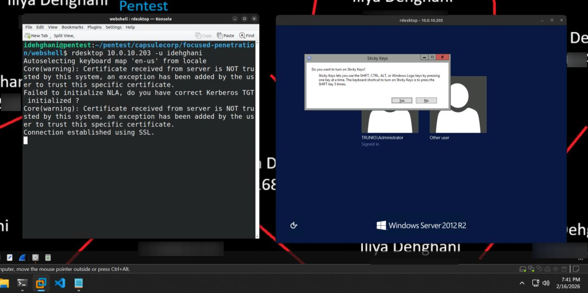
*Figure 5.7 — Sticky Keys accessibility prompt, the trigger mechanism for this backdoor.*

#### 3.5.1 Backing Up `sethc.exe`

Before replacement, a backup was taken to allow restoration post-engagement:

```
cmd.exe /c copy c:\windows\system32\sethc.exe c:\windows\system32\sethc.exe.backup
```

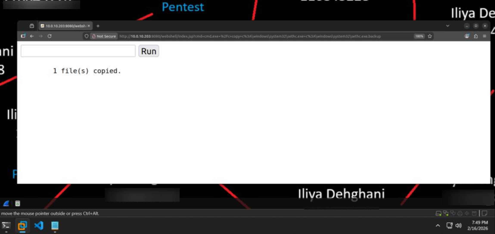
*Figure 5.8 — Confirmed backup of `sethc.exe`.*

By default, `sethc.exe` is read-only even for local administrators, so a direct overwrite fails with "Access Denied."

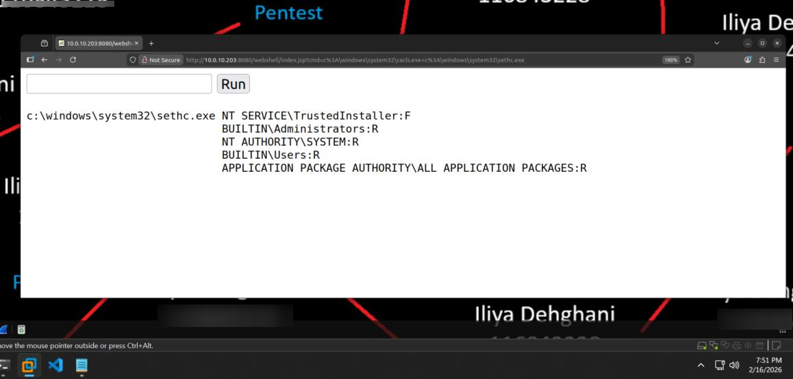
*Figure 5.9 — `cacls.exe` output confirming Read-only (R) permissions on `sethc.exe`.*

#### 3.5.2 Modifying File ACLs with `cacls.exe`

A direct attempt to elevate permissions from Read (R) to Full Control (F) using `cacls.exe` failed, because protected Windows system files restrict even administrators to read/execute access — administrators do not own the file, so they cannot directly modify its security descriptor. The correct two-step approach is to first take ownership, then grant permissions:

```
takeown /f "C:\Windows\System32\sethc.exe" /a
icacls "C:\Windows\System32\sethc.exe" /grant administrators:F
```

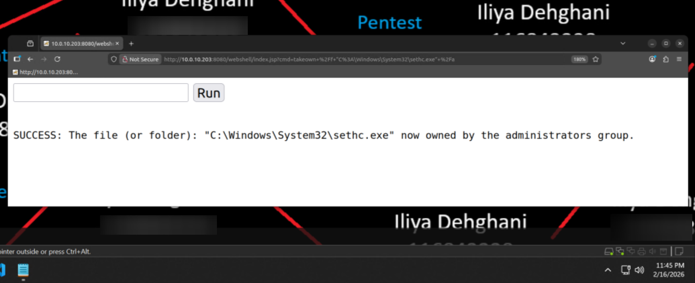
*Figure 5.10 — `takeown.exe` establishing administrator ownership of `sethc.exe`.*

With ownership established, Full Control was granted to the Administrators group:

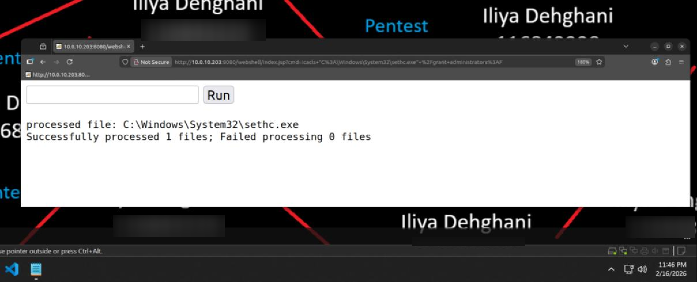
*Figure 5.11 — `icacls.exe` confirming the Full Control grant to `administrators` was successfully applied.*

Permissions were then rechecked and confirmed as Full Control:

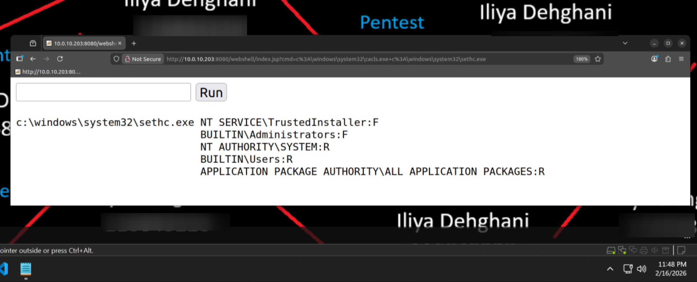
*Figure 5.12 — `cacls.exe` confirming `BUILTIN\Administrators` now has Full Control (F).*

`sethc.exe` was then replaced with `cmd.exe`, using `/Y` to suppress the overwrite confirmation prompt (required, since the JSP shell is non-interactive):

```
cmd.exe /c copy c:\windows\system32\cmd.exe c:\windows\system32\sethc.exe /Y
```

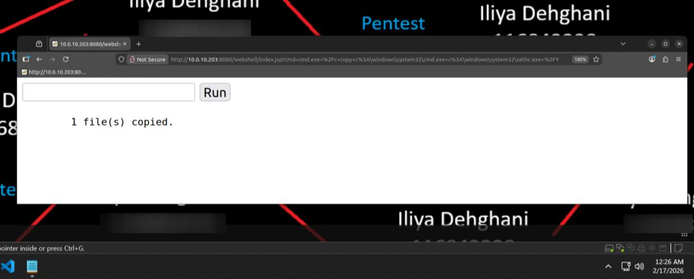
*Figure 5.13 — Confirmed replacement of `sethc.exe` with `cmd.exe`.*

#### 3.5.3 Launching Sticky Keys via RDP

An RDP session was opened with `rdesktop 10.0.10.203`, and pressing Shift five times triggered a fully interactive **SYSTEM-level** command prompt — a privilege level exceeding standard administrator rights, because the replaced binary is launched by `winlogon.exe`, the process responsible for the pre-authentication logon screen.

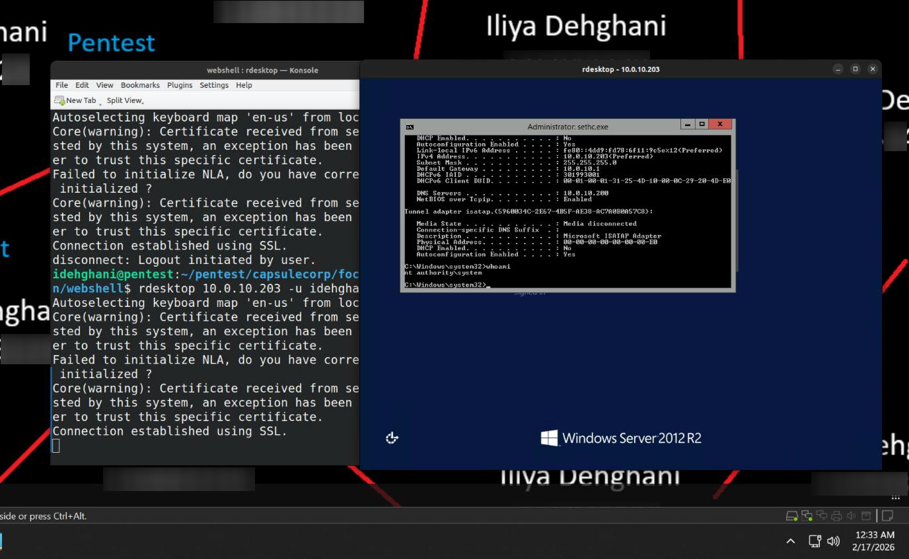
*Figure 5.14 — SYSTEM-level interactive shell obtained via the Sticky Keys backdoor.*

This technique's success depends entirely on RDP being enabled on the target — without RDP connectivity, an alternate approach to shell upgrade would be required.

### 3.6 Compromising a Vulnerable Jenkins Server

A second web-based attack vector was present in the lab: a Jenkins automation server with a weak password. Jenkins ships with a Groovy Script Console plugin enabled by default, providing a reliable remote code execution path.

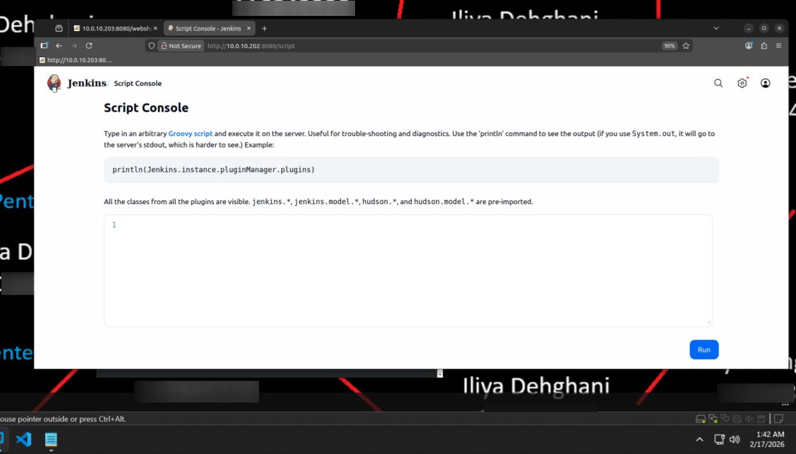
*Figure 5.15 — Jenkins Groovy Script Console accessed via `/script`.*

#### 3.6.1 Groovy Script Console Execution

Groovy's `.execute()` method allows execution of arbitrary OS commands from a string — for example, `ipconfig /all`.

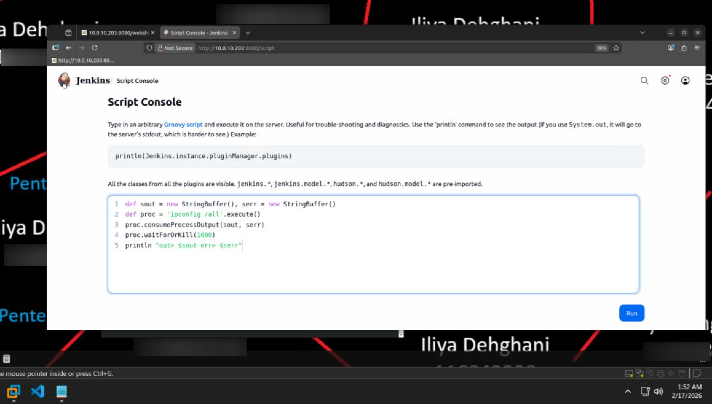
*Figure 5.16 — Groovy script executing `ipconfig /all` on the Jenkins host.*

Output is rendered immediately below the script input box:

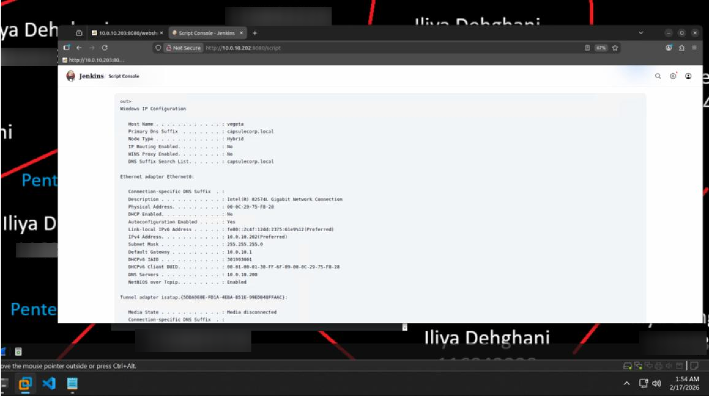
*Figure 5.17 — Command output rendered in the Jenkins console, effectively functioning as a built-in non-interactive web shell.*

## 4. Findings / Observations

| # | Finding | Severity | Affected Host |
|---|---|---|---|
| 1 | Default Tomcat Manager credentials permit arbitrary WAR deployment (RCE) | Critical | Trunks (10.0.10.203) |
| 2 | Sticky Keys backdoor achievable due to unrestricted RDP + local admin access | High | Trunks (10.0.10.203) |
| 3 | Default Jenkins credentials expose the Groovy Script Console (RCE) | Critical | Vegeta (10.0.10.202) |

## 5. Conclusion

Chapter 5 demonstrated two independent, fully successful paths to remote code execution driven entirely by weak default credentials on administrative web interfaces — Tomcat Manager and the Jenkins Groovy console. The Sticky Keys technique further shows how a non-interactive foothold can be escalated to a fully interactive, SYSTEM-level shell when RDP is exposed. These initial footholds, along with the access gained on Trunks and Vegeta, set up the credential- and database-focused exploitation covered in Chapter 6.

## 6. References

[1] R. Davis, *The Art of Network Penetration Testing*, Manning Publications, 2020.

[2] B. Gavin, "Q: Using CACLS on a protected file such as WMIC.EXE," Stack Overflow, 19 December 2018. [Online]. Available: https://stackoverflow.com/questions/53860574/q-using-cacls-on-a-protected-file-such-as-wmic-exe
