# Chapter 6 — Attacking Vulnerable Database Services
### Companion Lab Report: *The Art of Network Penetration Testing* (Royce Davis, Manning Publications, 2020)

| | |
|---|---|
| **Author** | Iliya Dehghani |
| **Source Lab** | Lab 3 |
| **Lab Environment** | Capsulecorp (VMware Workstation 17 Pro) |
| **Report Type** | Chapter walkthrough / technical lab report |

---

## 1. Objective

Building on the web-service compromises documented in Chapter 5, Chapter 6 shifts focus to **Microsoft SQL Server (MSSQL)** as an additional Phase 2 attack vector. Web and database services are commonly integrated — compromising an application like Tomcat often exposes database credentials in configuration files — and this report documents using discovered MSSQL credentials to achieve host-level command execution and extract Windows password hashes.

## 2. Tools Used

| Tool | Purpose |
|---|---|
| Metasploit (`mssql_login`, `mssql_enum`) | Validating MSSQL credentials and enumerating stored-procedure configuration |
| `mssqlclient.py` (Impacket) | Interactive MSSQL connection used in place of the incompatible `mssql-cli` |
| `xp_cmdshell` (MSSQL stored procedure) | OS-level command execution via the database service |
| `reg.exe` | Copying the SAM/SYSTEM registry hives |
| `secretsdump.py` (Impacket) | Offline extraction of local NTLM password hashes, in place of the deprecated `creddump` |

## 3. Methodology and Walkthrough

### 3.1 Compromising Microsoft SQL Server

To use MSSQL as an access vector, valid credentials are required first. The `sa` account on host 10.0.10.201 was found to be configured with the password `Password1`, verified using Metasploit's `mssql_login` auxiliary module.

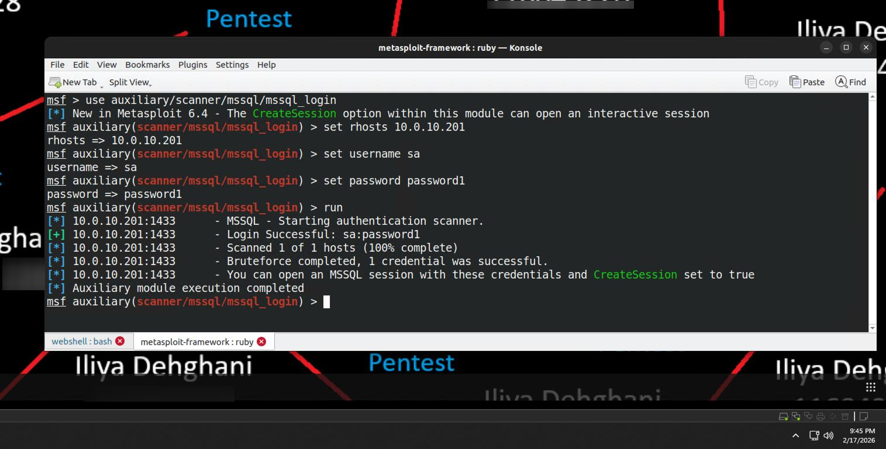
*Figure 6.1 — MSSQL credential validation via Metasploit's `mssql_login` module.*

With authenticated access confirmed, two attack vectors become available per Davis [1]:

1. **Database enumeration** — raw SQL queries to retrieve sensitive data (usernames, passwords, PII, financial records, network schematics)
2. **OS-level exploitation** — using the `xp_cmdshell` stored procedure to execute operating system commands and gain host-level control

The primary objective for this engagement was achieving host-level control via `xp_cmdshell`.

#### 3.1.1 MSSQL Stored Procedures

Stored procedures function like reusable methods, encapsulating complex SQL logic into named, callable entities. MSSQL ships with a set of "system stored procedures," some of which interact directly with the host OS — `xp_cmdshell` being the most significant for exploitation purposes. It accepts an OS command as an argument, executes it under the MSSQL service account's security context, and returns the output as a SQL response. Microsoft disables this by default in modern installations precisely because of its history of abuse by attackers and testers alike.

#### 3.1.2 Enumerating MSSQL Servers with Metasploit

The `mssql_enum` module was used to assess server configuration after credential verification.

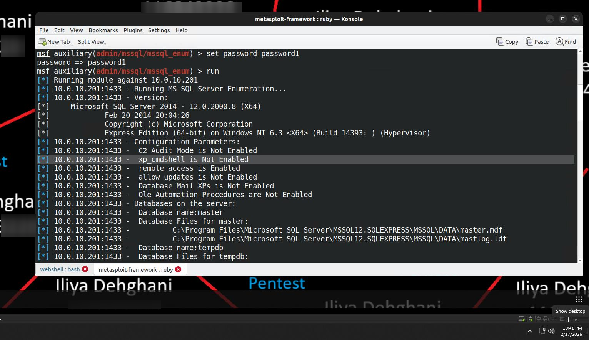
*Figure 6.2 — `mssql_enum` output confirming `xp_cmdshell` was disabled by default.*

#### 3.1.3 Enabling `xp_cmdshell`

`xp_cmdshell` is disabled by default but can be re-enabled by an attacker holding `sa` credentials or an equivalent administrative database role. Initial attempts to use the modern `sqlcmd` utility and the deprecated `mssql-cli` failed due to a software compatibility mismatch between the Ubuntu 22.04 attacker VM and the legacy MSSQL 2014 server.

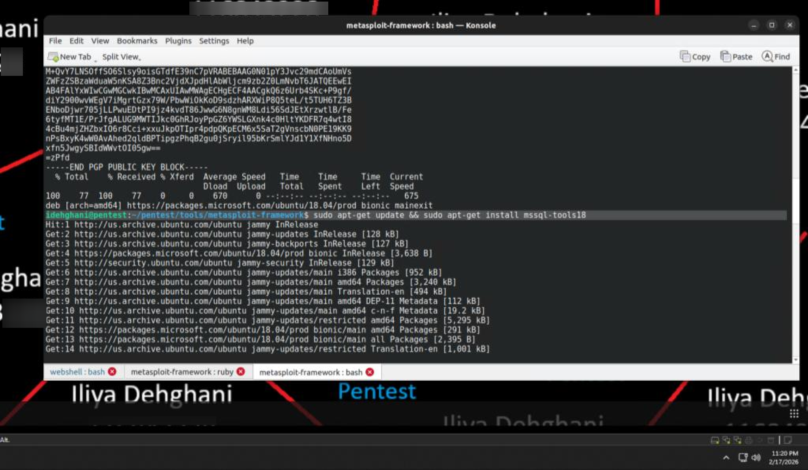
*Figure 6.3 — Attempted installation of the modern `sqlcmd` command-line tools (`mssql-tools18`).*

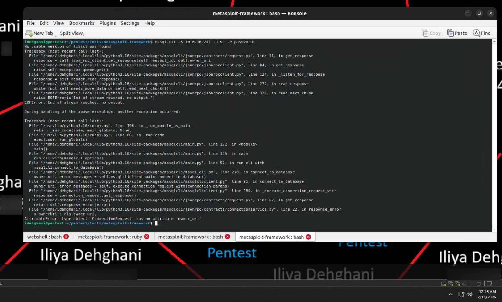
*Figure 6.4 — Version incompatibility between `mssql-cli` and the target MSSQL 2014 instance.*

A Python virtual environment using Impacket's `mssqlclient.py` was used instead, successfully connecting with:

```
mssqlclient.py sa:password1@10.0.10.201
```

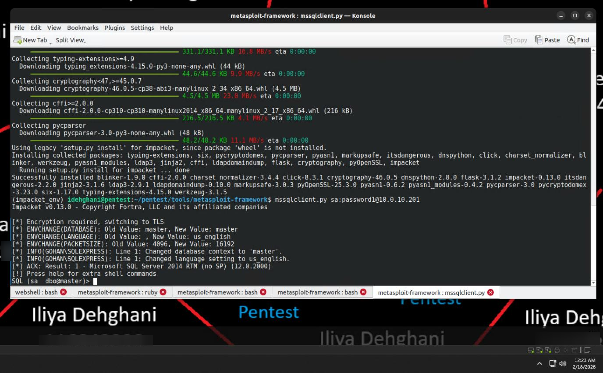
*Figure 6.5 — Interactive MSSQL session established via Impacket.*

Because `xp_cmdshell` is an advanced configuration option, enabling it requires two steps. First, advanced options were enabled:

```sql
sp_configure 'show advanced options', '1';
RECONFIGURE;
```

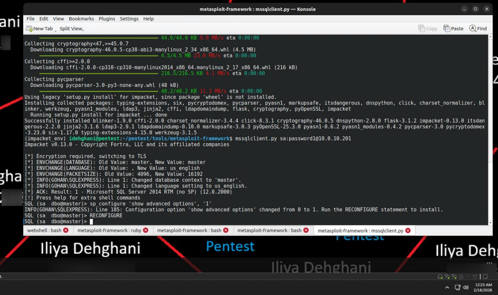
*Figure 6.6 — Advanced configuration options enabled — a change that must be documented for post-engagement reversal.*

Then `xp_cmdshell` itself was enabled:

```sql
sp_configure 'xp_cmdshell', '1';
RECONFIGURE;
```

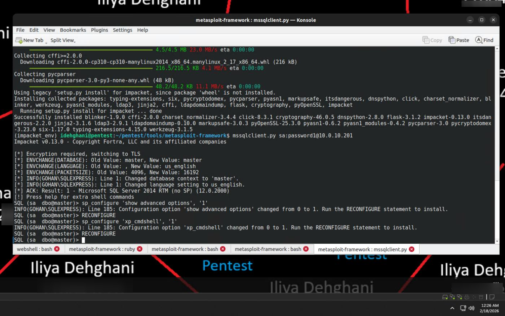
*Figure 6.7 — `xp_cmdshell` successfully enabled, allowing OS commands via the SQL interface.*

#### 3.1.4 Running OS Commands with `xp_cmdshell`

With `xp_cmdshell` enabled, the MSSQL server became an entry point for OS command execution — functionally a non-interactive shell (single-line commands only, no interactive prompts). The service account context was identified with:

```sql
exec master..xp_cmdshell 'whoami'
```

confirming execution as `NT SERVICE\MSSQLSERVER`. Local administrator group membership was then checked:

```sql
exec master..xp_cmdshell 'net localgroup administrators'
```

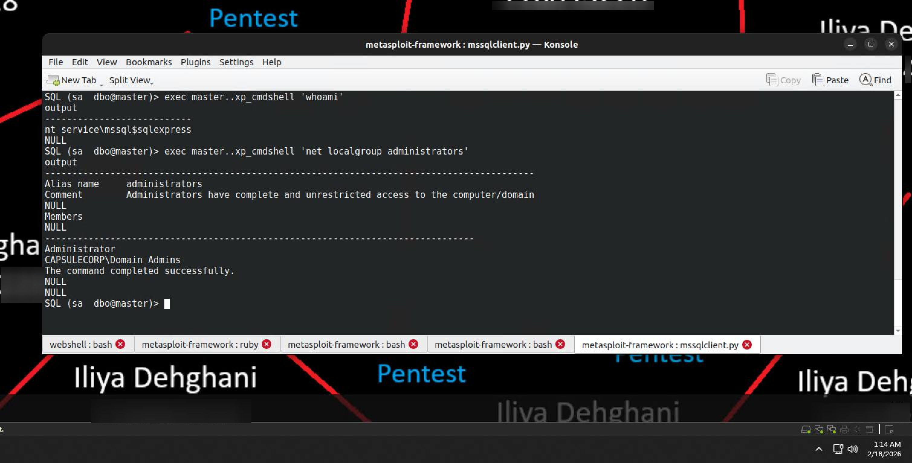
*Figure 6.8 — Confirmation that `NT SERVICE\MSSQLSERVER` is a member of the local Administrators group.*

### 3.2 Stealing Windows Account Password Hashes

Extracting password hashes from compromised systems is essential for lateral movement — with a captured hash, an attacker can authenticate to other systems sharing the same local administrator credentials using Pass-the-Hash, without ever needing the cleartext password.

Windows converts passwords into fixed-length hashes using a cryptographic hashing function (CHF). During authentication, Windows hashes the user's input and compares it against the value stored in the SAM registry hive.

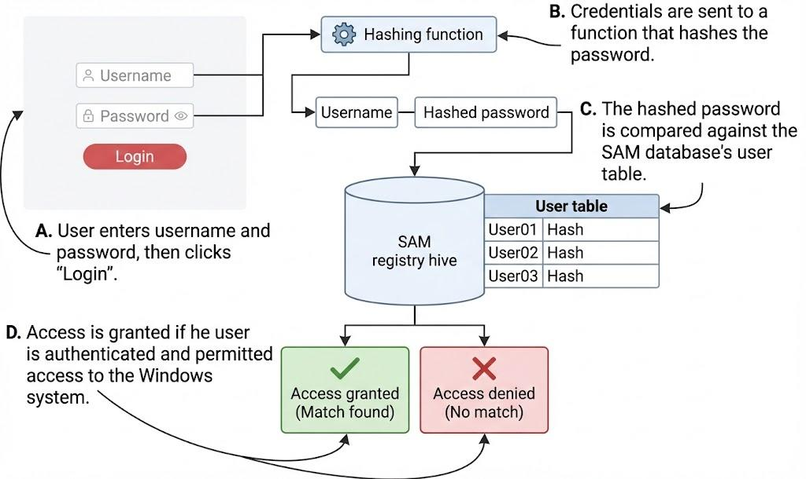
*Figure 6.9 — The Windows authentication flow: cleartext credentials → CHF → SAM comparison → access decision, reproduced from [1].*

Since the MSSQL service account holds local administrator rights, it can be used to extract these hashes via the existing non-interactive `xp_cmdshell` access.

#### 3.2.1 Copying Registry Hives with `reg.exe`

The SAM and SYSTEM registry hives (the latter holding the syskey/bootkey needed to decrypt SAM data) were targeted for extraction using:

```
reg.exe save HKLM\SAM c:\windows\temp\sam
reg.exe save HKLM\SYSTEM c:\windows\temp\sys
```

In this engagement, execution failed with a "required privilege is not held by the client" error, and the database interface became unstable following the attempt, preventing a screenshot of the failed run from being captured. In a normal successful run, this command reports "The operation completed successfully" and places the exported hives in `C:\windows\temp`.

#### 3.2.2 Downloading Registry Hive Copies

Because the automated `xp_cmdshell`-based transfer failed, the SAM and SYSTEM hives were manually exported and transferred to the Pentest VM for offline processing rather than being pulled directly via SMB from the shell.

### 3.3 Extracting Password Hashes with `secretsdump.py`

Hash extraction was performed offline against the exported registry copies to avoid triggering antivirus detection on live auditing tools. The book's recommended tool, `creddump`, was found to be incompatible with the current Python environment.

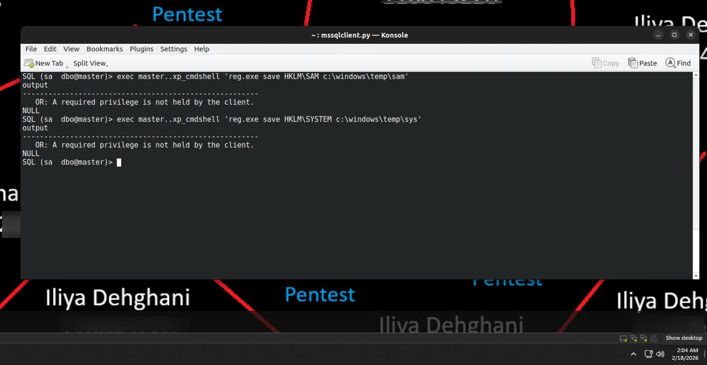
*Figure 6.10 — Attempted `creddump` installation, later abandoned due to incompatibility.*

The engagement pivoted to `secretsdump.py` from the Impacket library, which successfully extracted local NTLM password hashes for three accounts: **Administrator**, **Guest**, and **DefaultAccount**.

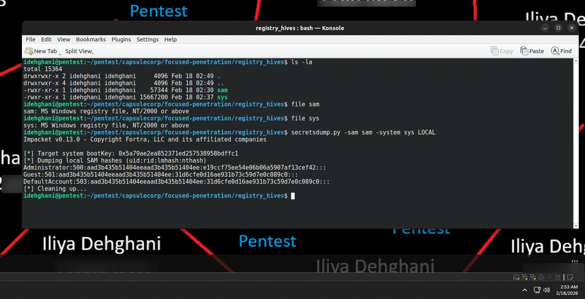
*Figure 6.11 — NTLM hashes extracted from the SAM/SYSTEM hives using `secretsdump.py`.*

**Exercise 6.1 — Stealing the SYSTEM and SAM Registry Hives.** The `xp_cmdshell`-driven extraction and transfer failed due to tooling incompatibility, but the objective was still achieved through the pivot to `secretsdump.py`, confirming hash extraction was possible despite the initial tooling failure.

#### 3.3.1 Understanding the Dumped Output

Password dump output is presented in colon-separated form: username, relative identifier (RID), and two hash fields. The classic LAN Manager (LM) hash field is typically a null placeholder in modern Windows systems, while the **NTLM hash** is the field of real interest — it is what attackers use for Pass-the-Hash authentication during lateral movement to systems sharing the same administrator credentials.

## 4. Findings / Observations

| # | Finding | Severity | Affected Host |
|---|---|---|---|
| 1 | Weak MSSQL `sa` credentials (`sa:Password1`) | Critical | Gohan (10.0.10.201) |
| 2 | `xp_cmdshell` re-enablable by any `sa`-equivalent account, yielding OS command execution | Critical | Gohan (10.0.10.201) |
| 3 | MSSQL service account holds local Administrator rights, enabling hash extraction | High | Gohan (10.0.10.201) |
| 4 | Local NTLM hashes recoverable for Administrator, Guest, and DefaultAccount | High | Gohan (10.0.10.201) |

## 5. Conclusion

Chapter 6 showed that database credential weaknesses can be just as damaging as web-application flaws — a single weak `sa` password led directly to OS-level command execution and, ultimately, to extracted NTLM password hashes suitable for Pass-the-Hash lateral movement. Tooling incompatibilities (`mssql-cli`, `creddump`) required real-time pivots to Impacket-based alternatives (`mssqlclient.py`, `secretsdump.py`), underscoring that a penetration tester must be prepared to substitute equivalent tools when the reference toolchain doesn't match the target environment. The credentials and hashes recovered in Chapters 5 and 6 form the basis for the lateral movement and privilege escalation activities covered in the following chapters.

## 6. References

[1] R. Davis, *The Art of Network Penetration Testing*, Manning Publications, 2020.

[2] B. Gavin, "Q: Using CACLS on a protected file such as WMIC.EXE," Stack Overflow, 19 December 2018. [Online]. Available: https://stackoverflow.com/questions/53860574/q-using-cacls-on-a-protected-file-such-as-wmic-exe

[3] Fortra, "secretsdump.py." [Online]. Available: https://github.com/fortra/impacket/blob/master/examples/secretsdump.py

[4] Microsoft, "Install the sqlcmd and bcp SQL Server command-line tools on Linux." [Online]. Available: https://learn.microsoft.com/en-us/sql/tools/mssql-cli
