# Chapter 8 — Windows Post-Exploitation
### Companion Lab Report: *The Art of Network Penetration Testing* (Royce Davis, Manning Publications, 2020)

| | |
|---|---|
| **Author** | Iliya Dehghani |
| **Source Lab** | Lab 4 |
| **Lab Environment** | Capsulecorp (VMware Workstation 17 Pro) |
| **Report Type** | Chapter walkthrough / technical lab report |

---

## 1. Objective

Building on the Meterpreter foothold established in Chapter 7, Chapter 8 covers post-exploitation on Windows: maintaining reliable re-entry, harvesting credentials (in-memory, cached, and filesystem-based), and moving laterally to other hosts via Pass-the-Hash and credential reuse.

## 2. Tools Used

| Tool | Purpose |
|---|---|
| Metasploit `exploit/windows/local/persistence` | Persistence (replacing the deprecated `run persistence` script) |
| Kiwi Meterpreter extension | In-memory credential extraction (replacing the legacy Mimikatz extension) |
| `post/windows/gather/cachedump` | Domain cached credential extraction |
| John the Ripper | Offline NTLM hash cracking (incremental and dictionary modes) |
| `findstr` / `where` | Filesystem credential harvesting |
| `auxiliary/scanner/smb/smb_login` | Credential reuse testing across hosts |
| NetExec (NXC, formerly CrackMapExec) | Pass-the-Hash authentication testing |

## 3. Methodology and Walkthrough

### 3.1 Fundamental Post-Exploitation Objectives

Post-exploitation activity on a compromised host falls into three categories, per Davis [1]:

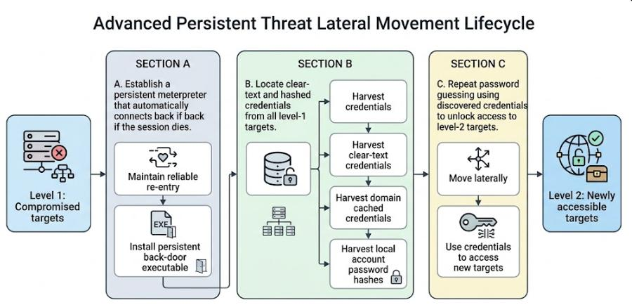
*Figure 8.1 — The three fundamental post-exploitation objectives, reproduced from [1].*

#### 3.1.1 Maintaining Reliable Re-Entry

Access during an INPT is typically represented as a command shell — interactive (Meterpreter, cmd.exe) or non-interactive (web shell, database console). Because a service crash or reboot can sever the existing connection, a persistent Meterpreter session can be configured to automatically restore an outbound callback if the session drops.

#### 3.1.2 Harvesting Credentials

A core INPT principle: access to one system can be leveraged to access others by reusing recovered credentials. This chapter covers three credential sources — local password hashes, domain cached credentials, and clear-text configuration files.

#### 3.1.3 Moving Laterally

Lateral movement (pivoting) uses credentials from one compromised host to access previously unreachable hosts. Hosts compromised directly through a vulnerability are **level-one** targets; those reached as a consequence of credential reuse are **level-two** targets. This distinction matters for remediation — clients often assume patching the level-one vulnerability would have prevented all downstream access, but undiscovered level-one vulnerabilities may exist elsewhere, and newly deployed systems with weak credentials constitute a continuously evolving attack surface.

### 3.2 Maintaining Reliable Re-Entry with Meterpreter

Metasploit's persistence tooling deploys an executable Meterpreter backdoor configured to auto-launch at system startup via an autorun registry value, periodically attempting to reconnect to the attacker.

| Argument | Purpose |
|---|---|
| `-A` | Automatically starts a listener on the attacking machine |
| `-L c:\\` | Writes the payload to the root of `C:\` |
| `-X` | Installs the payload to an autorun registry key |
| `-i 30` | Attempts a connection every 30 seconds |
| `-p 8443` | Port used for outbound connection attempts |
| `-r 10.0.10.250` | Attacker IP for callback connections |

*Table 8.1 — Persistent Meterpreter command arguments, reproduced from [1].*

#### 3.2.1 Installing a Meterpreter Autorun Backdoor Executable

The book's legacy `run persistence` command has been removed from current Metasploit releases; attempting it produced an error indicating the script was unavailable. `exploit/windows/local/persistence` was used as a modern replacement, generating a VBScript payload and a registry Run key to execute it on reboot.

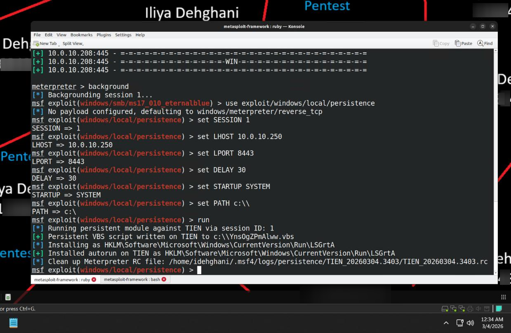
*Figure 8.2 — `exploit/windows/local/persistence` establishing a VBScript payload and autorun registry key.*

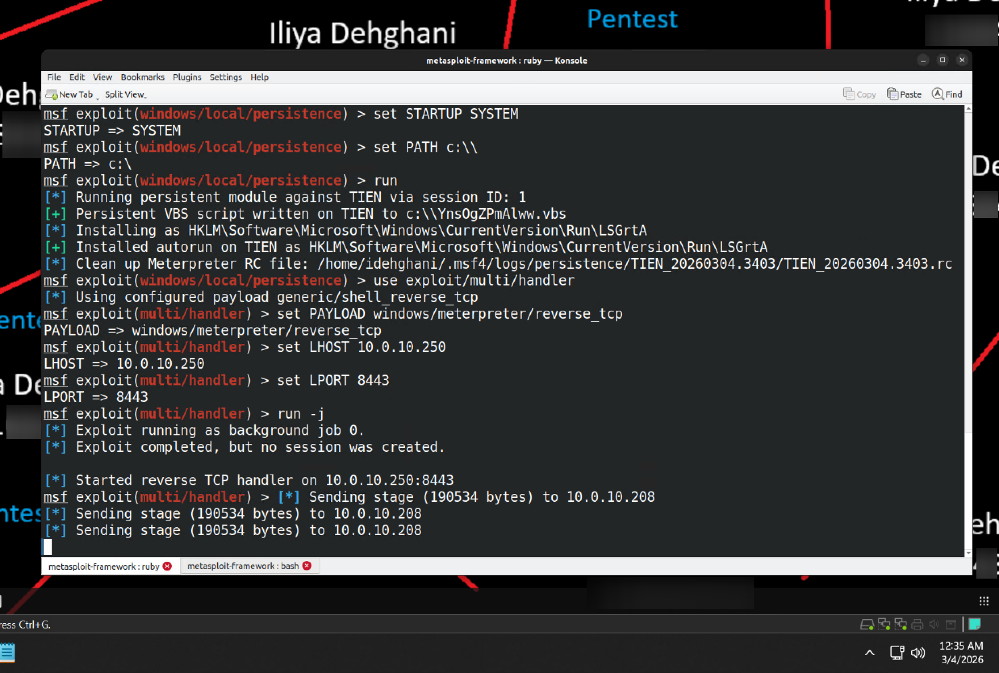
*Figure 8.3 — `exploit/multi/handler` listener configured to catch the returning session.*

Despite this substitution, the persistence mechanism did not successfully re-establish a callback session after reboot. This was recorded as a tooling/environment compatibility limitation rather than a methodology failure, and testing proceeded to the next phase.

### 3.3 Harvesting Credentials with Mimikatz

Windows stores authenticated users' clear-text passwords in the memory space of `lsass.exe` (Local Security Authority Subsystem Service). Mimikatz, created by Benjamin Delpy, exploits this design to recover clear-text credentials directly from memory, and has since been integrated into other frameworks including Metasploit.

#### 3.3.1 Using the Meterpreter Extension

The **Kiwi** extension has replaced the legacy Mimikatz extension in current Metasploit releases, offering equivalent credential extraction capability.

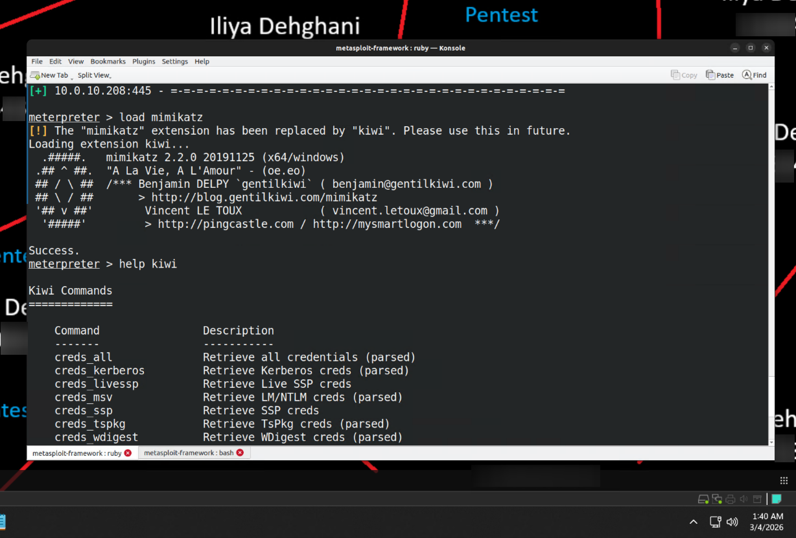
*Figure 8.4 — Kiwi extension loaded into the active Meterpreter session; `help kiwi` lists available commands.*

Running `creds_all` performed a full analysis of credential data resident in LSASS:

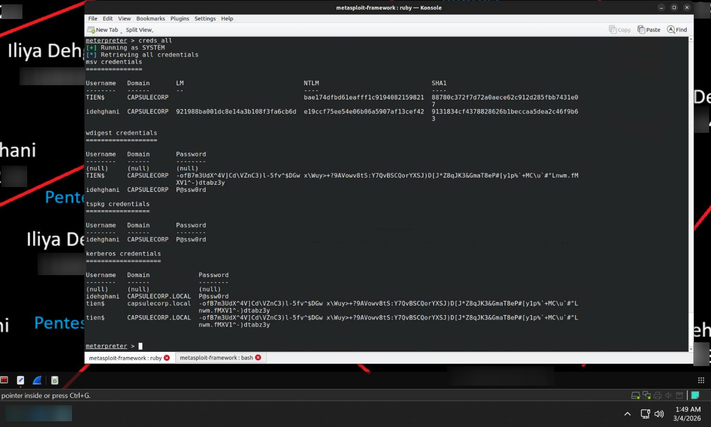
*Figure 8.5 — Domain account `CAPSULECORP\idehghani` recovered with both NTLM hash and plaintext password `P@ssw0rd`, alongside the machine account `TIEN$` and its NTLM hash.*

The recovered plaintext and machine-account credentials confirmed an active or recent authentication session on the target and served as directly usable assets for lateral movement.

### 3.4 Harvesting Domain Cached Credentials

Windows retains locally hashed domain account passwords (via `mscache`/`mscache2`) to permit authentication while offline from the domain controller. These are stored in the SECURITY registry hive, with the cached account count governed by `CachedLogonsCount` under `HKLM\Software\Microsoft\Windows NT\CurrentVersion\Winlogon`. From a SYSTEM-level session, these hashes are a valuable target for offline cracking or lateral movement.

#### 3.4.1 Using the Meterpreter Post Module

`post/windows/gather/cachedump` was run against TIEN to extract cached domain credential hashes from the SECURITY hive.

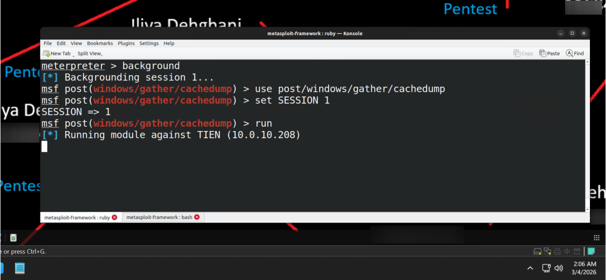
*Figure 8.6 — `cachedump` execution on TIEN, which began execution but stalled without producing output.*

The module did not return usable output in this environment; this was documented as a module-compatibility limitation rather than a methodology failure.

#### 3.4.2 Cracking Cached Credentials with John the Ripper

John the Ripper was built from source:

```
git clone https://github.com/magnumripper/JohnTheRipper.git
cd JohnTheRipper/src
./configure
make -s clean && make -sj2
```

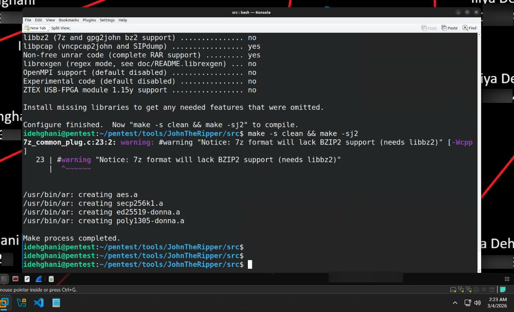
*Figure 8.7 — John the Ripper compiled from source.*

Since domain cached credentials could not be extracted directly, the NTLM hash recovered from LSASS memory via Kiwi was used instead to demonstrate offline cracking. Run with no wordlist specified, John defaulted to its standard mode sequence (`single` → bundled `password.lst` wordlist → `incremental`) and recovered the plaintext password for `CAPSULECORP\idehghani` as `P@ssw0rd` during the bundled-wordlist stage, before incremental mode was ever reached.

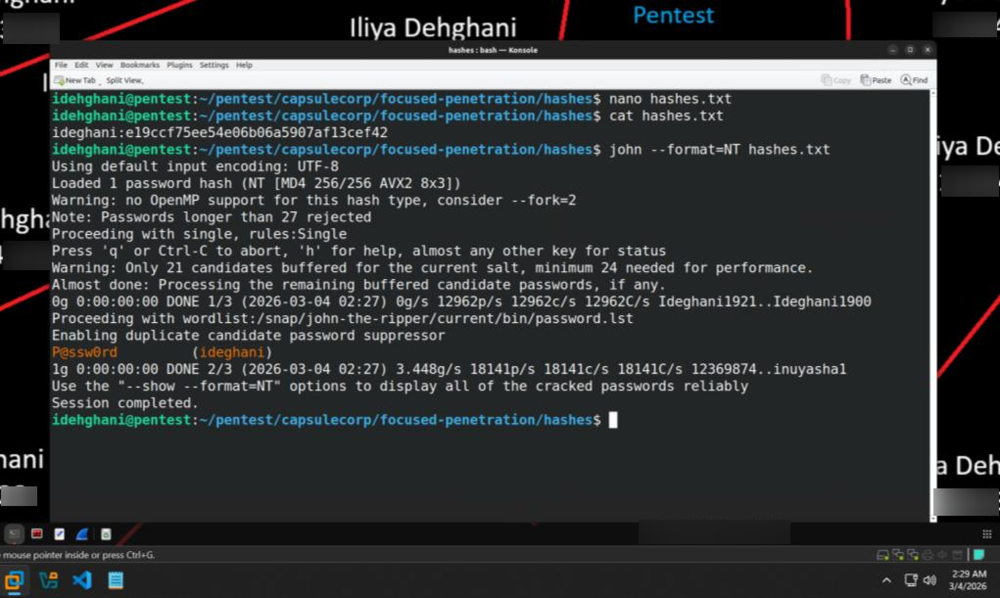
*Figure 8.8 — John's default-mode run cracking `P@ssw0rd` via its bundled `password.lst` wordlist stage.*

#### 3.4.3 Using a Dictionary File with John the Ripper

A dictionary-based attack was demonstrated using the standard `rockyou.txt` wordlist, confirming the same hash-to-password match via `--show`.

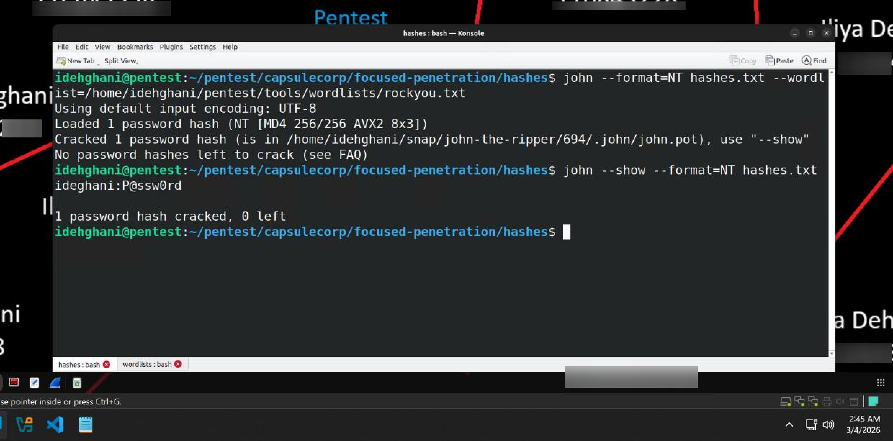
*Figure 8.9 — Dictionary attack against `hashes.txt`, confirming `P@ssw0rd` via `--show`.*

### 3.5 Harvesting Credentials from the Filesystem

Application configuration files are a commonly overlooked but reliable source of plaintext credentials, particularly for web applications paired with a backend database.

| Filename | Service |
|---|---|
| `web.config` | Microsoft IIS |
| `tomcat-users.xml` | Apache Tomcat |
| `config.inc.php` | phpMyAdmin |
| `sysprep.ini` | Microsoft Windows |
| `config.xml` | Jenkins |
| `Credentials.xml` | Jenkins |

*Table 8.3 — Configuration files commonly containing plaintext credentials, reproduced from [1].*

#### 3.5.1 Locating Files with `findstr` and `where`

Two native Windows tools support filesystem credential harvesting without GUI access:

- `findstr /s /c:"password=" c:\` — recursive content search for a specified string (slower, content-based)
- `where /r c:\ tomcat-users.xml` — search by filename (faster, name-based)

The two are complementary: `where` is optimal when the filename is known; `findstr` is better for locating unknown files containing a specific credential pattern.

### 3.6 Moving Laterally with Pass-the-Hash

Windows permits authentication using a 32-character NTLM hash in place of a plaintext password — combined with common administrator password reuse, this creates the **Pass-the-Hash** lateral movement technique. Once local NTLM hashes are extracted from a level-one host, they can be used to authenticate directly against neighboring level-two hosts, extending access beyond the original foothold. Local hashes were retrieved with:

```
hashdump
```

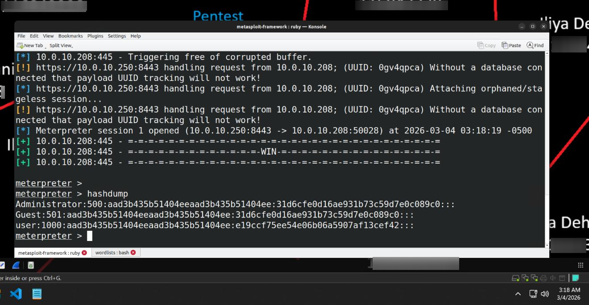
*Figure 8.10 — NTLM hashes for local accounts retrieved via Meterpreter's `hashdump`.*

#### 3.6.1 Using the Metasploit `smb_login` Module

`auxiliary/scanner/smb/smb_login` was configured to test acquired credentials across the Windows fleet:

```
set user administrator
set smbpass [HASH]
set smbdomain .
set rhosts file:windows.txt
```

`smbdomain` was set to `.` specifically to force local-account authentication and avoid Active Directory account lockouts.

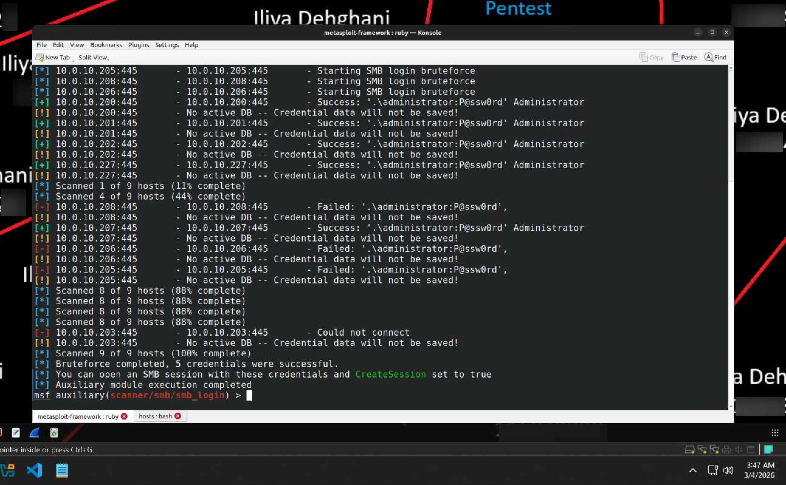
*Figure 8.11 — NTLM hash-based authentication failed in this run, but the plaintext password `P@ssw0rd` succeeded against 10.0.10.200, 10.0.10.201, 10.0.10.202, 10.0.10.207, and 10.0.10.227 — confirming local administrator credential reuse.*

#### 3.6.2 Passing-the-Hash with NetExec

NetExec (formerly CrackMapExec) was used to directly test the captured NTLM hash (`e19ccf75ee54e06b06a5907af13cef42`) against all Windows hosts in `windows.txt`, using `--local-auth` to force local (not domain) account authentication:

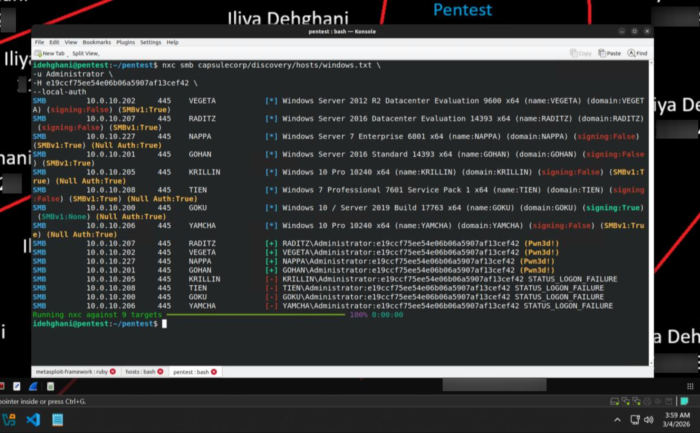
*Figure 8.12 — Successful hash-based authentication (marked `Pwn3d!`) against RADITZ (10.0.10.207), VEGETA (10.0.10.202), NAPPA (10.0.10.227), and GOHAN (10.0.10.201).*

**Exercise 8.1 — Accessing your first level-two host.** Completed via the preceding Pass-the-Hash testing: the extracted local Administrator NTLM hash successfully authenticated against multiple additional systems in the environment, demonstrating direct level-two host access.

## 4. Findings / Observations

| # | Finding | Severity | Affected Hosts |
|---|---|---|---|
| 1 | Plaintext domain credentials recoverable from LSASS memory | Critical | Tien (10.0.10.208) |
| 2 | Local administrator password reuse across the domain (`P@ssw0rd`) | Critical | Goku, Gohan, Vegeta, Raditz, Nappa |
| 3 | Local NTLM hash reusable for Pass-the-Hash authentication | Critical | Raditz, Vegeta, Nappa, Gohan |
| 4 | Weak/short passwords crackable via incremental brute-force in a practical timeframe | High | Tien (10.0.10.208) |
| 5 | Legacy Metasploit persistence/cachedump modules unreliable in this environment | Informational | Tien (10.0.10.208) |

## 5. Conclusion

Chapter 8 traced a complete post-exploitation chain from the single Meterpreter foothold gained in Chapter 7 to compromise of five additional hosts through pure credential reuse and Pass-the-Hash. Neither domain cached-credential extraction nor legacy persistence tooling functioned reliably against the current lab environment, illustrating that a real-world tester must be prepared to adapt when reference tooling is deprecated or incompatible. The core finding — a single reused local administrator password compromising the majority of the Windows fleet — is the clearest illustration in this engagement of how quickly one weak credential can cascade into domain-wide risk, directly motivating the credential-hygiene recommendations carried into the final engagement report.

## 6. References

[1] R. Davis, *The Art of Network Penetration Testing*, Manning Publications, 2020.
