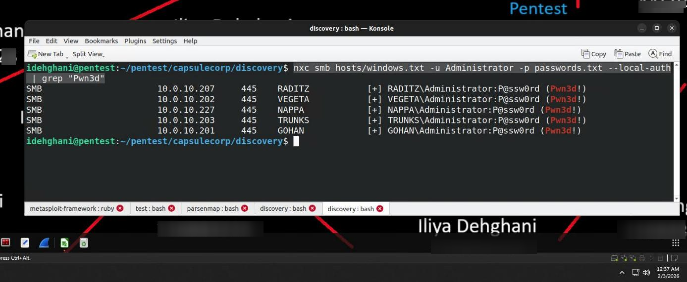
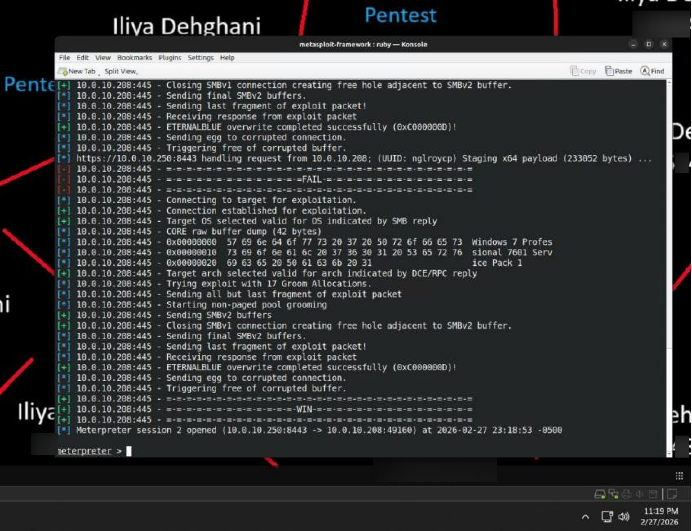
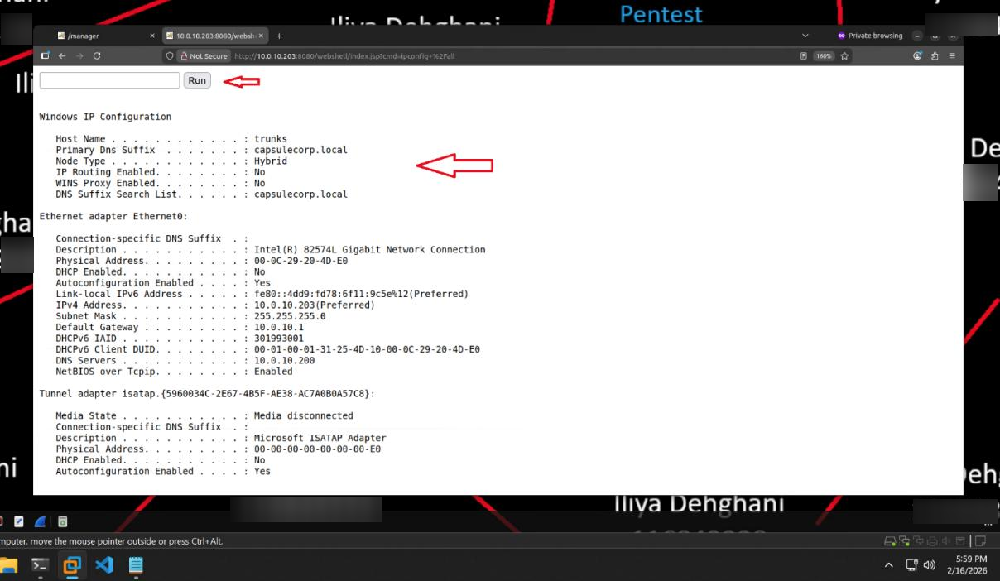
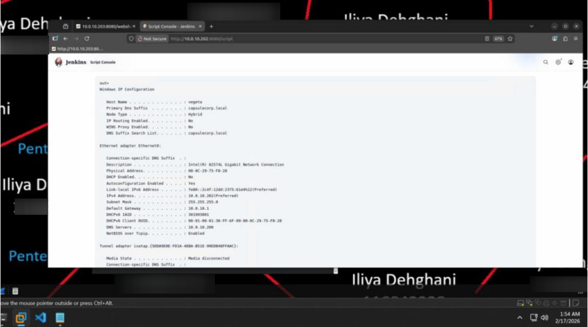
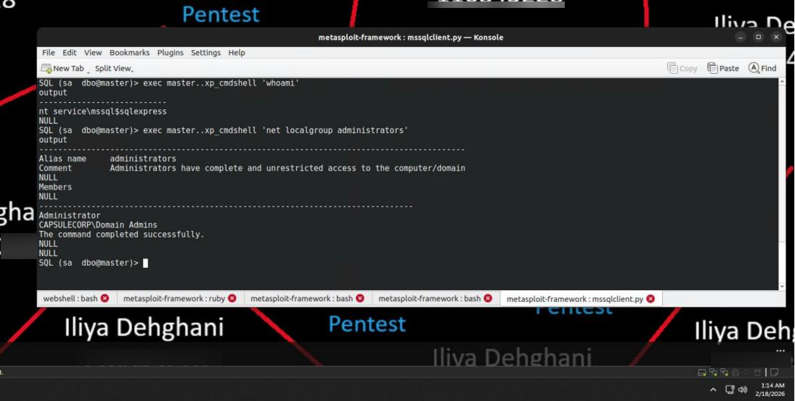
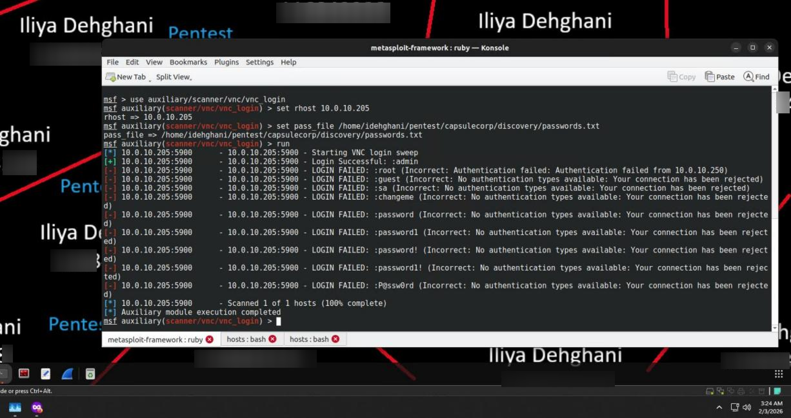
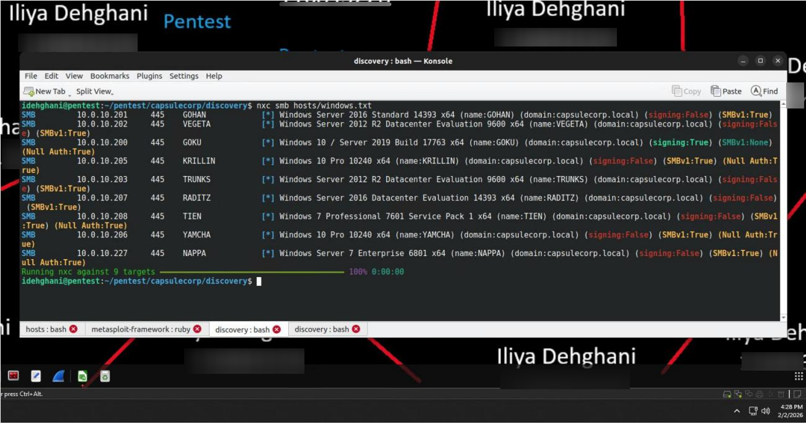
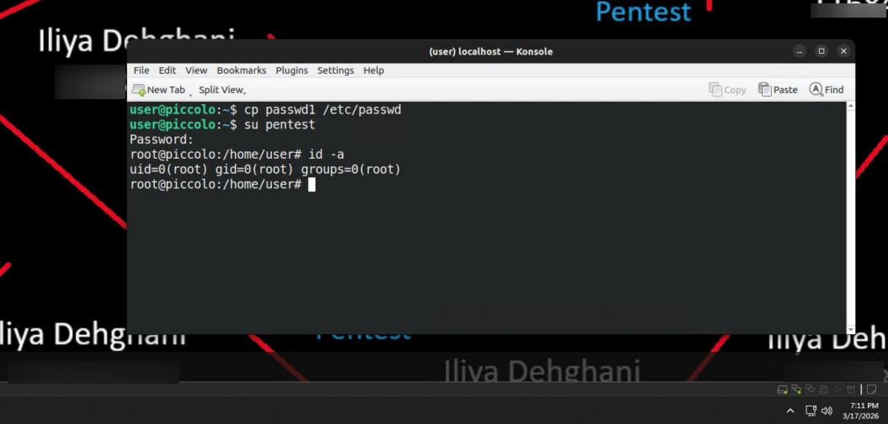
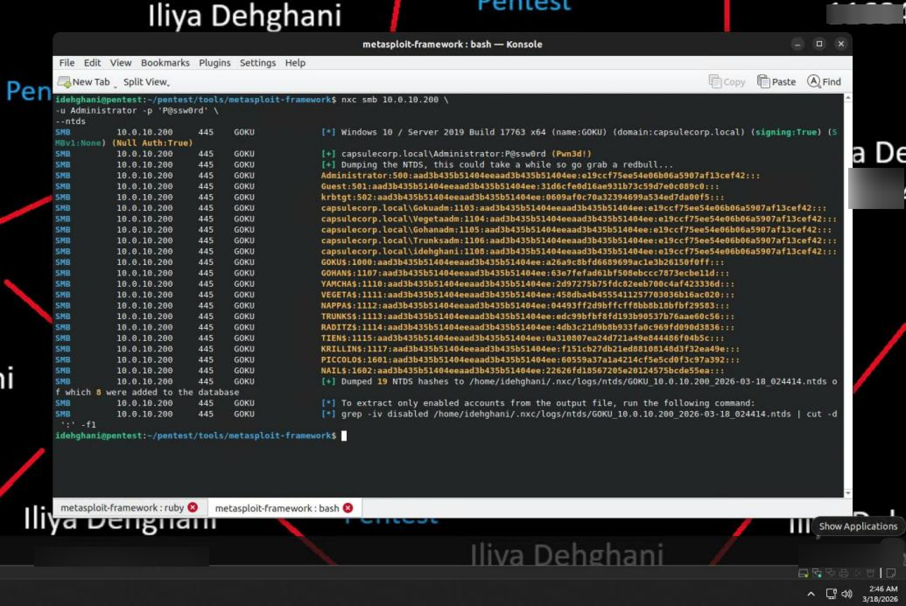

# Final Engagement Report
## Internal Network Penetration Test — Capsulecorp (capsulecorp.local)

| | |
|---|---|
| **Prepared by** | Iliya Dehghani |
| **Source Lab** | Lab 6 — Capstone Engagement |
| **Engagement Dates** | January 18, 2026 – March 18, 2026 |
| **Report Type** | Final pentest deliverable (capstone) |

*This report follows the eight-component pentest deliverable structure taught in Chapter 12 of Royce Davis's* The Art of Network Penetration Testing *— executive summary, engagement methodology, attack narrative, technical observations, and supporting appendices. Chapter 12 itself is a report-writing tutorial rather than hands-on lab content, so it is used here only as the structural reference for this deliverable, not as a separate chapter report.*

---

## 1. Executive Summary

### 1.1 Purpose and Goals

To evaluate the resilience of its corporate network, Capsulecorp commissioned an Internal Network Penetration Test (INPT). The objective was to assess the potential consequences of a realistic insider-threat scenario: an intruder with physical access to the internal network, but no prior credentials or knowledge, attempting to acquire administrative control of the Active Directory domain by compromising critical systems and escalating privileges.

### 1.2 Dates and Timeline

Testing was conducted from **January 18, 2026 to March 18, 2026**, covering all four phases of the engagement methodology: information gathering, focused penetration, post-exploitation and privilege escalation, and documentation.

### 1.3 Scope

The engagement scope covered the **10.0.10.0/24** subnet, encompassing all domain-joined Windows servers, Windows workstations, Linux/Ubuntu servers, and supporting network infrastructure. Eleven target hosts were in scope, along with the penetration testing workstation (10.0.10.250) and the network router (10.0.10.1). No system was excluded from testing.

| Host | IP Address | Operating System |
|---|---|---|
| Goku (Domain Controller) | 10.0.10.200 | Windows Server 2019 |
| Gohan | 10.0.10.201 | Windows Server 2016 |
| Vegeta | 10.0.10.202 | Windows Server 2012 R2 |
| Trunks | 10.0.10.203 | Windows Server 2012 R2 |
| Piccolo | 10.0.10.204 | Ubuntu 18.04 LTS |
| Krillin | 10.0.10.205 | Windows 10 Pro |
| Yamcha | 10.0.10.206 | Windows 10 Pro |
| Raditz | 10.0.10.207 | Windows Server 2016 |
| Tien | 10.0.10.208 | Windows 7 Professional |
| Nail | 10.0.10.209 | Ubuntu 18.04 LTS |
| Nappa | 10.0.10.227 | Windows Server 2008 Enterprise |

*Table 1 — The Capsulecorp 10.0.10.0/24 network environment: in-scope hosts, IP addresses, and operating systems.*

### 1.4 High-Level Results

The penetration test was **successful**. Testing progressed from a position of zero prior knowledge or credentials to **full Domain Administrator privileges** over the capsulecorp.local Active Directory domain. Key results:

- 11 hosts discovered and enumerated across the target subnet.
- Multiple default and weak credentials identified across Windows, database, web management, and VNC services.
- 4 Windows hosts confirmed vulnerable to the critical MS17-010 (EternalBlue) exploit.
- Initial footholds obtained on 3 hosts via web shell deployment (Tomcat), Groovy script console abuse (Jenkins), and database stored-procedure exploitation (MSSQL).
- SYSTEM-level access achieved on Windows targets via a Sticky Keys backdoor and EternalBlue exploitation.
- Clear-text domain credentials and NTLM hashes harvested from LSASS memory.
- Lateral movement via Pass-the-Hash and credential reuse extended access to additional hosts.
- Root-level access achieved on a Linux host via a misconfigured SUID binary (`/bin/cp`).
- **Full domain compromise** achieved by impersonating a Domain Administrator token and extracting all 19 NTDS password hashes from the domain controller (Goku).

**Recommended course of action:** Capsulecorp should immediately remediate default credentials, enforce strict password policy, disable unnecessary administrative interfaces, audit all SUID binary permissions on Linux systems, and patch all systems — with particular urgency on MS17-010. Detailed, actionable recommendations accompany each finding in Section 4.

---

## 2. Engagement Methodology

The engagement modeled a threat actor who has physically gained access to the internal network (e.g., via a compromised employee workstation or an open data jack in a conference room) and independently identifies, enumerates, and exploits the environment from that starting point, targeting the 10.0.10.0/24 range.

### Four-Phase Methodology

**Phase 1 — Information Gathering**
- Discover live hosts using ICMP sweeps, Nmap host discovery, and RMI port scanning.
- Enumerate listening services across all 65,535 TCP ports using Nmap with service version detection (`-sV`) and NSE script scanning (`-A`).
- Parse and organize scan results into protocol-specific target lists (HTTP, SMB, SSH, MySQL, etc.).

**Phase 2 — Focused Penetration**
- Deploy backdoor web shells on vulnerable web application servers.
- Exploit weak credentials to access remote management interfaces (Tomcat Manager, Jenkins Script Console, MSSQL).
- Execute publicly available exploits against unpatched services (MS17-010).
- Establish initial footholds on level-one targets.

**Phase 3 — Post-Exploitation and Privilege Escalation**
- Install persistent backdoors (Meterpreter autorun, systemd services, Sticky Keys).
- Harvest clear-text credentials, NTLM hashes, and domain cached credentials using Kiwi/Mimikatz and lsassy.
- Crack password hashes offline using John the Ripper.
- Move laterally to level-two targets using Pass-the-Hash and credential reuse.
- Escalate privileges on Linux hosts via SUID binary exploitation.
- Use Incognito token impersonation to identify and impersonate Domain Administrator accounts.
- Extract the NTDS.dit database from the domain controller to recover all domain account password hashes.

**Phase 4 — Documentation**
- Gather screenshots and evidence at every stage.
- Construct a linear narrative describing the full attack path.
- Compile technical findings with severity ratings, impact statements, evidence, and actionable recommendations.
- Produce this final deliverable.

---

## 3. Attack Narrative

The tester initiated the engagement by connecting to the Capsulecorp internal network on the 10.0.10.0/24 subnet.

**Discovery and Reconnaissance.** An initial ICMP ping sweep identified only three responsive hosts (Goku, Piccolo, Nail), since firewall rules on the remaining systems silently dropped ICMP echo requests. Switching to Nmap's native host discovery (ARP/TCP-based probes) successfully identified all 11 target hosts. A full-range TCP port scan (0–65,535) with service/version detection and NSE scripting revealed a diverse set of active services — DNS, Kerberos, LDAP, SMB, HTTP (IIS, Apache, Tomcat), MSSQL, MySQL, and SSH. Results were parsed with a Ruby-based XML parser (`parsenmap.rb`) into protocol-specific target lists to structure the vulnerability-discovery phase.

**Vulnerability Discovery.** Three categories of weakness were identified:

- **Authentication:** weak/default credentials on the local Administrator account across five Windows hosts (`P@ssw0rd`), the MSSQL `sa` account on Gohan (`password1`), Apache Tomcat Manager on Trunks (`admin:admin`), the Jenkins console on Vegeta (`admin:admin`), and VNC on Krillin (`admin`).
- **Patching:** four Windows hosts (Nappa, Tien, Krillin, Yamcha) confirmed likely vulnerable to MS17-010 (EternalBlue); outdated OpenSSH 7.6p1, Apache HTTP 2.4.29, and MySQL 5.7.42 also identified.
- **Configuration:** SMBv1 enabled with SMB signing disabled on multiple hosts (relay attack risk); several administrative web interfaces exposed with default configurations.

**Initial Exploitation.** Three independent footholds were established:

1. **Tomcat web shell (Trunks — 10.0.10.203):** a custom JSP web shell, packaged as a WAR file, was deployed via Tomcat Manager using discovered `admin:admin` credentials, enabling non-interactive OS command execution as `NT AUTHORITY\SYSTEM`.
2. **Jenkins Groovy console (Vegeta — 10.0.10.202):** OS commands were executed directly via the Jenkins Script Console, reachable with `admin:admin`.
3. **MSSQL `xp_cmdshell` (Gohan — 10.0.10.201):** Impacket's `mssqlclient.py` connected using `sa:password1`; `xp_cmdshell` was enabled via `sp_configure` and used for OS command execution as `NT SERVICE\MSSQLSERVER`, confirmed to hold local Administrator rights.

**Privilege Escalation on Windows.** The non-interactive Tomcat web shell was escalated to a SYSTEM-level interactive shell using the Sticky Keys backdoor technique: ownership of `sethc.exe` was taken with `takeown.exe`, Full Control granted via `icacls.exe`, and `sethc.exe` replaced with `cmd.exe`. Pressing Shift five times at the RDP login screen then launched an elevated `NT AUTHORITY\SYSTEM` prompt.

**Exploiting Unpatched Services.** MS17-010 (EternalBlue) was exploited on Tien (10.0.10.208) via Metasploit's `ms17_010_eternalblue` module with a Meterpreter reverse-HTTPS payload, yielding a SYSTEM-level session. `smart_hashdump` extracted local password hashes, and the Kiwi (Mimikatz) extension recovered clear-text domain credentials (`CAPSULECORP\idehghani:P@ssw0rd`) from LSASS memory.

**Credential Harvesting and Cracking.** Local NTLM hashes were obtained by extracting SAM/SYSTEM registry hive copies and processing them with Impacket's `secretsdump.py`. The password `P@ssw0rd` was independently confirmed by offline-cracking the extracted NTLM hash with John the Ripper.

**Lateral Movement.** The extracted local Administrator NTLM hash was tested against all in-scope Windows hosts via NetExec and Metasploit's `smb_login` module, successfully authenticating (marked `Pwn3d!`) to Raditz, Vegeta, Nappa, and Gohan — demonstrating pervasive credential reuse across the environment.

**Linux Post-Exploitation.** On Piccolo (10.0.10.204), a systemd service automated persistent re-entry via a reverse SSH tunnel. `/etc/shadow` was exfiltrated and cracked with John the Ripper, revealing the local user password (`user:P@ssw0rd`). SUID enumeration (`find / -perm -u=s`) revealed a dangerous, non-standard misconfiguration: `/bin/cp` carried the SUID bit. This was exploited to overwrite `/etc/passwd` with a backdoor root account (`pentest`), achieving full root access (`uid=0`).

**Domain Compromise.** With domain credentials and multiple compromised hosts in hand, `net group "Domain Admins" /domain` revealed two domain admin accounts: `Administrator` and `idehghani`. NetExec's `qwinsta` sweep across all Windows targets identified an active domain admin session for `idehghani` on Raditz (10.0.10.207). The harvested NTLM hash was used to establish a Meterpreter session on Raditz via Metasploit's `psexec` module; loading the Incognito extension revealed a delegation token for `CAPSULECORP\idehghani`, which was impersonated to obtain full Domain Administrator privileges. LSASS credential extraction on Raditz via NetExec's `lsassy` module confirmed the domain admin NTLM hash (clear-text was unavailable due to WDigest being disabled). Finally, all Active Directory password hashes were extracted from the domain controller Goku (10.0.10.200) using NetExec's built-in NTDS extraction (`--ntds`), which automated the Volume Shadow Copy creation, retrieval, and hash extraction process — yielding **19 NTDS hashes** and confirming complete compromise of the capsulecorp.local domain.

---

## 4. Technical Observations

Each finding below is presented with a severity rating, observation, impact statement, evidence, affected assets, and actionable recommendations.

### Finding 1: Default Credentials on Local Administrator Accounts

| | |
|---|---|
| **Severity** | Critical |
| **Title** | Default password on local Administrator accounts across multiple Windows hosts |

**Observation.** The built-in local Administrator account (RID 500) was configured with the same weak, readily guessable password (`P@ssw0rd`) on five Windows hosts, enabling full administrative access via SMB authentication.

**Impact.** An adversary could obtain unrestricted administrative access to every affected server and workstation. Compromise of a single host grants access to all others due to password reuse — this was the primary mechanism for expanding from one compromised host to domain-wide control in this engagement.

**Evidence.** NetExec SMB authentication confirmed `Pwn3d!` status on all affected hosts using `Administrator:P@ssw0rd`, and via Pass-the-Hash with the corresponding NTLM hash (`e19ccf75ee54e06b06a5907af13cef42`).

*Figure 1 — Successful authentication (`Pwn3d!`) on five Windows hosts using `Administrator:P@ssw0rd`.*

**Assets Affected.** 10.0.10.201 (Gohan), 10.0.10.202 (Vegeta), 10.0.10.203 (Trunks), 10.0.10.207 (Raditz), 10.0.10.227 (Nappa)

**Recommendation.** Replace all local Administrator passwords with unique, complex credentials immediately. Deploy Microsoft's Local Administrator Password Solution (LAPS) to autonomously manage and rotate local administrator passwords per host. Implement a formal password policy mandating minimum length (14+ characters), complexity, and regular rotation.

---

### Finding 2: MS17-010 (EternalBlue) — Missing Critical Security Patch

| | |
|---|---|
| **Severity** | Critical |
| **Title** | Multiple Windows hosts vulnerable to MS17-010 (EternalBlue) remote code execution |

**Observation.** MS17-010, a critical SMBv1 remote code execution vulnerability, was confirmed likely present on four Windows hosts. Metasploit's `ms17_010_eternalblue` module successfully exploited the vulnerability on Tien (10.0.10.208), yielding a SYSTEM-level Meterpreter session with no credentials required.

**Impact.** An unauthenticated attacker with network access can remotely execute arbitrary code on any vulnerable host with SYSTEM privileges. In this engagement, the initial SYSTEM-level access that enabled credential harvesting and subsequent domain compromise originated from this single vulnerability.

**Evidence.** Metasploit scanner output confirming "Host is likely VULNERABLE to MS17-010!" on all four targets; successful exploitation on Tien with an active SYSTEM-level Meterpreter session.

*Figure 2 — Successful exploitation of MS17-010 (EternalBlue) on Tien (10.0.10.208) via `ms17_010_eternalblue`, resulting in a SYSTEM-level Meterpreter reverse HTTPS session.*

**Assets Affected.** 10.0.10.205 (Krillin), 10.0.10.206 (Yamcha), 10.0.10.208 (Tien), 10.0.10.227 (Nappa)

**Recommendation.** Apply the Microsoft MS17-010 security update to all affected systems without delay. Disable SMBv1 across the environment. Establish a formal patch management process ensuring timely critical updates. Decommission or upgrade end-of-life operating systems (Windows 7 on Tien, Windows Server 2008 on Nappa).

---

### Finding 3: Default Credentials on Apache Tomcat Server

| | |
|---|---|
| **Severity** | High |
| **Title** | Default credentials found on Apache Tomcat Manager interface |

**Observation.** The administrative Manager interface (TCP 8080) on one Apache Tomcat server (v8.5.96) had default credentials (`admin:admin`), permitting authentication and deployment of a custom WAR-packaged JSP web shell.

**Impact.** An adversary deploying a malicious WAR file gains unrestricted control of the underlying server, which was operating with SYSTEM-level privileges in this environment. This access was subsequently used to establish the Sticky Keys backdoor for persistent SYSTEM-level RDP access.

**Evidence.** Metasploit `tomcat_mgr_login` confirming `admin:admin`; deployed web shell visible in the Manager interface; `ipconfig /all` executed via the JSP shell confirming OS-level command execution.

*Figure 3 — `ipconfig /all` executed via the JSP web shell on Trunks (10.0.10.203), confirming host-level access through Tomcat Manager.*

**Assets Affected.** 10.0.10.203 (Trunks)

**Recommendation.** Change all default passwords and enforce strong, unique credentials for Tomcat administrative accounts, per Capsulecorp's official password policy (or a newly established one following industry best practices). Evaluate whether the Tomcat Manager web application is required; disable it via configuration if not. Restrict management interface access to authorized administrator IP addresses only.

---

### Finding 4: Default Credentials on Jenkins Automation Server

| | |
|---|---|
| **Severity** | High |
| **Title** | Default credentials on Jenkins server enabling remote code execution via Groovy Script Console |

**Observation.** Default credentials (`admin:admin`) were identified on one Jenkins automation server (TCP 8080). The default-enabled Groovy Script Console permitted execution of arbitrary OS commands on the underlying host.

**Impact.** An adversary can obtain a non-interactive shell via the Groovy Script Console, usable to install backdoors, extract credentials, or pivot to other systems. Jenkins provided an independent attack vector into the Capsulecorp environment during this engagement.

**Evidence.** Medusa brute-force output confirming `admin:admin` for the Jenkins HTTP login; Groovy Script Console executing `ipconfig /all` and returning host details (hostname: vegeta, domain: capsulecorp.local).

*Figure 4 — `ipconfig /all` output executed via the Jenkins Groovy Script Console on Vegeta (10.0.10.202), confirming remote OS command execution through the default admin account.*

**Assets Affected.** 10.0.10.202 (Vegeta)

**Recommendation.** Change the default Jenkins administrator password immediately to a secure, distinctive credential. Disable or restrict the Groovy Script Console to authorized administrators via Jenkins' role-based access control (RBAC). Review Jenkins security configuration against the official Jenkins Security Advisory guidelines and restrict network access to the management interface.

---

### Finding 5: Weak Credentials on Microsoft SQL Server

| | |
|---|---|
| **Severity** | High |
| **Title** | Weak password on MSSQL `sa` account enabling OS command execution via `xp_cmdshell` |

**Observation.** The `sa` account on one Microsoft SQL Server 2014 instance had a weak password (`password1`). `xp_cmdshell` was enabled via `sp_configure` after authentication and used for OS command execution; the MSSQL service account was confirmed to be a member of the local Administrators group.

**Impact.** An adversary with `sa` access can enable `xp_cmdshell` to execute arbitrary OS commands with local Administrator privileges — granting complete control of the database server, its data, extractable local password hashes, and a pivot point for further lateral movement.

**Evidence.** Metasploit `mssql_login` confirming `sa:password1`; `mssqlclient.py` session showing `xp_cmdshell` enabled, `whoami` returning `nt service\mssql$sqlexpress`, and `net localgroup administrators` confirming administrative membership.

*Figure 5 — Results of `whoami` and `net localgroup administrators` via `xp_cmdshell` on Gohan (10.0.10.201), confirming the MSSQL service account holds local Administrator privileges.*

**Assets Affected.** 10.0.10.201 (Gohan)

**Recommendation.** Update the `sa` account password to a complex, strong credential immediately. Disable `xp_cmdshell` unless a documented business need exists, and audit its usage where retained. Ensure the MSSQL service account follows the principle of least privilege and is removed from the local Administrators group.

---

### Finding 6: Weak VNC Password

| | |
|---|---|
| **Severity** | High |
| **Title** | Weak password on VNC remote desktop service |

**Observation.** One host was found running a VNC service (TCP 5900) with a weak password (`admin`), confirmed via Metasploit's `vnc_login` auxiliary module.

**Impact.** An attacker could obtain direct, unencrypted remote desktop access, enabling visual interaction with the system, data exfiltration, and further exploitation. VNC traffic is unencrypted by default, exposing session data and credentials to network eavesdropping.

**Evidence.** Metasploit `vnc_login` output: "Login Successful: :admin" against 10.0.10.205:5900.

*Figure 6 — Successful VNC authentication on Krillin (10.0.10.205) using the weak password `admin`.*

**Assets Affected.** 10.0.10.205 (Krillin)

**Recommendation.** Replace the VNC password with a strong, unique credential. Disable the VNC service entirely if not required. If required, tunnel VNC through an encrypted channel and restrict access to authorized administrator IPs via host-based firewall rules.

---

### Finding 7: SMBv1 Enabled with Signing Disabled

| | |
|---|---|
| **Severity** | High |
| **Title** | SMBv1 protocol enabled and SMB signing disabled on multiple Windows hosts |

**Observation.** Multiple Windows hosts had the deprecated SMBv1 protocol enabled, with SMB signing disabled on several of these, identified via NetExec SMB enumeration.

**Impact.** Disabled SMB signing combined with SMBv1 exposes hosts to well-known attack vectors including SMB relay attacks and exploitation of MS17-010. Microsoft has advised against SMBv1 use since 2017 due to critical, well-documented vulnerabilities.

**Evidence.** NetExec SMB enumeration output showing `SMBv1:True` and `signing:False` on the affected hosts.

*Figure 7 — SMBv1 status, SMB signing configuration, and null authentication settings across all in-scope Windows hosts.*

**Assets Affected.** 10.0.10.201 (Gohan), 10.0.10.202 (Vegeta), 10.0.10.203 (Trunks), 10.0.10.205 (Krillin), 10.0.10.206 (Yamcha), 10.0.10.207 (Raditz), 10.0.10.208 (Tien), 10.0.10.227 (Nappa)

**Recommendation.** Disable SMBv1 across the environment via Group Policy. Enforce (not merely enable) SMB signing on all domain-joined systems via Group Policy (`Microsoft network server: Digitally sign communications (always)` = Enabled). Consult Microsoft's documentation on SMB signing enforcement and SMBv1 disabling for implementation guidance.

---

### Finding 8: SUID Binary Misconfiguration on Linux Host

| | |
|---|---|
| **Severity** | Critical |
| **Title** | Root privilege escalation enabled by a misconfigured SUID permission on `/bin/cp` |

**Observation.** The Linux host Piccolo (10.0.10.204) had the SUID bit set on `/bin/cp` — a non-standard configuration. Since `/bin/cp` is owned by root, any user could execute it with root-level file-operation privileges. This was exploited to overwrite `/etc/passwd` with a modified version containing a new UID-0 (root) account, achieving full root access.

**Impact.** Any authenticated user on this host, including a compromised web application or low-privilege service account, could escalate to complete root privileges — reading all files, installing persistent backdoors, modifying system configuration, and using the host as a launch point against other systems.

**Evidence.** Output of `find / -perm -u=s 2>/dev/null` showing `/bin/cp` with the SUID bit set, followed by `id -a` after switching to the backdoor account, showing `uid=0(root) gid=0(root) groups=0(root)`.

*Figure 8 — Successful privilege escalation to root (uid=0) on Piccolo (10.0.10.204) via the misconfigured SUID bit on `/bin/cp`.*

**Assets Affected.** 10.0.10.204 (Piccolo)

**Recommendation.** Remove the SUID bit from `/bin/cp` immediately (`chmod u-s /bin/cp`). Conduct a comprehensive audit of all SUID/SGID binaries across Linux/UNIX hosts, retaining the permission only where a documented operational need exists. Implement a configuration management process to prevent unauthorized SUID bit changes, and consider deploying file integrity monitoring (FIM).

---

### Finding 9: Complete Active Directory Domain Compromise

| | |
|---|---|
| **Severity** | Critical |
| **Title** | Full compromise of the capsulecorp.local Active Directory domain |

**Observation.** Complete Domain Administrator privileges were obtained by chaining a series of individual vulnerabilities: identifying a logged-in domain admin session on Raditz (10.0.10.207), establishing a Meterpreter session via Pass-the-Hash, loading Incognito, and impersonating the `CAPSULECORP\idehghani` delegation token. NetExec's NTDS dump functionality was then used to extract all 19 Active Directory account password hashes from the domain controller (Goku — 10.0.10.200).

**Impact.** Domain Administrator access grants unrestricted control over every domain-joined system — all servers, workstations, and user accounts — constituting a complete compromise of Capsulecorp's IT infrastructure. At this level, an adversary can access all corporate data (financial records, PII, intellectual property), deploy ransomware domain-wide, create persistent backdoor accounts, modify Group Policy, and halt business operations entirely. Every domain user's password is compromised as a result of the NTDS extraction.

**Evidence.** `net group "Domain Admins" /domain` output showing `Administrator` and `idehghani`; Incognito `impersonate_token capsulecorp\\idehghani` output confirming successful impersonation; `whoami` confirming `capsulecorp\idehghani`; NetExec NTDS dump output showing all 19 hashes extracted.

*Figure 9 — NetExec NTDS extraction from the domain controller Goku (10.0.10.200), showing all 19 Active Directory account password hashes successfully dumped.*

**Assets Affected.** 10.0.10.200 (Goku — Domain Controller) and all domain-joined systems

**Recommendation.** This finding is the cumulative result of every vulnerability documented above, and remediating the full chain is required to disrupt the attack path: change all default and weak credentials, disable SMBv1, enforce SMB signing, deploy unique local administrator passwords (LAPS), and eliminate the SUID misconfiguration on Linux hosts. Patch all systems against MS17-010. Reduce Domain Admins group membership, implement tiered administration (separating domain admin credentials from daily-use accounts), enable WDigest protections appropriately, and consider Credential Guard on supported Windows systems. Following remediation of all findings in this report, a complete domain-wide password reset is strongly advised.

---

## Appendix A: Severity Definitions

| Severity | Definition |
|---|---|
| **Critical** | Findings that affect business-critical functions or undermine the domain. Exploitation could disrupt business operations, allow an attacker to control the Active Directory domain, compromise the domain controller, or access all enterprise user accounts and credentials. |
| **High** | Findings that compromise a significant business function or system, but do not by themselves grant domain-wide control. Exploitation could meaningfully disrupt business operations or expose sensitive data. |

*Table 11 — Classifying report findings by severity.*

## Appendix B: Hosts and Services

| IP Address | Hostname | OS | Open Ports and Services |
|---|---|---|---|
| 10.0.10.200 | GOKU | Windows Server 2019 | 53/TCP DNS; 445/TCP Microsoft-DS (SMB) |
| 10.0.10.201 | GOHAN | Windows Server 2016 | 1433/TCP MSSQL; 5985/TCP HTTPAPI httpd 2.0 / WinRM |
| 10.0.10.202 | VEGETA | Windows Server 2012 R2 | 80/TCP HTTP; Jenkins web admin interface |
| 10.0.10.203 | TRUNKS | Windows Server 2012 R2 | 8080/TCP Apache Tomcat; 3389/TCP RDP |
| 10.0.10.204 | PICCOLO | Ubuntu 18.04 | 22/TCP SSH; 80/TCP HTTP |
| 10.0.10.205 | KRILLIN | Windows 10 Pro | 135 (MSRPC), 445 (SMB), 5900 (VNC) |
| 10.0.10.206 | YAMCHA | Windows 10 Pro | 135 (MSRPC), 445 (SMB) |
| 10.0.10.207 | RADITZ | Windows Server 2016 | 80 (HTTP — IIS 10.0), 445 (SMB) |
| 10.0.10.208 | TIEN | Windows 7 Pro SP1 | 135 (MSRPC), 445 (SMB) |
| 10.0.10.209 | NAIL | Ubuntu 18.04 | 22/TCP SSH; 3306/TCP MySQL |
| 10.0.10.227 | NAPPA | Windows Server 2008 | 135, 5504, 49154 (MSRPC), 445 (SMB) |

*Table 12 — Complete inventory of discovered hosts, operating systems, and listening network services.*

## Appendix C: Tool List

- Nmap — https://nmap.org/
- Metasploit Framework — https://github.com/rapid7/metasploit-framework
- NetExec (NXC) — https://github.com/Pennyw0rth/NetExec
- Impacket — https://github.com/fortra/impacket
- John the Ripper — https://www.openwall.com/john/
- Medusa — https://github.com/jmk-foofus/medusa
- EyeWitness — https://github.com/RedSiegeInfoSec/EyeWitness
- parsenmap.rb — https://github.com/R3dy/parsenmap
- curl — https://curl.se/
- rdesktop — https://www.rdesktop.org/
- OpenSSL — https://www.openssl.org/
- searchsploit (Exploit-DB) — https://www.exploit-db.com/searchsploit

## Appendix D: Additional References

- NIST SP 800-123 — Guide to General Server Security: https://csrc.nist.gov/publications/detail/sp/800-123/final
- CIS Benchmarks — Hardening guides for Windows, Linux, SQL Server, and Apache: https://www.cisecurity.org/cis-benchmarks
- Microsoft LAPS — Local Administrator Password Solution: https://learn.microsoft.com/en-us/windows-server/identity/laps/laps-overview
- Microsoft SMBv1 Disabling Guide: https://learn.microsoft.com/en-us/windows-server/storage/file-server/troubleshoot/detect-enable-and-disable-smbv1-v2-v3
- Microsoft MS17-010 Security Update: https://docs.microsoft.com/en-us/security-updates/securitybulletins/2017/ms17-010
- OWASP Testing Guide: https://owasp.org/www-project-web-security-testing-guide/
- Apache Tomcat Security Hardening: https://tomcat.apache.org/tomcat-9.0-doc/security-howto.html
- Jenkins Security Best Practices: https://www.jenkins.io/doc/book/security/
- NIST SP 800-53 — Security and Privacy Controls for Information Systems: https://csrc.nist.gov/publications/detail/sp/800-53/rev-5/final

## Report Reference

R. Davis, *The Art of Network Penetration Testing*, Manning Publications, 2020.
